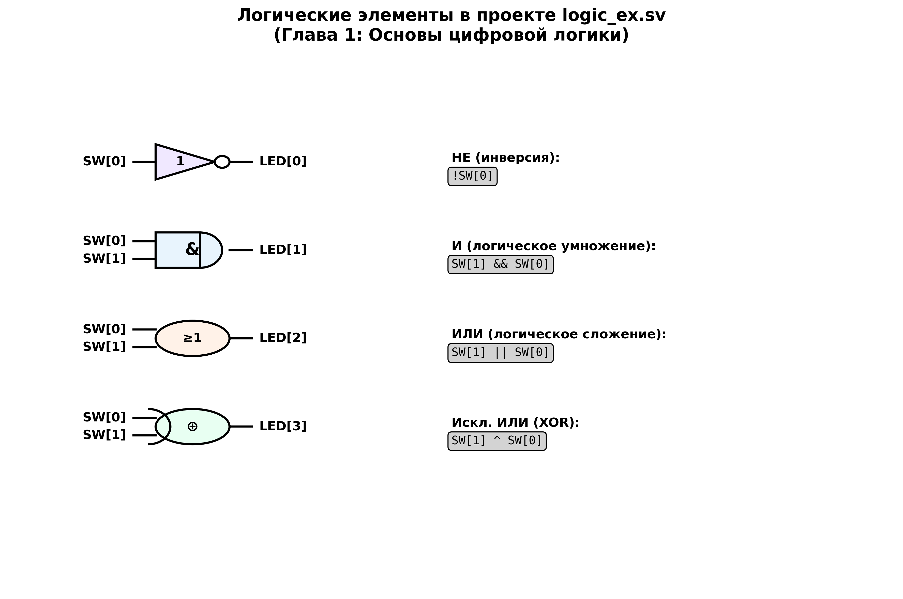
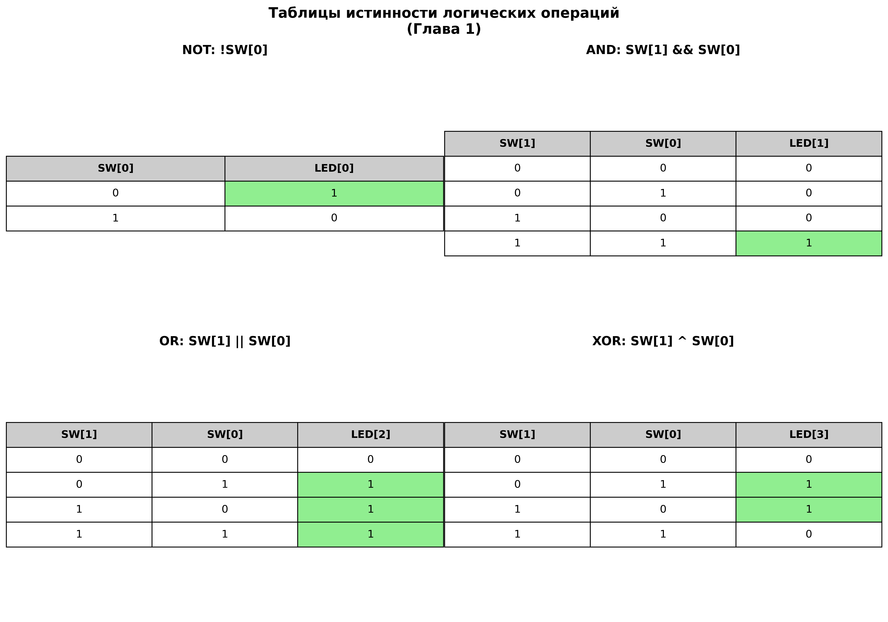
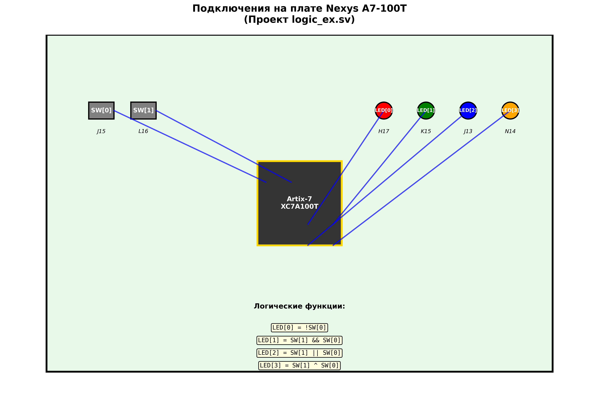

# Глава 1: Основы цифровой логики - Подробный анализ

## Обзор главы
Первая глава знакомит с основами программирования FPGA, используя простые логические операции. Это фундамент для понимания всех последующих тем. Мы изучаем базовый синтаксис SystemVerilog, структуру модулей и физическое подключение к плате Nexys A7-100T.

## Структура файлов главы

```
CH1/
├── hdl/                    # HDL исходные файлы
│   ├── logic_ex.sv        # Основные логические операции
│   └── challenge.sv       # Практическое задание (полный сумматор)
├── tb/                     # Тестовые модули (TestBench)
│   ├── tb.sv             # Тестирование logic_ex.sv
│   └── tb_challenge.sv   # Тестирование challenge.sv
└── build/                  # Файлы сборки проекта
    ├── challenge/         # Проект Vivado для задания
    ├── logic_ex/          # Проект Vivado для основного примера
    ├── logic_ex_basys3/   # Проект для платы Basys-3 (альтернативная)
    └── xdc/               # Файлы ограничений (constraints)
        ├── Nexys-A7-100T-Master.xdc  # Для Nexys A7-100T
        └── Basys-3-Master.xdc        # Для Basys-3
```

---

## 1. Анализ основного примера: logic_ex.sv

### Структура модуля

```systemverilog
`timescale 1ns/10ps
module logic_ex
  (
   input  wire  [1:0]    SW,      // 2 переключателя (SW0, SW1)
   output logic [3:0]    LED     // 4 светодиода (LED0-LED3)
   );
```

**Ключевые особенности:**
- **`timescale 1ns/10ps`** - директива временных масштабов для симуляции
  - 1ns - единица времени
  - 10ps - точность времени
- **`input wire [1:0] SW`** - входной сигнал, 2-битный массив переключателей
- **`output logic [3:0] LED`** - выходной сигнал, 4-битный массив светодиодов
- **SystemVerilog vs Verilog:** использование типа `logic` вместо `wire/reg`

### Логические операции


*Диаграмма логических элементов, используемых в проекте logic_ex.sv*

#### 1. Операция НЕ (NOT/Инверсия)
```systemverilog
assign LED[0] = !SW[0];  // line 8
```
- **Функция:** Инвертирует состояние SW[0]
- **Логика:** Если SW[0] = 1, то LED[0] = 0; если SW[0] = 0, то LED[0] = 1
- **Физическая реализация:** Когда переключатель SW0 включен, LED0 выключается

#### 2. Операция И (AND/Логическое умножение)
```systemverilog
assign LED[1] = SW[1] && SW[0];  // line 9
```
- **Функция:** Логическое И двух входов
- **Логика:** LED[1] = 1 только когда оба SW[1] И SW[0] равны 1
- **Физическая реализация:** LED1 светится только когда оба переключателя включены

**Альтернативные записи (закомментированы):**
```systemverilog
//assign LED[1] = SW[1] & SW[0];               // Побитовое И
//assign LED[1] = (SW[1] == 1'b1) & (SW[0] == 1'b1);  // Явное сравнение
//assign LED[1] = &SW[1:0];                    // Редукционное И
```

#### 3. Операция ИЛИ (OR/Логическое сложение)
```systemverilog
assign LED[2] = SW[1] || SW[0];  // line 14
```
- **Функция:** Логическое ИЛИ двух входов
- **Логика:** LED[2] = 1 когда SW[1] ИЛИ SW[0] (или оба) равны 1
- **Физическая реализация:** LED2 светится когда включен хотя бы один переключатель

**Альтернативные записи:**
```systemverilog
//assign LED[2] = SW[1] | SW[0];               // Побитовое ИЛИ
//assign LED[2] = |SW[1:0];                    // Редукционное ИЛИ
```

#### 4. Операция исключающее ИЛИ (XOR)
```systemverilog
assign LED[3] = SW[1] ^ SW[0];   // line 19
```
- **Функция:** Исключающее ИЛИ (XOR)
- **Логика:** LED[3] = 1 только когда SW[1] и SW[0] имеют разные значения
- **Физическая реализация:** LED3 светится когда включен ровно один переключатель
- **Применение:** Часто используется в схемах сравнения и детекции изменений

### Важные концепции SystemVerilog

#### Типы операторов
1. **Логические операторы:** `&&`, `||`, `!` - работают с логическими значениями
2. **Побитовые операторы:** `&`, `|`, `^`, `~` - работают с каждым битом отдельно
3. **Редукционные операторы:** `&SW`, `|SW`, `^SW` - применяются ко всем битам массива

#### Операторы сравнения
- **`==`** - логическое равенство (может возвращать X при неопределенности)
- **`===`** - строгое равенство (учитывает X и Z состояния)

---

## 2. Анализ практического задания: challenge.sv

### Структура модуля
```systemverilog
module challenge
  (
   input  wire  [2:0]    SW,     // 3 переключателя для полного сумматора
   output logic [1:0]    LED     // 2 светодиода для суммы и переноса
   );
```

### Назначение входов (согласно комментариям)
```systemverilog
// SW[2] is carry in   - входной перенос
// SW[1] is A         - первое слагаемое
// SW[0] is B         - второе слагаемое
```

### Задание для студента
```systemverilog
assign LED[0] = ; // Write the code for the Sum    - код для суммы
assign LED[1] = ; // Write the code for the Carry  - код для переноса
```

### Теория полного сумматора

**Полный сумматор (Full Adder)** - цифровая схема, которая складывает три однобитных числа:
- A (первое слагаемое)
- B (второе слагаемое)
- Cin (входной перенос)

**Результат:**
- Sum (сумма) = A ⊕ B ⊕ Cin
- Cout (выходной перенос) = AB + Cin(A ⊕ B)

### Решение задания
Хотя в файле оставлены пустые строки для самостоятельного решения, правильная реализация:

```systemverilog
assign LED[0] = SW[1] ^ SW[0] ^ SW[2];  // Sum = A ⊕ B ⊕ Cin
assign LED[1] = (SW[1] & SW[0]) | (SW[2] & (SW[1] ^ SW[0])); // Carry
```

**Таблица истинности полного сумматора:**
| SW[2] (Cin) | SW[1] (A) | SW[0] (B) | LED[0] (Sum) | LED[1] (Cout) |
|-------------|-----------|-----------|--------------|---------------|
|      0      |     0     |     0     |      0       |       0       |
|      0      |     0     |     1     |      1       |       0       |
|      0      |     1     |     0     |      1       |       0       |
|      0      |     1     |     1     |      0       |       1       |
|      1      |     0     |     0     |      1       |       0       |
|      1      |     0     |     1     |      0       |       1       |
|      1      |     1     |     0     |      0       |       1       |
|      1      |     1     |     1     |      1       |       1       |


*Визуальное представление таблиц истинности для всех логических операций*

---

## 3. Анализ тестовых модулей (TestBench)

### Тестирование logic_ex.sv (tb.sv)

#### Структура тестового модуля
```systemverilog
module tb;
  logic [1:0] SW;    // Сигналы-стимулы
  logic [3:0] LED;   // Наблюдаемые сигналы

  logic_ex u_logic_ex (.*);  // Инстанцирование тестируемого модуля
```

**`.*` синтаксис** - автоматическое подключение портов по именам (SystemVerilog особенность)

#### Генерация стимулов
```systemverilog
initial begin
  $printtimescale(tb);      // Вывод временного масштаба
  SW = '0;                  // Инициализация нулями ('0 - все биты в ноль)
  for (int i = 0; i < 4; i++) begin
    $display("Setting switches to %2b", i[1:0]);
    SW = i[1:0];            // Подача всех комбинаций 00, 01, 10, 11
    #100;                   // Задержка 100 временных единиц
  end
  $display("PASS: logic_ex test PASSED!");
  $stop;                    // Завершение симуляции
end
```

#### Автоматическая проверка результатов
```systemverilog
always @(SW, LED) begin
  if (!SW[0] !== LED[0]) begin           // Проверка инверсии
    $display("FAIL: NOT Gate mismatch");
    $stop;
  end
  if (&SW[1:0] !== LED[1]) begin         // Проверка логического И
    $display("FAIL: AND Gate mismatch");
    $stop;
  end
  if (|SW[1:0] !== LED[2]) begin         // Проверка логического ИЛИ
    $display("FAIL: OR Gate mismatch");
    $stop;
  end
  if (^SW[1:0] !== LED[3]) begin         // Проверка XOR
    $display("FAIL: XOR Gate mismatch");
    $stop;
  end
end
```

### Тестирование challenge.sv (tb_challenge.sv)

#### Эталонная проверка
```systemverilog
logic [2:0] sum;
assign sum = SW[0] + SW[1] + SW[2];     // Эталонная арифметическая сумма

always @(SW, LED) begin
  if (sum !== LED) begin                // Сравнение с эталоном
    $display("FAIL: Addition mismatch");
    $stop;
  end
end
```

---

## 4. Физическая реализация: файлы ограничений (.xdc)

### Назначение файлов ограничений
Файлы .xdc (Xilinx Design Constraints) определяют:
1. **Физическое подключение** сигналов к выводам FPGA
2. **Электрические параметры** (напряжение, стандарт I/O)
3. **Временные ограничения** (частоты, задержки)

### Анализ Nexys-A7-100T-Master.xdc


*Схема подключений сигналов на плате Nexys A7-100T*

#### Глобальные настройки
```tcl
set_property CFGBVS VCCO [current_design]      # Источник питания конфигурации
set_property CONFIG_VOLTAGE 3.3 [current_design]  # Напряжение конфигурации 3.3V
```

#### Назначение переключателей
```tcl
set_property -dict { PACKAGE_PIN J15   IOSTANDARD LVCMOS33 } [get_ports { SW[0] }];
set_property -dict { PACKAGE_PIN L16   IOSTANDARD LVCMOS33 } [get_ports { SW[1] }];
```

**Расшифровка:**
- **PACKAGE_PIN J15** - физический вывод FPGA (координата на кристалле)
- **IOSTANDARD LVCMOS33** - стандарт входа/выхода (Low Voltage CMOS, 3.3V)
- **SW[0], SW[1]** - имена сигналов в HDL коде

#### Назначение светодиодов
```tcl
set_property -dict { PACKAGE_PIN H17   IOSTANDARD LVCMOS33 } [get_ports { LED[0] }];
set_property -dict { PACKAGE_PIN K15   IOSTANDARD LVCMOS33 } [get_ports { LED[1] }];
set_property -dict { PACKAGE_PIN J13   IOSTANDARD LVCMOS33 } [get_ports { LED[2] }];
set_property -dict { PACKAGE_PIN N14   IOSTANDARD LVCMOS33 } [get_ports { LED[3] }];
```

### Важность правильных ограничений

1. **Без .xdc файла** - инструменты синтеза не знают, куда подключать сигналы
2. **Неправильные ограничения** - проект может не работать или работать неправильно
3. **Несоответствие имен** - частая ошибка начинающих

---

## 5. Работа с проектом в Vivado 2019.x

### Открытие проекта
1. Открыть Vivado 2019.x
2. File → Open Project
3. Выбрать `CH1/build/logic_ex/logic_ex.xpr`
4. При необходимости подтвердить миграцию проекта

### Возможные проблемы совместимости
1. **Версия IP ядер** - могут потребовать обновления
2. **Изменения в алгоритмах** - результаты синтеза могут отличаться
3. **Новые предупреждения** - обычно не критичны

### Процесс компиляции
1. **Synthesis** - преобразование HDL в логические элементы
2. **Implementation** - размещение и трассировка на FPGA
3. **Generate Bitstream** - создание файла конфигурации (.bit)

---

## 6. Практические выводы и рекомендации

### Что изучили
1. **Базовый синтаксис SystemVerilog** - модули, порты, типы данных
2. **Логические операции** - NOT, AND, OR, XOR
3. **Комбинационную логику** - assign statements
4. **Тестирование** - основы написания testbench
5. **Физическую реализацию** - связь HDL с реальным железом

### Ключевые принципы
1. **Все в FPGA параллельно** - assign выполняются одновременно
2. **Каждому сигналу нужен драйвер** - один источник на сигнал
3. **Имена портов должны совпадать** - HDL код и .xdc файл
4. **Тестирование критично** - всегда проверяйте логику в симуляции

### Типичные ошибки новичков
1. **Забыть подключить .xdc файл** к проекту
2. **Перепутать имена сигналов** в HDL и constraints
3. **Не понимать разницу** между логическими и побитовыми операторами
4. **Пропустить симуляцию** перед синтезом

### Следующие шаги
После освоения этой главы вы готовы к:
1. **Главе 2** - арифметические операции и параметризация
2. **Более сложным проектам** с многими входами/выходами
3. **Изучению последовательной логики** в Главе 3

---

## Заключение

Первая глава закладывает фундамент для всего курса FPGA программирования. Понимание базовых логических операций, структуры модулей SystemVerilog и связи между HDL кодом и физическим железом критично для успешного освоения более сложных тем в следующих главах.

Обязательно попрактикуйтесь с симуляцией тестовых модулей и попробуйте самостоятельно решить задание с полным сумматором - это поможет закрепить полученные знания.