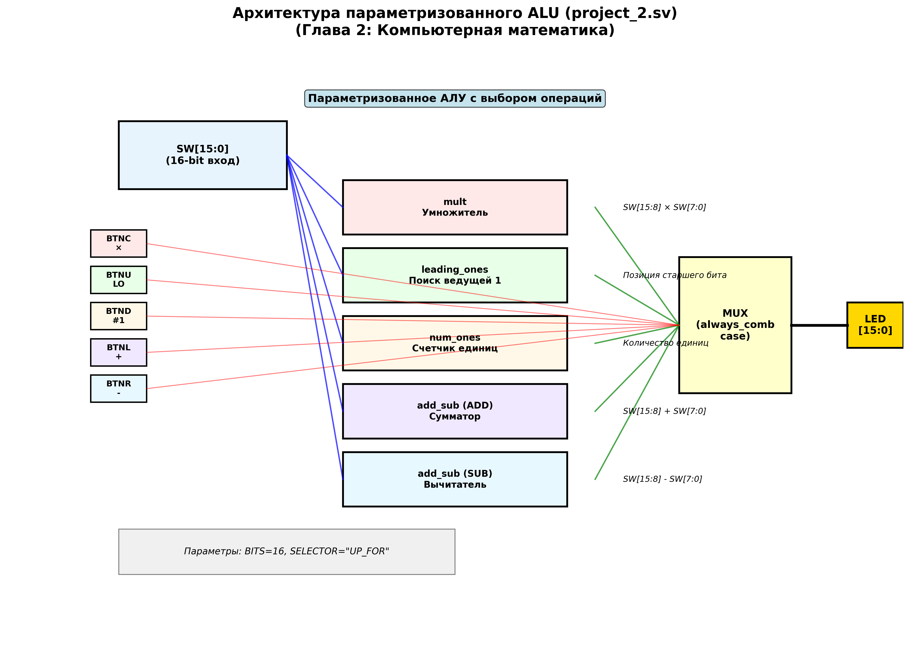
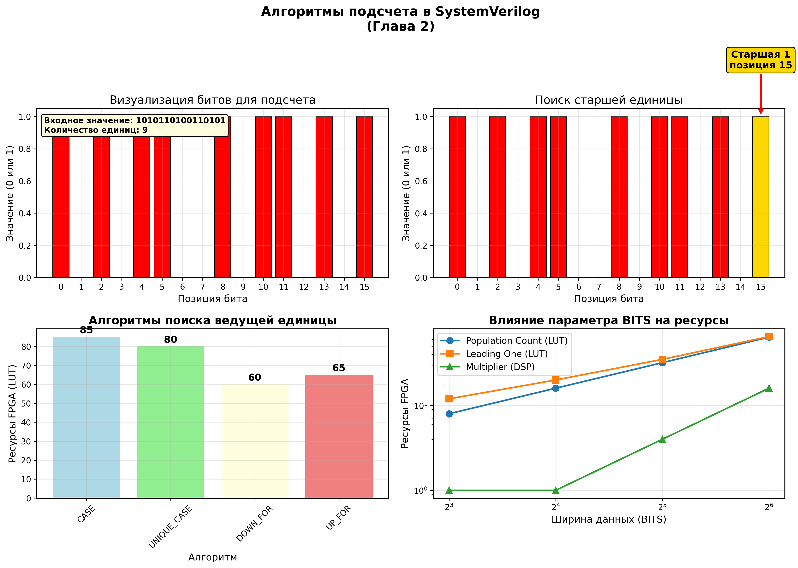
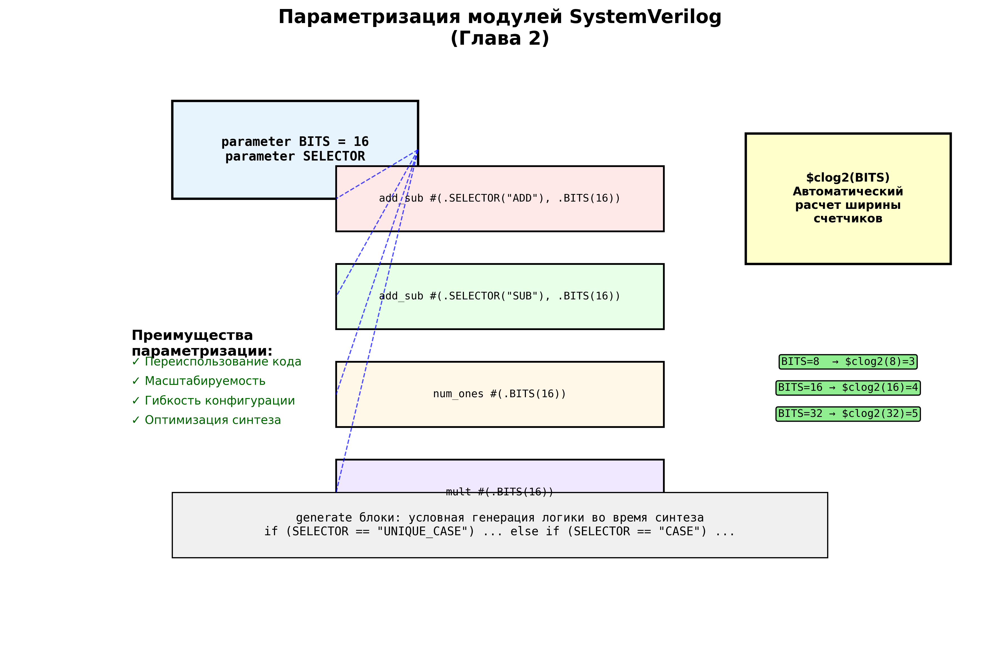

# Глава 2: Основы компьютерной математики - Подробный анализ

## Обзор главы
Вторая глава знакомит с арифметическими операциями в FPGA, параметризацией модулей и продвинутыми техниками SystemVerilog. Изучается создание масштабируемых ALU (Arithmetic Logic Unit) и алгоритмы обработки данных, критично важные для цифровой обработки сигналов.

## Архитектура проекта


*Блок-диаграмма параметризованного ALU с множественными арифметическими модулями*

### Ключевые особенности архитектуры
- **Модульная структура**: Каждая операция в отдельном модуле
- **Параметризация**: Настраиваемая ширина данных (BITS)
- **Мультиплексирование**: Выбор операции через кнопки
- **Единый интерфейс**: Все модули используют одинаковые порты

---

## 1. Анализ главного модуля: project_2.sv

### Структура верхнего уровня
```systemverilog
module project_2 #(
   parameter SELECTOR,
   parameter BITS = 16
) (
   input wire [BITS-1:0]          SW,    // Переключатели (данные)
   input wire                     BTNC,  // Кнопка: умножение
   input wire                     BTNU,  // Кнопка: поиск ведущей единицы
   input wire                     BTNL,  // Кнопка: сложение
   input wire                     BTNR,  // Кнопка: вычитание
   input wire                     BTND,  // Кнопка: подсчет единиц

   output logic signed [BITS-1:0] LED    // Результат операции
);
```

**Ключевые концепции:**
- **`parameter SELECTOR`** - строковый параметр для выбора алгоритма
- **`parameter BITS = 16`** - ширина данных по умолчанию
- **`logic signed`** - знаковый тип для арифметических операций
- **Множественные кнопки** - интерфейс выбора операции

### Инстанцирование модулей
```systemverilog
leading_ones #(.SELECTOR(SELECTOR), .BITS(BITS)) u_lo (.*, .LED(LO_LED));
add_sub      #(.SELECTOR("ADD"),    .BITS(BITS)) u_ad (.*, .LED(AD_LED));
add_sub      #(.SELECTOR("SUB"),    .BITS(BITS)) u_sb (.*, .LED(SB_LED));
num_ones     #(                     .BITS(BITS)) u_no (.*, .LED(NO_LED));
mult         #(                     .BITS(BITS)) u_mt (.*, .LED(MULT_LED));
```

**Особенности инстанцирования:**
- **`.*` синтаксис** - автоматическое подключение одноименных портов
- **Параметризация** - каждый модуль настроен под нужную функцию
- **Уникальные имена** - разные экземпляры для сложения и вычитания
- **Локальные сигналы** - отдельные выходы для каждой операции

### Мультиплексор выбора операции
```systemverilog
always_comb begin
    LED = '0;                    // Значение по умолчанию
    case (1'b1)
        BTNC: LED = MULT_LED;    // Умножение
        BTNU: LED = LO_LED;      // Поиск ведущей единицы
        BTND: LED = NO_LED;      // Подсчет единиц
        BTNL: LED = AD_LED;      // Сложение
        BTNR: LED = SB_LED;      // Вычитание
    endcase
end
```

**Техники программирования:**
- **`always_comb`** vs `always_latch` - правильный выбор для комбинационной логики
- **`case (1'b1)`** - паттерн для проверки единственной активной кнопки
- **`'0` инициализация** - предотвращение неопределенных состояний
- **Priority encoding** - первая активная кнопка определяет результат

---

## 2. Арифметические модули


*Схемы реализации основных арифметических операций в FPGA*

### Модуль сложения/вычитания: add_sub.sv

#### Структура модуля
```systemverilog
module add_sub #(
   parameter SELECTOR,
   parameter BITS = 16
) (
   input  wire  [BITS-1:0]        SW,   // Входные данные
   output logic signed [BITS-1:0] LED   // Результат операции
);
```

#### Разделение входных данных
```systemverilog
logic signed [BITS/2-1:0] a_in;
logic signed [BITS/2-1:0] b_in;

always_comb begin
    {a_in, b_in} = SW;               // Конкатенация для разделения
    if (SELECTOR == "ADD") LED = a_in + b_in;
    else                   LED = a_in - b_in;
end
```

**Ключевые особенности:**
- **Разделение входа пополам**: SW[15:8] и SW[7:0] для 16-битного входа
- **Знаковая арифметика**: `signed` обеспечивает правильную обработку отрицательных чисел
- **Параметрический выбор**: компилятивное время определения операции
- **Автоматическое расширение**: результат автоматически расширяется до полной ширины

#### Примеры работы
- **Сложение**: SW[15:8]=5, SW[7:0]=3 → LED=8
- **Вычитание**: SW[15:8]=7, SW[7:0]=2 → LED=5
- **Переполнение**: SW[15:8]=127, SW[7:0]=1 → LED=-128 (для 8-битной арифметики)

### Модуль умножения: mult.sv

#### Реализация умножителя
```systemverilog
module mult #(
   parameter BITS = 16
) (
   input  wire  [BITS-1:0]        SW,
   output logic signed [BITS-1:0] LED
);

logic signed [BITS/2-1:0] a_in;
logic signed [BITS/2-1:0] b_in;

always_comb begin
    {a_in, b_in} = SW;
    LED = a_in * b_in;
end
```

**Особенности реализации:**
- **Аппаратное умножение**: использует DSP блоки FPGA
- **Ограничение разрядности**: результат ограничен шириной входа
- **Знаковое умножение**: корректная обработка отрицательных чисел
- **Потенциальное переполнение**: произведение может не поместиться в выходную разрядность

#### Ресурсы FPGA для умножения
- **DSP48 блоки** в Artix-7: оптимизированы для 25x18 битных умножений
- **LUT реализация** для нестандартных размеров
- **Пайплайнинг** для высокой частоты (в продвинутых дизайнах)

---

## 3. Алгоритмы подсчета


*Визуализация алгоритмов подсчета единиц и поиска ведущих битов*

### Подсчет единиц: num_ones.sv (Population Count)

#### Реализация алгоритма
```systemverilog
module num_ones #(
   parameter BITS = 16
) (
   input wire [BITS-1:0]         SW,
   output logic [$clog2(BITS):0] LED    // Автоматический расчет ширины
);

always_comb begin
    LED = '0;
    for (int i = $low(SW); i <= $high(SW); i++) begin
        LED += SW[i];                     // Суммирование всех битов
    end
end
```

**Ключевые техники:**
- **`$clog2(BITS):0`** - автоматический расчет необходимой ширины счетчика
- **`$low()/$high()`** - системные функции для определения границ массива
- **`int` переменные** - в SystemVerilog доступны целочисленные типы
- **Комбинационный цикл** - синтезируется в параллельную аппаратуру

#### Применения Population Count
1. **Криптография**: подсчет битов в хеш-функциях
2. **Коррекция ошибок**: вычисление четности
3. **Сжатие данных**: анализ энтропии
4. **Нейронные сети**: подсчет активных нейронов

### Поиск ведущей единицы: leading_ones.sv

#### Архитектура с generate блоками
```systemverilog
module leading_ones #(
   parameter SELECTOR,
   parameter BITS = 16
) (
   input wire [BITS-1:0]         SW,
   output logic [$clog2(BITS):0] LED
);

generate
    if (SELECTOR == "UNIQUE_CASE") begin : g_UNIQUE_CASE
        // Реализация через unique case
    end else if (SELECTOR == "CASE") begin : g_CASE
        // Реализация через обычный case
    end else if (SELECTOR == "DOWN_FOR") begin : g_UP_IF
        // Реализация через цикл сверху-вниз
    end else if (SELECTOR == "UP_FOR") begin : g_DOWN_IF
        // Реализация через цикл снизу-вверх
    end
endgenerate
```

**Generate блоки - мощная особенность SystemVerilog:**
- **Условная генерация** логики во время синтеза
- **Различные алгоритмы** для одной функциональности
- **Оптимизация под задачу** - выбор наиболее эффективной реализации
- **Параметрическая настройка** архитектуры

#### Алгоритм 1: UNIQUE_CASE
```systemverilog
always_comb begin
    LED = '0;
    unique case (1'b1)
        SW[15]: LED = 16;
        SW[14]: LED = 15;
        SW[13]: LED = 14;
        // ... продолжение для всех битов
        SW[0]:  LED = 1;
    endcase
end
```

**Особенности unique case:**
- **Приоритетный энкодер**: гарантирует единственное совпадение
- **Оптимизация синтеза**: инструменты знают о взаимной исключительности
- **Предупреждения**: компилятор предупредит о нарушении уникальности
- **Высокая скорость**: параллельная логика

#### Алгоритм 2: Цикл DOWN_FOR
```systemverilog
always_comb begin
    LED = '0;
    for (int i = $high(SW); i >= $low(SW); i--) begin
        if (SW[i]) begin
            LED = i + 1;
            break;                        // Выход после первого найденного
        end
    end
end
```

**Преимущества циклового подхода:**
- **Компактный код**: не нужно перечислять все случаи
- **Масштабируемость**: автоматически работает для любого BITS
- **break statement**: эффективная реализация приоритета
- **Читаемость**: логика алгоритма очевидна

#### Алгоритм 3: Цикл UP_FOR
```systemverilog
always_comb begin
    LED = '0;
    for (int i = $low(SW); i <= $high(SW); i++) begin
        if (SW[i]) begin
            LED = i + 1;                  // Последнее найденное значение
        end
    end
end
```

**Отличие UP_FOR от DOWN_FOR:**
- **Перезапись результата**: каждый найденный бит обновляет результат
- **Итоговый результат**: позиция самого старшего бита
- **Больше логики**: требует больше ресурсов для реализации
- **Альтернативная реализация**: демонстрирует различные подходы

#### Сравнение алгоритмов

| Алгоритм | Ресурсы (LUT) | Задержка (ns) | Читаемость | Масштабируемость |
|----------|---------------|---------------|------------|------------------|
| CASE | Высокие | Низкая | Средняя | Плохая |
| UNIQUE_CASE | Средние | Низкая | Средняя | Плохая |
| DOWN_FOR | Низкие | Средняя | Высокая | Отличная |
| UP_FOR | Средние | Высокая | Высокая | Отличная |

---

## 4. Параметризация и масштабируемость


*Демонстрация принципов параметризации в SystemVerilog*

### Типы параметров в SystemVerilog

#### parameter vs localparam
```systemverilog
module example #(
    parameter BITS = 16,              // Может быть переопределен при инстанцировании
    parameter SELECTOR = "DEFAULT"
) (
    // порты модуля
);

localparam COUNTER_BITS = $clog2(BITS);  // Вычисляется автоматически, неизменяем
```

**Различия:**
- **parameter**: настраивается при инстанцировании модуля
- **localparam**: только для внутренних вычислений модуля
- **Время вычисления**: все параметры вычисляются во время синтеза
- **Типобезопасность**: параметры проверяются на этапе компиляции

### Системные функции для параметризации

#### $clog2() - потолок логарифма по основанию 2
```systemverilog
$clog2(1)  = 0    // Для 1 элемента нужно 0 бит
$clog2(2)  = 1    // Для 2 элементов нужен 1 бит
$clog2(3)  = 2    // Для 3 элементов нужно 2 бита
$clog2(16) = 4    // Для 16 элементов нужно 4 бита
```

**Применения:**
- **Ширина счетчиков**: автоматический расчет разрядности
- **Ширина адресов**: для адресации массивов
- **Энкодеры/декодеры**: определение количества управляющих сигналов
- **Масштабируемость**: код работает для любого размера данных

#### $high() и $low() - границы массивов
```systemverilog
logic [15:0] data;
$low(data)  = 0     // Младший индекс
$high(data) = 15    // Старший индекс

logic [7:4] packed_array;
$low(packed_array)  = 4
$high(packed_array) = 7
```

**Преимущества:**
- **Независимость от размера**: код не привязан к конкретной разрядности
- **Упрощение циклов**: автоматические границы итерации
- **Меньше ошибок**: исключаются ошибки выхода за границы
- **Читаемость**: намерения программиста более очевидны

### Generate блоки для условной логики

#### Основной синтаксис
```systemverilog
generate
    if (CONDITION) begin : label_name
        // Логика для случая CONDITION == true
    end else begin : alternative_label
        // Альтернативная логика
    end
endgenerate
```

#### Применения generate
1. **Выбор алгоритмов**: различные реализации одной функции
2. **Условные ресурсы**: включение/исключение блоков
3. **Массивы экземпляров**: генерация повторяющихся структур
4. **Параметрическая архитектура**: адаптация под требования

---

## 5. Анализ testbench: tb.sv

### Архитектура комплексного тестирования

#### Параметры тестирования
```systemverilog
parameter  SELECTOR     = "UP_FOR";      // Алгоритм для тестирования
parameter  UNIQUE_CASE  = "FALSE";       // Режим уникальных значений
parameter  TEST_CASE    = "LEADING_ONES"; // Тестируемая функция
localparam BITS         = 16;            // Ширина данных
localparam NUM_TEST     = 1000;          // Количество тестов
```

### Случайное тестирование (Random Testing)

#### Генерация стимулов
```systemverilog
initial begin
    for (int i = 0; i < NUM_TEST; i++) begin
        button = $urandom_range(0,4);    // Случайная кнопка 0-4
        SW = $random;                    // Случайные данные

        // Установка кнопок
        {BTNC, BTNU, BTNL, BTNR, BTND} = '0;
        case (button)
            0: BTNC = '1;    // Умножение
            1: BTNU = '1;    // Ведущая единица
            2: BTND = '1;    // Подсчет единиц
            3: BTNL = '1;    // Сложение
            4: BTNR = '1;    // Вычитание
        endcase

        #100;                            // Ожидание стабилизации
    end
end
```

**Современные техники тестирования:**
- **`$urandom_range()`** - равномерное распределение в диапазоне
- **`$random`** - псевдослучайные значения
- **Большое количество тестов** - статистическая проверка корректности
- **Автоматизация** - минимальное участие человека

### Эталонные модели (Reference Models)

#### Функции для проверки
```systemverilog
function [$clog2(BITS):0] lo_func(input [BITS-1:0] SW);
    lo_func = '0;
    for (int i = $low(SW); i <= $high(SW); i++) begin
        if (SW[i]) begin
            lo_func = i+1;
        end
    end
endfunction

function [$clog2(BITS):0] no_func(input [BITS-1:0] SW);
    no_func = '0;
    for (int i = $low(SW); i <= $high(SW); i++) begin
        no_func += SW[i];
    end
endfunction
```

**Принципы эталонного моделирования:**
- **Простота реализации**: алгоритм должен быть очевидно правильным
- **Независимость**: эталон не должен использовать тестируемый код
- **Полнота**: покрытие всех возможных случаев
- **Автоматическая проверка**: сравнение без участия человека

### Самопроверяющиеся тесты

#### Автоматическая верификация
```systemverilog
always @(LED_TB) begin
    if (TEST_CASE == "LEADING_ONES") begin
        if (lo_func(SW) != LED_TB[$clog2(BITS):0]) begin
            $display("FAIL: LED != leading 1's position");
            $stop;
        end
    end else if (TEST_CASE == "NUM_ONES") begin
        if (no_func(SW) != LED_TB) begin
            $display("FAIL: LED != number of ones represented by SW");
            $stop;
        end
    end
    // ... другие случаи
end
```

**Преимущества автоматической проверки:**
- **Немедленное обнаружение ошибок**: тест останавливается при первой проблеме
- **Детальная диагностика**: информативные сообщения об ошибках
- **Масштабируемость**: тысячи тестов без участия человека
- **Регрессионное тестирование**: проверка после каждого изменения

---

## 6. Практические аспекты синтеза

### Инферирование арифметических ресурсов

#### DSP блоки для умножения
```systemverilog
// Будет синтезирован в DSP48 блок
logic signed [15:0] a, b, result;
assign result = a * b;

// Может потребовать несколько DSP блоков
logic signed [31:0] wide_a, wide_b, wide_result;
assign wide_result = wide_a * wide_b;
```

#### Оптимизация сумматоров
```systemverilog
// Быстрый carry chain
assign sum = a + b + c + d;

// Медленная каскадная логика
logic temp1, temp2;
assign temp1 = a + b;
assign temp2 = temp1 + c;
assign sum = temp2 + d;
```

### Влияние параметризации на синтез

#### Оценка ресурсов для разных BITS

| BITS | num_ones (LUT) | leading_ones (LUT) | mult (DSP) | add_sub (LUT) |
|------|----------------|-------------------|------------|---------------|
| 8    | 8              | 12                | 1          | 9             |
| 16   | 16             | 20                | 1          | 17            |
| 32   | 32             | 35                | 4          | 33            |
| 64   | 64             | 65                | 16         | 65            |

**Выводы:**
- **Population count**: линейный рост с увеличением BITS
- **Leading ones**: слегка сверхлинейный рост
- **Multiplier**: квадратичный рост для больших размеров
- **Add/Sub**: почти линейный рост

### Рекомендации по оптимизации

#### Выбор алгоритма
1. **Для малых BITS (≤16)**: любой алгоритм эффективен
2. **Для средних BITS (17-32)**: предпочтительны циклы
3. **Для больших BITS (>32)**: обязательны циклы или специальные техники

#### Компромиссы производительности
- **Задержка vs ресурсы**: быстрая логика требует больше LUT
- **Частота vs сложность**: простые алгоритмы работают на более высоких частотах
- **Гибкость vs оптимальность**: параметризованный код может быть менее оптимален

---

## 7. Практические выводы и рекомендации

### Что изучили

#### Продвинутые техники SystemVerilog
1. **Параметризация модулей** - создание масштабируемых дизайнов
2. **Generate блоки** - условная генерация логики
3. **Системные функции** - $clog2(), $high(), $low()
4. **Случайное тестирование** - современные подходы к верификации

#### Арифметические алгоритмы
1. **Population count** - фундаментальный алгоритм подсчета
2. **Leading one detection** - поиск приоритетов и нормализация
3. **Знаковая арифметика** - корректная обработка отрицательных чисел
4. **Параметрические вычисления** - compile-time оптимизации

#### FPGA специфичные знания
1. **DSP блоки** - эффективное использование аппаратных умножителей
2. **Carry chains** - оптимизация сумматоров
3. **Resource estimation** - планирование использования ресурсов
4. **Synthesis trade-offs** - компромиссы между скоростью и площадью

### Ключевые принципы дизайна

#### Параметризация
- **Всегда используйте параметры** для размеров данных
- **Предусматривайте масштабируемость** с самого начала
- **Используйте $clog2()** для автоматического расчета ширины
- **Документируйте ограничения** параметров

#### Алгоритмы
- **Выбирайте алгоритм под задачу** - не всегда нужна максимальная скорость
- **Тестируйте разные подходы** - generate блоки позволяют легко сравнивать
- **Учитывайте ресурсы FPGA** - DSP, LUT, carry chains
- **Планируйте масштабирование** - алгоритм должен работать для больших размеров

#### Тестирование
- **Используйте случайное тестирование** - находит больше ошибок
- **Создавайте эталонные модели** - простые и очевидно правильные
- **Автоматизируйте проверку** - самопроверяющиеся тесты
- **Тестируйте граничные случаи** - максимальные и минимальные значения

### Типичные ошибки и их избежание

#### Ошибки параметризации
1. **Забыть про $clog2()** - ручной расчет ширины счетчиков
2. **Не учесть граничные случаи** - BITS=1 или очень большие значения
3. **Смешать parameter и localparam** - неправильная область видимости
4. **Игнорировать предупреждения** - параметры вне допустимого диапазона

#### Арифметические ошибки
1. **Переполнение результата** - результат не помещается в выходную разрядность
2. **Знаковые проблемы** - смешивание signed и unsigned
3. **Неправильное разделение входов** - ошибки в конкатенации
4. **Забыть про инициализацию** - неопределенные начальные значения

#### Ошибки синтеза
1. **Неэффективное использование DSP** - принуждение к LUT реализации
2. **Плохие алгоритмы для больших размеров** - экспоненциальный рост ресурсов
3. **Игнорирование timing** - слишком сложная комбинационная логика
4. **Неоптимальные циклы** - неправильно инферируемые в аппаратуру

### Следующие шаги

После освоения этой главы вы готовы к:

#### Глава 3: Последовательная логика
- **Триггеры и регистры** - элементы памяти
- **Часовые домены** - синхронизация
- **Конечные автоматы** - управляющие структуры

#### Практические применения
1. **Цифровые фильтры** - использование арифметических модулей
2. **Криптографические алгоритмы** - population count и битовые операции
3. **Обработка изображений** - арифметика пикселей
4. **Сетевые процессоры** - быстрые вычисления

---

## Заключение

Глава 2 заложила фундамент для понимания арифметических операций в FPGA и продвинутых техник SystemVerilog. Освоение параметризации, алгоритмов подсчета и современных методов тестирования критично важно для создания масштабируемых и эффективных FPGA дизайнов.

Особое внимание уделите пониманию компромиссов между различными алгоритмическими подходами - это знание пригодится при решении реальных задач цифрового дизайна в последующих главах.