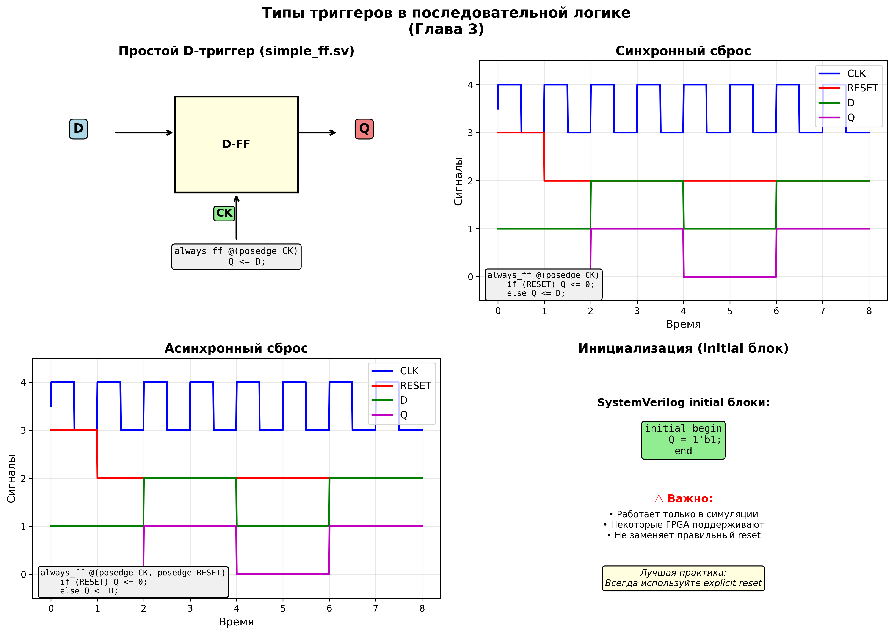
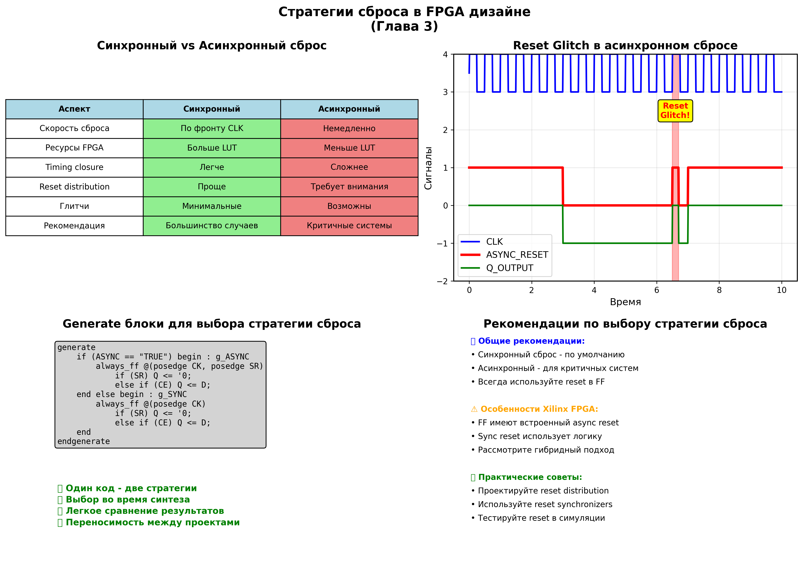
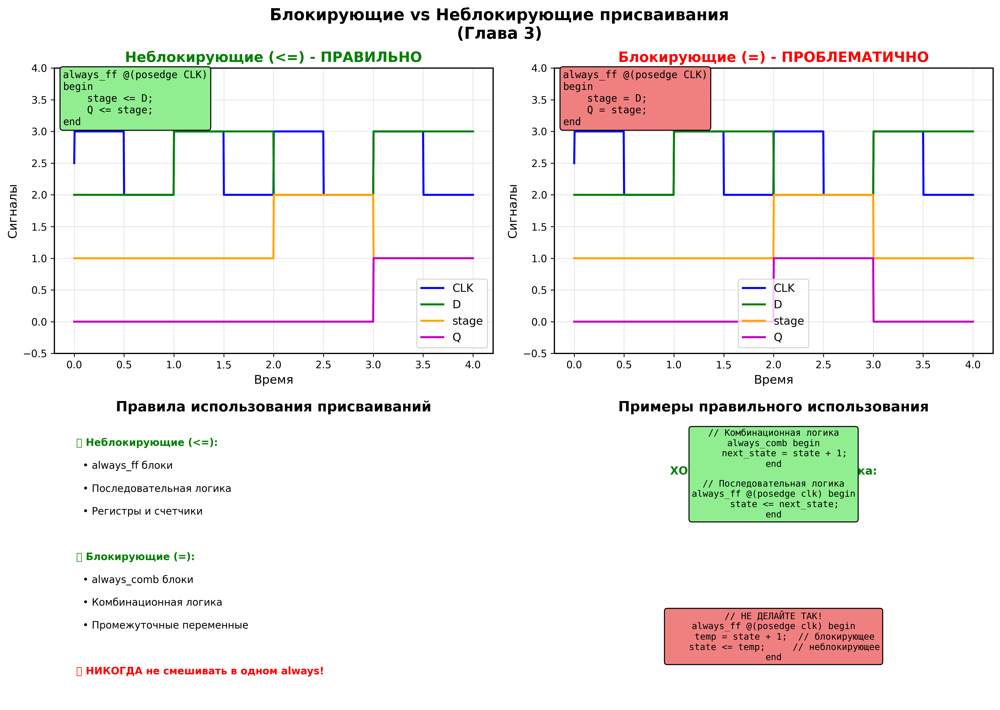
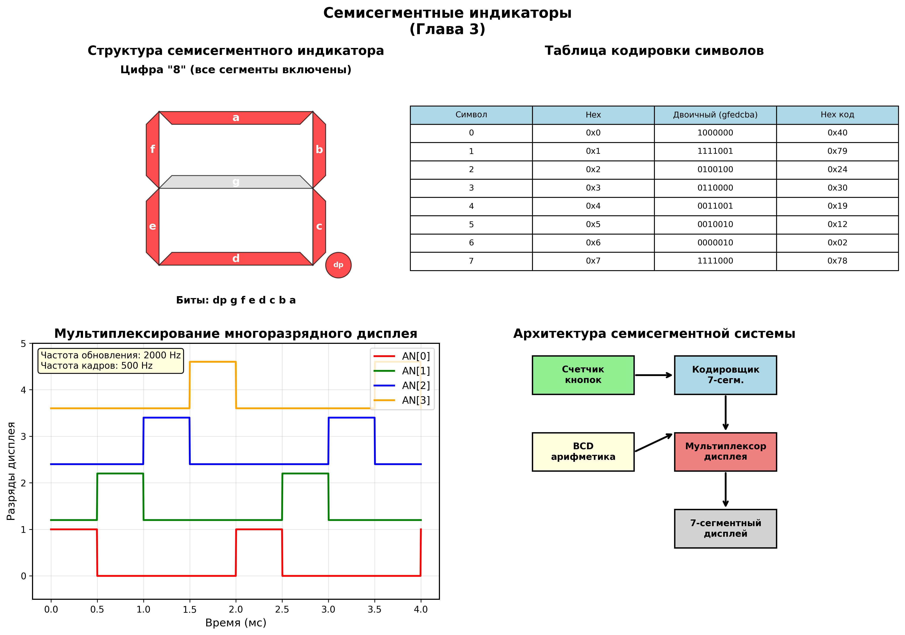
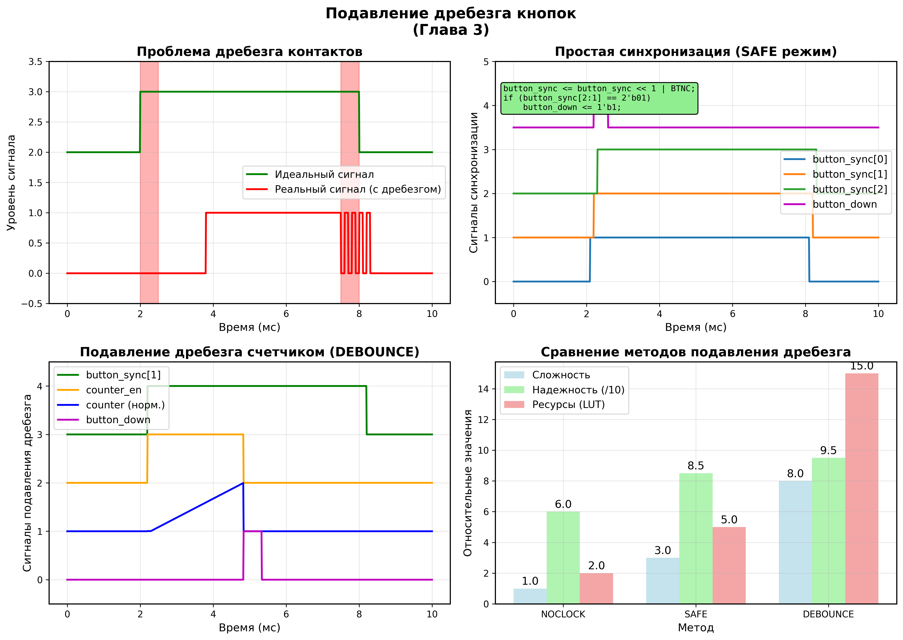

# Глава 3: Последовательная логика и элементы памяти - Подробный анализ

## Обзор главы
Третья глава представляет фундаментальный переход от комбинационной к последовательной логике - основе всех цифровых систем с памятью. Изучаются D-триггеры, стратегии сброса, критически важные концепции блокирующих vs неблокирующих присваиваний, и практические применения в виде семисегментных индикаторов с подавлением дребезга кнопок.

## Структура проектов в главе

Глава 3 организована в виде отдельных подпроектов, каждый из которых демонстрирует определенные концепции:

```
CH3/
├── simple_ff/           # Базовый D-триггер
├── simple_ff_async/     # Триггер с выбором типа сброса
├── simple_init_ff/      # Триггер с инициализацией
├── blocking/            # Демонстрация присваиваний
└── counting_buttons/    # Интегрированный проект с дисплеем
```

---

## 1. Основы последовательной логики


*Диаграмма различных типов триггеров и их реализации в SystemVerilog*

### 1.1. Простейший D-триггер (simple_ff.sv)

#### Базовая реализация
```systemverilog
module simple_ff (
   input wire   CK,     // Тактовый сигнал
   input wire   D,      // Данные
   output logic Q       // Выход
);

  always_ff @(posedge CK) Q <= D;

endmodule
```

**Ключевые концепции:**
- **`always_ff`** - специальный блок SystemVerilog для последовательной логики
- **`@(posedge CK)`** - чувствительность к положительному фронту часов
- **`<=` неблокирующее присваивание** - правильный синтаксис для регистров
- **Простота реализации** - минимальный код для базового элемента памяти

#### Принцип работы D-триггера
1. **На фронте часов** (0→1 переход) значение входа D записывается в триггер
2. **Между фронтами** выход Q сохраняет предыдущее значение
3. **Setup time** - данные должны стабилизироваться до фронта часов
4. **Hold time** - данные должны удерживаться после фронта часов

### 1.2. Триггер с инициализацией (simple_init_ff.sv)

#### Инициализация в SystemVerilog
```systemverilog
module simple_ff (
   input wire   CK,
   input wire   D,
   output logic Q
);

  initial begin Q = '1; end          // Инициализация в 1
  always_ff @(posedge CK) Q <= D;

endmodule
```

**Особенности initial блоков:**
- **Только в симуляции** - initial блоки выполняются только в testbench
- **Некоторые FPGA поддерживают** - современные Xilinx FPGA могут инициализировать FF
- **Не заменяет reset** - всегда используйте явный сброс в реальных проектах
- **Полезно для симуляции** - задает известное начальное состояние

---

## 2. Стратегии сброса


*Сравнение синхронного и асинхронного сброса с временными диаграммами*

### 2.1. Параметризованный выбор стратегии (simple_ff_async.sv)

#### Архитектура с generate блоками
```systemverilog
module simple_ff_async #(
   parameter ASYNC = "TRUE"     // Параметр выбора стратегии
) (
   input wire   CK,             // Часы
   input wire   CE,             // Разрешение записи
   input wire   SR,             // Сигнал сброса
   input wire   D,              // Данные
   output logic Q               // Выход
);

  initial Q = '1;               // Инициализация

  generate
    if (ASYNC == "TRUE") begin : g_ASYNC
      always @(posedge CK, posedge SR) begin
        if (SR) Q <= '0;
        else if (CE) Q <= D;
      end
    end else begin : g_SYNC
      always @(posedge CK) begin
        if (SR) Q <= '0;
        else if (CE) Q <= D;
      end
    end
  endgenerate
endmodule
```

### 2.2. Синхронный vs Асинхронный сброс

#### Синхронный сброс
```systemverilog
always_ff @(posedge CK) begin
    if (RESET) Q <= '0;         // Сброс проверяется на фронте часов
    else if (CE) Q <= D;        // Запись данных при разрешении
end
```

**Преимущества:**
- ✅ **Простая реализация** - сброс как обычный сигнал
- ✅ **Нет проблем с timing** - сброс синхронизирован с часами
- ✅ **Легкий routing** - не требует специальных ресурсов
- ✅ **Предсказуемое поведение** - отсутствуют glitch при сбросе

**Недостатки:**
- ❌ **Больше ресурсов** - сброс реализуется через LUT
- ❌ **Зависимость от часов** - сброс не работает при отсутствии часов
- ❌ **Задержка сброса** - сброс происходит только на фронте часов

#### Асинхронный сброс
```systemverilog
always_ff @(posedge CK, posedge RESET) begin
    if (RESET) Q <= '0;         // Немедленный сброс
    else if (CE) Q <= D;        // Запись при отсутствии сброса
end
```

**Преимущества:**
- ✅ **Немедленный сброс** - независимо от состояния часов
- ✅ **Меньше ресурсов** - использует встроенный reset FF
- ✅ **Гарантированная инициализация** - система всегда стартует из known state
- ✅ **Подходит для критичных систем** - safety systems

**Недостатки:**
- ❌ **Сложный routing** - требует глобальных reset сетей
- ❌ **Reset glitches** - ложные срабатывания при помехах
- ❌ **Timing сложности** - reset recovery/removal времена
- ❌ **Метастабильность** - при снятии сброса близко к фронту часов

### 2.3. Рекомендации по выбору стратегии

| Критерий | Синхронный | Асинхронный | Рекомендация |
|----------|------------|-------------|--------------|
| **Обычные системы** | ✅ | - | Предпочтительно |
| **Safety critical** | - | ✅ | Обязательно |
| **Low power** | ✅ | - | Меньше потребление |
| **High speed** | ✅ | ❌ | Легче timing closure |
| **Простота дизайна** | ✅ | ❌ | Меньше сложности |

---

## 3. Блокирующие vs Неблокирующие присваивания


*Временные диаграммы демонстрирующие критическую разность между типами присваиваний*

### 3.1. Демонстрационный модуль (blocking.sv)

#### Параметризованное сравнение
```systemverilog
module blocking #(
   parameter BLOCK = "FALSE"    // Выбор типа присваивания
) (
   input wire   CK,
   input wire   D,
   output logic Q
);

  logic stage;                  // Промежуточный сигнал

  initial begin
    stage = '0;
    Q     = '0;
  end

  generate
    if (BLOCK == "TRUE") begin : g_BLOCK
      always @(posedge CK) begin
        stage = D;              // БЛОКИРУЮЩЕЕ присваивание
        Q     = stage;          // БЛОКИРУЮЩЕЕ присваивание
      end
    end else begin : g_NONBLOCK
      always @(posedge CK) begin
        stage <= D;             // НЕБЛОКИРУЮЩЕЕ присваивание
        Q     <= stage;         // НЕБЛОКИРУЮЩЕЕ присваивание
      end
    end
  endgenerate
endmodule
```

### 3.2. Критическая разность поведения

#### Неблокирующие присваивания (<=) - ПРАВИЛЬНО
```systemverilog
always_ff @(posedge CK) begin
    stage <= D;     // stage получит значение D в конце такта
    Q     <= stage; // Q получит СТАРОЕ значение stage
end
```

**Результат:** Создается **сдвиговый регистр** - данные проходят через stage на следующем такте.

**Поведение:**
- Такт 1: D=1 → stage=1, Q=0 (Q получает старое значение stage=0)
- Такт 2: D=0 → stage=0, Q=1 (Q получает предыдущее значение stage=1)

#### Блокирующие присваивания (=) - ПРОБЛЕМАТИЧНО
```systemverilog
always_ff @(posedge CK) begin
    stage = D;      // stage получает значение D НЕМЕДЛЕННО
    Q     = stage;  // Q получает НОВОЕ значение stage
end
```

**Результат:** Создается **комбинационная логика** - Q=D с задержкой на один такт.

**Поведение:**
- Такт 1: D=1 → stage=1, Q=1 (Q получает новое значение stage=1)
- Такт 2: D=0 → stage=0, Q=0 (Q получает новое значение stage=0)

### 3.3. Золотые правила использования присваиваний

#### ✅ ПРАВИЛЬНОЕ использование

**Для последовательной логики:**
```systemverilog
always_ff @(posedge clk) begin
    // ТОЛЬКО неблокирующие присваивания
    state <= next_state;
    counter <= counter + 1;
    data_reg <= data_in;
end
```

**Для комбинационной логики:**
```systemverilog
always_comb begin
    // ТОЛЬКО блокирующие присваивания
    next_state = state + 1;
    address = base_addr + offset;
    valid = enable && ready;
end
```

#### ❌ НЕПРАВИЛЬНОЕ использование

**НИКОГДА не смешивать в одном always блоке:**
```systemverilog
always_ff @(posedge clk) begin
    temp = state + 1;    // ❌ БЛОКИРУЮЩЕЕ в sequential блоке
    state <= temp;       // ❌ Смешивание типов присваиваний
end
```

#### 🎯 Последствия неправильного использования
1. **Гонки сигналов** - непредсказуемое поведение в симуляции
2. **Несоответствие simulation vs synthesis** - разное поведение в симуляции и после синтеза
3. **Нарушение timing** - неожиданные critical paths
4. **Ошибки в многотактовых схемах** - неправильная передача данных

---

## 4. Семисегментные индикаторы


*Архитектура системы семисегментной индикации с мультиплексированием*

### 4.1. Архитектура системы counting_buttons

#### Главный модуль
```systemverilog
module counting_buttons #(
   parameter MODE         = "DEC",    // "DEC" или "HEX"
   parameter NUM_SEGMENTS = 8,        // Количество разрядов
   parameter CLK_PER      = 10,       // Период часов (ns)
   parameter REFR_RATE    = 1000,     // Частота обновления (Hz)
   parameter ASYNC_BUTTON = "SAFE"    // Режим обработки кнопки
) (
   input wire                      clk,
   input wire                      BTNC,        // Кнопка счетчика
   input wire                      CPU_RESETN,  // Сигнал сброса
   output logic [NUM_SEGMENTS-1:0] anode,       // Управление разрядами
   output logic [7:0]              cathode      // Сегменты дисплея
);
```

### 4.2. Кодирование символов (cathode_top.sv)

#### Таблица кодировки семисегментных символов
```systemverilog
always_ff @(posedge clk) begin
    cathode[7] <= digit_point;  // Десятичная точка
    case (encoded)
      4'h0: cathode[6:0] <= 7'b1000000;  // "0"
      4'h1: cathode[6:0] <= 7'b1111001;  // "1"
      4'h2: cathode[6:0] <= 7'b0100100;  // "2"
      4'h3: cathode[6:0] <= 7'b0110000;  // "3"
      4'h4: cathode[6:0] <= 7'b0011001;  // "4"
      4'h5: cathode[6:0] <= 7'b0010010;  // "5"
      4'h6: cathode[6:0] <= 7'b0000010;  // "6"
      4'h7: cathode[6:0] <= 7'b1111000;  // "7"
      4'h8: cathode[6:0] <= 7'b0000000;  // "8"
      4'h9: cathode[6:0] <= 7'b0010000;  // "9"
      4'hA: cathode[6:0] <= 7'b0001000;  // "A"
      4'hB: cathode[6:0] <= 7'b0000011;  // "B"
      4'hC: cathode[6:0] <= 7'b1000110;  // "C"
      4'hD: cathode[6:0] <= 7'b0100001;  // "D"
      4'hE: cathode[6:0] <= 7'b0000110;  // "E"
      4'hF: cathode[6:0] <= 7'b0001110;  // "F"
    endcase
end
```

**Понимание кодировки:**
- **Биты [6:0]** соответствуют сегментам **g-f-e-d-c-b-a**
- **'0' = сегмент включен**, '1' = сегмент выключен (инверсная логика)
- **Бит [7]** - десятичная точка (dp)

### 4.3. Мультиплексирование дисплея (seven_segment.sv)

#### Расчет частоты обновления
```systemverilog
localparam INTERVAL = int'(100000000 / (CLK_PER * REFR_RATE));
// Для CLK_PER=10ns (100MHz), REFR_RATE=1000Hz:
// INTERVAL = 100000000 / (10 * 1000) = 10000 тактов
```

#### Циклический счетчик разрядов
```systemverilog
logic [$clog2(INTERVAL)-1:0]     refresh_count;  // Счетчик времени
logic [$clog2(NUM_SEGMENTS)-1:0] anode_count;    // Номер активного разряда

always @(posedge clk) begin
    if (refresh_count == INTERVAL) begin
        refresh_count <= '0;
        anode_count   <= anode_count + 1'b1;     // Переход к следующему разряду
    end else
        refresh_count <= refresh_count + 1'b1;   // Отсчет времени

    anode              <= '1;                    // Отключить все разряды
    anode[anode_count] <= '0;                    // Включить активный разряд
    cathode            <= segments[anode_count]; // Отобразить соответствующий символ
end
```

**Принцип мультиплексирования:**
1. **По очереди включается каждый разряд** на время INTERVAL тактов
2. **Для каждого разряда отображается соответствующий символ**
3. **Из-за инерции зрения** кажется, что все разряды светятся одновременно
4. **Частота обновления должна быть >50Hz** для отсутствия мерцания

### 4.4. Десятичная арифметика (BCD)

#### Функция десятичного инкремента
```systemverilog
function [NUM_SEGMENTS-1:0][3:0] dec_inc;
    input [NUM_SEGMENTS-1:0][3:0] din;
    bit [3:0] next_val;
    bit       carry_in;

    carry_in = '1;                              // Начальный перенос для +1
    for (int i = 0; i < NUM_SEGMENTS; i++) begin
        next_val = din[i] + carry_in;
        if (next_val > 9) begin                 // Переполнение разряда
            dec_inc[i] = '0;                    // Сброс разряда в 0
            carry_in   = '1;                    // Перенос в старший разряд
        end else begin
            dec_inc[i] = next_val;              // Сохранение результата
            carry_in   = '0;                    // Отсутствие переноса
        end
    end
endfunction
```

**BCD (Binary Coded Decimal) арифметика:**
- **Каждый десятичный разряд** кодируется 4 битами (0000-1001)
- **При превышении 9** разряд сбрасывается в 0 с переносом
- **Используется в калькуляторах** и дисплейных системах
- **Упрощает отображение** - прямое соответствие разряд-символ

---

## 5. Подавление дребезга кнопок


*Различные методы подавления дребезга механических контактов*

### 5.1. Проблема дребезга контактов

#### Физическая природа дребезга
Механические контакты при размыкании/замыкании генерируют серию коротких импульсов из-за:
- **Упругости металла** - контакты "подпрыгивают"
- **Окисления поверхности** - нестабильное сопротивление
- **Механических вибраций** - резонанс в конструкции
- **Электростатики** - искрение при размыкании

**Временные характеристики дребезга:**
- **Длительность**: 1-20 мс (типично 5-10 мс)
- **Частота**: 100-1000 Hz
- **Амплитуда**: Полный размах сигнала

### 5.2. Метод SAFE - Базовая синхронизация

#### Реализация
```systemverilog
(* ASYNC_REG = "TRUE" *) logic [2:0] button_sync;

always @(posedge clk) begin
    button_down <= '0;
    button_sync <= button_sync << 1 | BTNC;        // Сдвиговый регистр
    if (button_sync[2:1] == 2'b01)                 // Детекция фронта 0→1
        button_down <= '1;
    else
        button_down <= '0;
end
```

**Принцип работы:**
1. **Три FF синхронизатора** - button_sync[2:0]
2. **Сдвиг влево с добавлением нового бита** - `<< 1 | BTNC`
3. **Детекция перехода 01** - button_sync[2:1] == 2'b01
4. **Один импульс на нажатие** - button_down активен один такт

**Атрибуты синтеза:**
- **`(* ASYNC_REG = "TRUE" *)`** - помечает регистры как асинхронные
- **Помогает в timing анализе** - инструменты понимают назначение
- **Улучшает placement** - регистры размещаются близко

### 5.3. Метод DEBOUNCE - Полное подавление

#### Реализация со счетчиком
```systemverilog
(* ASYNC_REG = "TRUE" *) logic [2:0] button_sync;
logic       counter_en;
logic [7:0] counter;

always @(posedge clk) begin
    button_down <= '0;
    button_sync <= button_sync << 1 | BTNC;

    // Запуск счетчика при детекции фронта
    if (button_sync[2:1] == 2'b01)
        counter_en <= '1;
    else if (~button_sync[1])
        counter_en <= '0;

    // Счетчик подавления дребезга
    if (counter_en) begin
        counter <= counter + 1'b1;
        if (&counter) begin                         // Все биты = 1 (255)
            counter_en <= '0;
            counter    <= '0;
            button_down <= '1;                      // Подтвержденное нажатие
        end
    end
end
```

**Алгоритм подавления:**
1. **Детекция первого фронта** запускает счетчик
2. **Счетчик работает 255 тактов** (2.55 мкс при 100MHz)
3. **Если кнопка остается нажатой** - генерируется button_down
4. **Если кнопка отпускается** - счетчик сбрасывается

### 5.4. Метод NOCLOCK - Простая синхронизация

#### Минимальная реализация
```systemverilog
always @(posedge clk) begin
    last_button <= button;
    button      <= BTNC;
    if (BTNC & ~button) button_down <= '1;          // Детекция фронта
    else button_down <= '0;
end
```

**Особенности:**
- **Только синхронизация входа** - без подавления дребезга
- **Минимальные ресурсы** - 2 FF
- **Быстрая реакция** - задержка только на синхронизацию
- **Подходит для качественных кнопок** - с минимальным дребезгом

### 5.5. Сравнение методов подавления дребезга

| Метод | Ресурсы (LUT) | Задержка | Надежность | Применение |
|-------|---------------|----------|------------|------------|
| **NOCLOCK** | 2 | 2 такта | 60% | Качественные кнопки |
| **SAFE** | 5 | 3 такта | 85% | Обычные применения |
| **DEBOUNCE** | 15 | 255 тактов | 95% | Критичные системы |

**Рекомендации по выбору:**
- **NOCLOCK**: Для тестирования и качественных переключателей
- **SAFE**: Стандартный выбор для большинства применений
- **DEBOUNCE**: Для шумных сред и критичных применений

---

## 6. Debug атрибуты и отладка

### 6.1. Атрибуты для отладки

#### mark_debug атрибут
```systemverilog
(* mark_debug = "true" *) logic button_down;
(* mark_debug = "true" *) logic [2:0] button_sync;
(* mark_debug = "true" *) logic counter_en;
```

**Назначение mark_debug:**
- **Автоматическое включение в ILA** - Integrated Logic Analyzer
- **Не влияет на логику** - только для отладки
- **Vivado автоматически подключает** к debug infrastructure
- **Можно наблюдать в runtime** - ChipScope/ILA

#### ASYNC_REG атрибут
```systemverilog
(* ASYNC_REG = "TRUE" *) logic [2:0] button_sync;
```

**Значение ASYNC_REG:**
- **Помечает синхронизаторы** - регистры для асинхронных сигналов
- **Исключает из timing анализа** - не проверяется setup/hold
- **Улучшает placement** - размещение оптимизировано для синхронизации
- **Документирует назначение** - понятно из кода

### 6.2. Стратегии отладки последовательной логики

#### Общие принципы
1. **Всегда используйте reset** - известное начальное состояние
2. **Помечайте ключевые сигналы** - mark_debug для важных точек
3. **Разделяйте логику** - отдельные always блоки для разных функций
4. **Документируйте состояния** - комментарии к сложной логике

#### Типичные ошибки в последовательной логике

**Clock domain crossing без синхронизации:**
```systemverilog
// ❌ НЕПРАВИЛЬНО
always_ff @(posedge clk_a) signal_a <= data;
always_ff @(posedge clk_b) signal_b <= signal_a;  // Метастабильность!

// ✅ ПРАВИЛЬНО
always_ff @(posedge clk_a) signal_a <= data;
always_ff @(posedge clk_b) sync_reg <= {sync_reg[1:0], signal_a};
```

**Гонки в комбинационной логике:**
```systemverilog
// ❌ НЕПРАВИЛЬНО
always_comb begin
    if (condition) signal <= value1;
    if (other_condition) signal <= value2;  // Возможная гонка
end

// ✅ ПРАВИЛЬНО
always_comb begin
    signal = default_value;
    if (condition) signal = value1;
    else if (other_condition) signal = value2;
end
```

---

## 7. Практические рекомендации

### 7.1. Стиль кодирования для последовательной логики

#### Именование переменных и сигналов
**Обязательное требование**: Для каждой переменной/сигнала указывается краткое объяснение происхождения названия:
- `clk` - сокращение от "clock" (тактовый сигнал)
- `resetn` - reset с инверсной логикой (active low reset)
- `data_valid` - флаг валидности данных (data validity flag)
- `button_sync` - регистр синхронизации кнопки (button synchronization register)
- `counter_en` - сигнал разрешения счетчика (counter enable)
- `anode_count` - счетчик номера анода дисплея (anode number counter)
- `refresh_count` - счетчик обновления дисплея (refresh rate counter)

#### Шаблон для регистров с reset
```systemverilog
always_ff @(posedge clk) begin
    if (!resetn) begin
        // Инициализация всех регистров
        state <= IDLE;
        counter <= '0;
        data_valid <= '0;
    end else begin
        // Рабочая логика
        case (state)
            IDLE: if (start) state <= ACTIVE;
            ACTIVE: begin
                counter <= counter + 1;
                if (done) state <= IDLE;
            end
        endcase
    end
end
```

#### Разделение комбинационной и последовательной логики
```systemverilog
// Комбинационная логика
always_comb begin
    next_state = state;
    next_counter = counter;

    case (state)
        IDLE: if (start) next_state = ACTIVE;
        ACTIVE: begin
            next_counter = counter + 1;
            if (done) next_state = IDLE;
        end
    endcase
end

// Последовательная логика
always_ff @(posedge clk) begin
    if (!resetn) begin
        state <= IDLE;
        counter <= '0;
    end else begin
        state <= next_state;
        counter <= next_counter;
    end
end
```

### 7.2. Timing анализ и constraints

#### Важные timing параметры
- **Setup time (Tsu)**: Минимальное время установки данных до фронта
- **Hold time (Th)**: Минимальное время удержания данных после фронта
- **Clock-to-Q (Tcq)**: Время от фронта часов до изменения выхода
- **Propagation delay (Tpd)**: Задержка через комбинационную логику

#### Timing constraints для семисегментного дисплея
```tcl
# Частота системных часов
create_clock -period 10.0 [get_ports clk]

# Выходы дисплея - не критичны по времени
set_output_delay -clock clk 2.0 [get_ports {anode[*] cathode[*]}]

# Входы кнопок - асинхронные, нужна синхронизация
set_input_delay -clock clk 0.0 [get_ports BTNC]
set_false_path -from [get_ports BTNC]  # Асинхронный вход
```

### 7.3. Верификация последовательной логики

#### Стратегии тестирования

**Проверка reset поведения:**
```systemverilog
initial begin
    reset_test();
    normal_operation_test();
    edge_cases_test();
end

task reset_test();
    resetn = 0;
    repeat(10) @(posedge clk);
    assert(state == IDLE) else $error("Reset failed");
    assert(counter == 0) else $error("Counter not reset");
endtask
```

**Проверка кнопки:**
```systemverilog
task button_test();
    BTNC = 0;
    repeat(5) @(posedge clk);

    BTNC = 1;  // Нажатие кнопки
    repeat(3) @(posedge clk);
    assert(button_down == 1) else $error("Button detection failed");

    repeat(1) @(posedge clk);
    assert(button_down == 0) else $error("Button should be single pulse");
endtask
```

---

## 8. Заключение и ключевые выводы

### Фундаментальные принципы

Глава 3 заложила критически важные основы для понимания последовательной логики:

#### 🎯 **Ключевые концепции**
1. **D-триггеры** - базовые элементы памяти в цифровых системах
2. **Стратегии сброса** - выбор между синхронным и асинхронным сбросом
3. **Присваивания** - критическая разность между `<=` и `=`
4. **Timing** - понимание setup/hold времен и clock domains
5. **Практические интерфейсы** - семисегментные дисплеи и кнопки

#### ⚡ **Практические навыки**
1. **always_ff vs always_comb** - правильное использование блоков
2. **Generate блоки** - параметрическая генерация логики
3. **Debug атрибуты** - подготовка к отладке в реальном железе
4. **Мультиплексирование** - эффективное управление ресурсами
5. **Подавление дребезга** - надежная обработка пользовательского ввода

### Готовность к следующим этапам

После освоения Главы 3 вы готовы к:

#### 📚 **Глава 4: Конечные автоматы**
- **Понимание состояний** - уже есть опыт с регистрами состояний
- **Комбинационная логика переходов** - навыки разделения логики
- **Синхронизация** - понимание clock domain и reset стратегий

#### 🔧 **Практические проекты**
- **Контроллеры интерфейсов** - SPI, I2C, UART
- **Пользовательские интерфейсы** - клавиатуры, дисплеи, энкодеры
- **Системы реального времени** - точное управление timing

#### 🎨 **Дизайн методология**
- **Структурированный подход** - разделение функций по модулям
- **Параметризация** - создание переиспользуемых компонентов
- **Верификация** - систематическое тестирование функциональности

### Критические моменты для запоминания

#### ⚠️ **Никогда не забывайте:**
1. **`<=` для последовательной логики**, `=` для комбинационной
2. **Всегда используйте reset** в реальных проектах
3. **Синхронизируйте асинхронные входы** (кнопки, внешние сигналы)
4. **Тестируйте в симуляции** перед загрузкой в FPGA
5. **Документируйте timing требования** для сложных интерфейсов

#### 🚀 **Следующие шаги**
Теперь, с пониманием последовательной логики, элементов памяти и практических интерфейсов, вы готовы к изучению конечных автоматов в Главе 4, которые объединят все полученные знания в мощный инструмент для создания сложных управляющих систем.

---

*Глава 3 завершает изучение фундаментальных строительных блоков цифровых систем. Комбинация комбинационной логики (Глава 1), арифметических операций (Глава 2) и элементов памяти (Глава 3) создает полный набор инструментов для реализации любых цифровых алгоритмов в FPGA.*