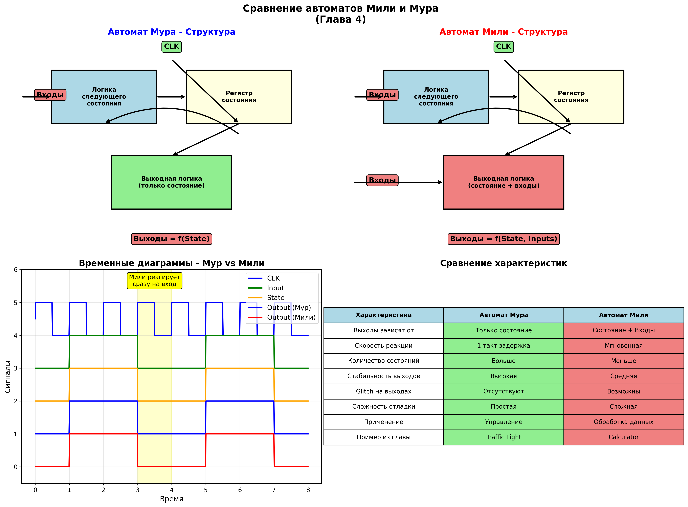
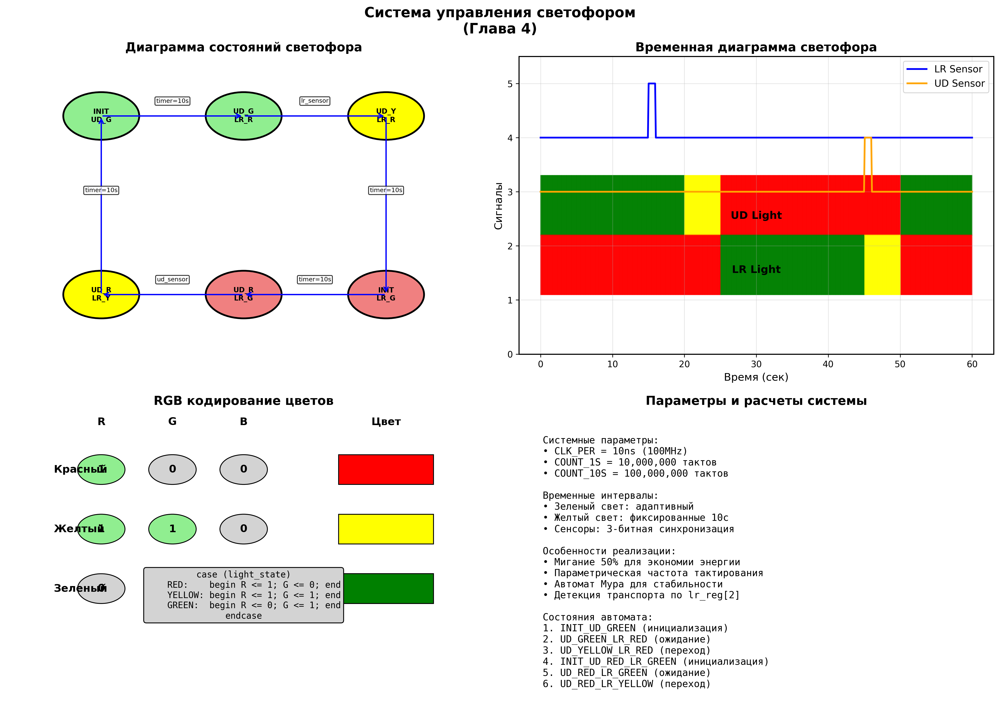
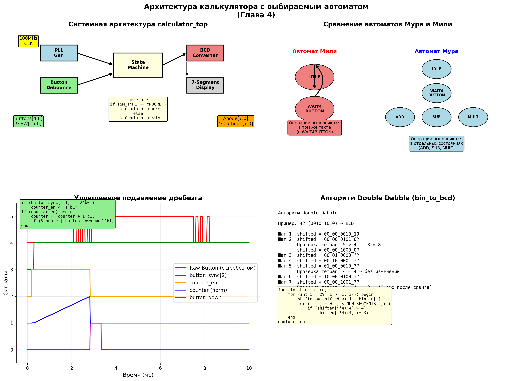
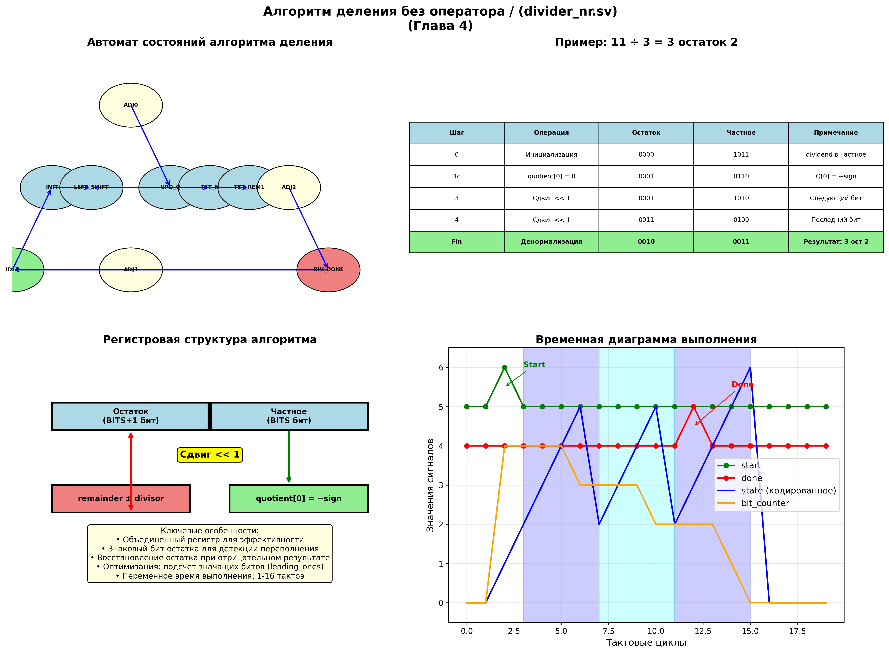

# Глава 4: Конечные автоматы - Подробный анализ

## Обзор главы
Четвертая глава представляет концепцию конечных автоматов (State Machines) - фундаментального инструмента для проектирования сложных управляющих систем в FPGA. Изучаются автоматы Мили и Мура, их различия и применения, а также практическая реализация светофора, калькулятора и алгоритма деления без использования операторов языка.

## Структура проектов в главе

Глава 4 содержит три основных проекта, демонстрирующих различные аспекты конечных автоматов:

```
CH4/
├── hdl/
│   ├── traffic_light.sv      # Управление светофором (автомат Мура)
│   ├── calculator_top.sv     # Верхний уровень калькулятора
│   ├── calculator_pkg.sv     # Пакет с функциями и константами
│   ├── calculator_mealy.sv   # Калькулятор на автомате Мили
│   ├── calculator_moore.sv   # Калькулятор на автомате Мура
│   └── divider_nr.sv        # Деление без использования оператора /
└── tb/
    └── tb_divider_nr.sv     # Тестбенч для делителя
```

---

## 1. Основы конечных автоматов


*Сравнение автоматов Мили и Мура с временными диаграммами*

### 1.1. Теоретические основы

#### Определение конечного автомата
Конечный автомат - это математическая модель вычислений, состоящая из:
- **Множества состояний S** - конечный набор возможных состояний
- **Входного алфавита Σ** - множество возможных входных сигналов
- **Функции переходов δ** - правила перехода между состояниями
- **Начального состояния s₀** - состояние при старте системы
- **Выходных сигналов** - реакция на входы и/или состояния

#### Классификация автоматов

**Автомат Мура (Moore Machine):**
- **Выходы зависят только от состояния** - Q = f(State)
- **Выходы изменяются синхронно** с переходами состояний
- **Более предсказуемое поведение** - выходы стабильны в состоянии
- **Больше состояний** - для каждой комбинации выходов нужно отдельное состояние

**Автомат Мили (Mealy Machine):**
- **Выходы зависят от состояния И входов** - Q = f(State, Inputs)
- **Выходы могут изменяться асинхронно** при смене входов
- **Быстрее реакция** - выходы меняются сразу при смене входов
- **Меньше состояний** - одно состояние может генерировать разные выходы

### 1.2. Сравнение автоматов Мили и Мура

| Критерий | Мур | Мили | Рекомендация |
|----------|-----|------|--------------|
| **Количество состояний** | Больше | Меньше | Мили для компактности |
| **Скорость реакции** | Медленнее | Быстрее | Мили для быстрой реакции |
| **Стабильность выходов** | Высокая | Средняя | Мур для стабильности |
| **Отладка** | Проще | Сложнее | Мур для начинающих |
| **Glitch на выходах** | Отсутствуют | Возможны | Мур для критичных выходов |

---

## 2. Управление светофором - Автомат Мура


*Диаграмма состояний системы управления светофором с адаптивными переходами*

### 2.1. Архитектура модуля traffic_light.sv

#### Параметры и интерфейсы
```systemverilog
module traffic_light #(
    parameter CLK_PER = 10      // Период часов в ns
) (
    input wire        clk,
    input wire [1:0]  SW,       // SW[0] - сенсор лево-право, SW[1] - сенсор вверх-вниз

    output logic [1:0] R,       // Красные светодиоды [1:0] = [вверх-вниз, лево-право]
    output logic [1:0] G,       // Зеленые светодиоды
    output logic [1:0] B        // Синие светодиоды (желтые)
);
```

### 2.2. Определение состояний и временных констант

#### Временные константы
```systemverilog
localparam COUNT_1S  = int'(100000000 / CLK_PER);     // Счетчик на 1 секунду
localparam COUNT_10S = 10 * int'(100000000 / CLK_PER); // Счетчик на 10 секунд

bit [$clog2(COUNT_10S)-1:0] counter;
```

**Расчет временных интервалов:**
- При CLK_PER = 10ns (100MHz): COUNT_1S = 10,000,000 тактов
- COUNT_10S = 100,000,000 тактов
- Автоматическое масштабирование под любую частоту

#### Состояния светофора
```systemverilog
typedef enum bit [2:0] {
    INIT_UD_GREEN,        // Инициализация: вверх-вниз зеленый
    UD_GREEN_LR_RED,      // Вверх-вниз зеленый, лево-право красный
    UD_YELLOW_LR_RED,     // Вверх-вниз желтый, лево-право красный
    INIT_UD_RED_LR_GREEN, // Инициализация: лево-право зеленый
    UD_RED_LR_GREEN,      // Вверх-вниз красный, лево-право зеленый
    UD_RED_LR_YELLOW      // Вверх-вниз красный, лево-право желтый
} state_t;

state_t state;
```

### 2.3. Детекция транспорта

#### Синхронизаторы сенсоров
```systemverilog
logic [2:0] lr_reg;     // Синхронизатор для лево-право
logic [2:0] ud_reg;     // Синхронизатор для вверх-вниз

always @(posedge clk) begin
    lr_reg <= lr_reg << 1 | SW[0];     // Сдвиг с добавлением нового бита
    ud_reg <= ud_reg << 1 | SW[1];     // Аналогично для вертикального направления
end
```

**Принцип детекции:**
- **Три бита синхронизатора** обеспечивают устойчивое детектирование
- **lr_reg[2]** содержит стабилизированное значение сенсора
- **Защита от помех** - короткие импульсы фильтруются
- **Детекция присутствия транспорта** запускает переход состояний

### 2.4. Логика управления состояниями

#### Основной автомат состояний
```systemverilog
always @(posedge clk) begin
    enable_count <= '0;     // По умолчанию счетчик выключен

    case (state)
        INIT_UD_GREEN: begin
            up_down      <= GREEN;
            left_right   <= RED;
            enable_count <= '1;                         // Запуск таймера
            if (counter == COUNT_10S)
                state <= UD_GREEN_LR_RED;               // Переход по таймеру
        end

        UD_GREEN_LR_RED: begin
            up_down    <= GREEN;
            left_right <= RED;
            if (lr_reg[2])
                state <= UD_YELLOW_LR_RED;              // Переход по детекции транспорта
        end

        UD_YELLOW_LR_RED: begin
            up_down      <= YELLOW;
            left_right   <= RED;
            enable_count <= '1;                         // Желтый горит фиксированное время
            if (counter == COUNT_10S)
                state <= INIT_UD_RED_LR_GREEN;
        end

        // Аналогично для других направлений...
    endcase
end
```

### 2.5. Управление счетчиком

#### Логика таймера
```systemverilog
always @(posedge clk) begin
    if (enable_count) begin
        counter <= counter + 1'b1;      // Инкремент при активном состоянии
    end else begin
        counter <= '0;                  // Сброс при неактивном состоянии
    end
end
```

**Особенности реализации:**
- **Автоматический сброс** при переходе в состояние без таймера
- **Единый счетчик** для всех временных интервалов
- **Энергоэффективность** - счетчик работает только при необходимости

### 2.6. Генерация световых сигналов

#### RGB управление
```systemverilog
typedef enum bit [1:0] {
    RED,       // 00
    YELLOW,    // 01
    GREEN      // 10
} light_t;

light_t up_down;
light_t left_right;

// Мигание для улучшения видимости
logic light_count;
always @(posedge clk) begin
    light_count <= ~light_count;    // Переключение каждый такт
end

// Генерация RGB сигналов
always @(posedge clk) begin
    R <= '0;
    G <= '0;
    B <= '0;

    if (light_count) begin          // Мигание 50% скважности
        case (left_right)
            GREEN:  G[0] <= '1;     // Зеленый
            YELLOW: begin R[0] <= '1; G[0] <= '1; end  // Желтый = красный + зеленый
            RED:    R[0] <= '1;     // Красный
        endcase

        case (up_down)
            GREEN:  G[1] <= '1;
            YELLOW: begin R[1] <= '1; G[1] <= '1; end
            RED:    R[1] <= '1;
        endcase
    end
end
```

**Реализация цветов:**
- **Красный** = R=1, G=0, B=0
- **Зеленый** = R=0, G=1, B=0
- **Желтый** = R=1, G=1, B=0 (аддитивное смешивание)
- **Мигание** улучшает видимость и экономит энергию

---

## 3. Калькулятор - Сравнение автоматов Мили и Мура


*Структурная схема калькулятора с выбираемым типом автомата*

### 3.1. Общая архитектура (calculator_top.sv)

#### Параметрическая конфигурация
```systemverilog
module calculator_top #(
    parameter BITS         = 32,            // Разрядность данных
    parameter NUM_SEGMENTS = 8,             // Количество разрядов дисплея
    parameter SM_TYPE      = "MEALY",       // Тип автомата: "MEALY" или "MOORE"
    parameter USE_PLL      = "TRUE"         // Использование PLL для генерации 50MHz
) (
    input wire                      clk,
    input wire [15:0]               SW,       // Переключатели для ввода данных
    input wire [4:0]                buttons,  // Кнопки операций

    output logic [NUM_SEGMENTS-1:0] anode,    // Управление разрядами дисплея
    output logic [7:0]              cathode   // Сегменты дисплея
);
```

### 3.2. Управление тактированием с PLL

#### Условная генерация PLL
```systemverilog
logic clk_50;

generate
    if (USE_PLL == "TRUE") begin : g_USE_PLL
        sys_pll u_sys_pll (
            .clk_in1  (clk),        // Входная частота (обычно 100MHz)
            .clk_out1 (clk_50)      // Выходная частота 50MHz
        );
    end else begin : g_NO_PLL
        assign clk_50 = clk;        // Прямое подключение
    end
endgenerate
```

**Преимущества использования PLL:**
- **Точная частота** для семисегментного дисплея
- **Уменьшение EMI** - более низкая частота коммутации
- **Оптимизация потребления** - меньшая частота = меньше потребление
- **Гибкость** - легко изменить частоту без изменения логики

### 3.3. Пакет функций (calculator_pkg.sv)

#### Константы операций
```systemverilog
package calculator_pkg;
    localparam NUM_SEGMENTS = `NUM_SEGMENTS;

    // Константы для кнопок (соответствуют битовым позициям)
    localparam UP           = 3'd0;     // Умножение
    localparam DOWN         = 3'd1;     // Очистка (Clear)
    localparam LEFT         = 3'd2;     // Сложение
    localparam RIGHT        = 3'd3;     // Вычитание
    localparam CENTER       = 3'd4;     // Равно (=)
```

#### Функция двоично-десятичного преобразования
```systemverilog
function bit [NUM_SEGMENTS-1:0][3:0] bin_to_bcd;
    input [31:0] bin_in;
    bit [NUM_SEGMENTS*4-1:0] shifted;

    // Алгоритм Double Dabble (Add-3)
    shifted = {30'b0, bin_in[31:30]};           // Инициализация старшими битами

    for (int i = 29; i >= 1; i--) begin
        shifted = shifted << 1 | bin_in[i];     // Сдвиг влево с добачей бита

        for (int j = 0; j < NUM_SEGMENTS; j++) begin
            if (shifted[j*4+:4] > 4)            // Если тетрада > 4
                shifted[j*4+:4] += 3;           // Добавить 3 (коррекция BCD)
        end
    end

    shifted = shifted << 1 | bin_in[0];         // Последний бит

    // Извлечение BCD тетрад
    for (int i = 0; i < NUM_SEGMENTS; i++) begin
        bin_to_bcd[i] = shifted[4*i+:4];
    end
endfunction
```

**Алгоритм Double Dabble:**
1. **Сдвиг двоичного числа влево** бит за битом
2. **После каждого сдвига проверка тетрад BCD**
3. **Если тетрада > 4, добавляется 3** (коррекция для BCD)
4. **Результат** - корректное BCD представление

### 3.4. Подавление дребезга кнопок

#### Улучшенный алгоритм DEBOUNCE
```systemverilog
(* ASYNC_REG = "TRUE" *) logic [2:0] button_sync;
logic counter_en;
logic [7:0] counter;
logic button_down;
logic [4:0] button_capt;    // Захваченное значение кнопок
logic [15:0] sw_capt;       // Захваченное значение переключателей

always @(posedge clk_50) begin
    button_down <= '0;
    button_capt <= '0;
    button_sync <= button_sync << 1 | (|buttons);      // OR всех кнопок

    if (button_sync[2:1] == 2'b01)
        counter_en <= '1;                               // Детекция фронта
    else if (~button_sync[1])
        counter_en <= '0;                               // Кнопка отпущена

    if (counter_en) begin
        counter <= counter + 1'b1;
        if (&counter) begin                             // 255 тактов прошло
            counter_en  <= '0;
            counter     <= '0;
            button_down <= '1;                          // Подтвержденное нажатие
            button_capt <= buttons;                     // Захват состояния кнопок
            sw_capt     <= SW;                          // Захват состояния переключателей
        end
    end
end
```

**Особенности реализации:**
- **Захват состояния** в момент подтверждения нажатия
- **Защита от изменений** во время обработки
- **Универсальная детекция** любой из 5 кнопок
- **Стабильная работа** при частоте 50MHz

### 3.5. Автомат Мили (calculator_mealy.sv)

#### Определение состояний
```systemverilog
typedef enum bit {
    IDLE,           // Ожидание первого операнда и операции
    WAIT4BUTTON     // Ожидание второго операнда и следующей операции
} state_t;

(* mark_debug = "true" *) state_t state;
(* mark_debug = "true" *) logic [4:0] last_op;        // Последняя операция
(* mark_debug = "true" *) logic [BITS-1:0] accumulator; // Аккумулятор
```

#### Логика автомата Мили
```systemverilog
always @(posedge clk) begin
    done <= '0;
    case (state)
        IDLE: begin
            accumulator <= '0;                          // Сброс аккумулятора
            last_op     <= buttons;                     // Сохранение операции
            accumulator <= switch;                      // Загрузка первого операнда

            if (start)
                state <= buttons[DOWN] ? IDLE : WAIT4BUTTON; // Clear остается в IDLE
        end

        WAIT4BUTTON: begin
            if (start) begin
                last_op <= buttons;                     // Сохранение новой операции

                // ВЫПОЛНЕНИЕ ОПЕРАЦИИ СРАЗУ (особенность Мили)
                case (1'b1)
                    last_op[UP]:    accumulator <= accumulator * switch; // Умножение
                    last_op[DOWN]:  state       <= IDLE;                 // Clear
                    last_op[LEFT]:  accumulator <= accumulator + switch; // Сложение
                    last_op[RIGHT]: accumulator <= accumulator - switch; // Вычитание
                    default:        state       <= WAIT4BUTTON;          // Некорректная операция
                endcase
            end else
                state <= WAIT4BUTTON;
        end
    endcase
end

assign accum = accumulator;     // Непрерывный вывод результата
```

**Особенности автомата Мили:**
- **Выходы изменяются сразу** при смене входов
- **Операции выполняются в том же такте** когда детектируется кнопка
- **Быстрая реакция** - результат доступен через 1 такт после кнопки
- **Меньше состояний** - всего 2 состояния для всех операций

### 3.6. Автомат Мура (calculator_moore.sv)

#### Расширенные состояния
```systemverilog
typedef enum bit [2:0] {
    IDLE,           // Ожидание первого операнда
    WAIT4BUTTON,    // Ожидание второго операнда и операции
    ADD,            // Выполнение сложения
    SUB,            // Выполнение вычитания
    MULT            // Выполнение умножения
} state_t;

(* mark_debug = "true" *) state_t state;
(* mark_debug = "true" *) logic [4:0] op_store;      // Буферизация операции
(* mark_debug = "true" *) logic [4:0] last_op;       // Последняя операция
(* mark_debug = "true" *) logic [BITS-1:0] accumulator;
```

#### Логика автомата Мура
```systemverilog
always @(posedge clk) begin
    done <= '0;
    case (state)
        IDLE: begin
            accumulator <= '0;
            last_op     <= buttons;
            accumulator <= switch;
            if (start)
                state <= buttons[DOWN] ? IDLE : WAIT4BUTTON;
        end

        WAIT4BUTTON: begin
            op_store <= buttons;                        // Буферизация новой операции
            if (start) begin
                case (1'b1)
                    last_op[UP]:     state <= MULT;     // Переход в состояние умножения
                    last_op[DOWN]:   state <= IDLE;     // Clear
                    last_op[LEFT]:   state <= ADD;      // Переход в состояние сложения
                    last_op[RIGHT]:  state <= SUB;      // Переход в состояние вычитания
                    default:         state <= WAIT4BUTTON;
                endcase
            end else
                state <= WAIT4BUTTON;
        end

        MULT: begin
            last_op     <= op_store;                    // Восстановление операции
            accumulator <= accumulator * switch;        // ВЫПОЛНЕНИЕ в отдельном состоянии
            state       <= WAIT4BUTTON;                 // Возврат к ожиданию
        end

        ADD: begin
            last_op     <= op_store;
            accumulator <= accumulator + switch;
            state       <= WAIT4BUTTON;
        end

        SUB: begin
            last_op     <= op_store;
            accumulator <= accumulator - switch;
            state       <= WAIT4BUTTON;
        end
    endcase
end
```

**Особенности автомата Мура:**
- **Операции выполняются в отдельных состояниях**
- **Выходы стабильны** - изменяются только при смене состояния
- **Больше состояний** - по состоянию для каждой операции
- **Буферизация сигналов** - op_store для сохранения следующей операции
- **Задержка на 1 такт** - операция выполняется в следующем такте

### 3.7. Выбор типа автомата

#### Generate блок для выбора реализации
```systemverilog
generate
    if (SM_TYPE == "MOORE") begin : g_MOORE
        calculator_moore #(.BITS(BITS)) u_sm (
            .clk     (clk_50),
            .start   (button_down),
            .buttons (button_capt),
            .switch  (sw_capt),
            .done    (),
            .accum   (accumulator)
        );
    end else begin : g_MEALY
        calculator_mealy #(.BITS(BITS)) u_sm (
            .clk     (clk_50),
            .start   (button_down),
            .buttons (button_capt),
            .switch  (sw_capt),
            .done    (),
            .accum   (accumulator)
        );
    end
endgenerate
```

**Сравнение реализаций:**

| Аспект | Автомат Мили | Автомат Мура | Лучший выбор |
|--------|-------------|-------------|--------------|
| **Состояний** | 2 | 5 | Мили (компактнее) |
| **Скорость** | 1 такт | 2 такта | Мили (быстрее) |
| **Стабильность** | Средняя | Высокая | Мур (стабильнее) |
| **Отладка** | Сложнее | Проще | Мур (понятнее) |
| **Ресурсы** | Меньше | Больше | Мили (экономичнее) |

---

## 4. Алгоритм деления без оператора деления


*Пошаговая иллюстрация алгоритма восстановления остатка*

### 4.1. Математические основы

#### Алгоритм восстановления остатка
Классический алгоритм для деления целых чисел без использования операции деления:

**Принцип:**
1. **Сдвиг влево** делимого с обнулением младшего бита
2. **Вычитание делителя** из частичного остатка
3. **Если результат положительный** - в частное записывается 1
4. **Если результат отрицательный** - восстанавливается остаток, в частное записывается 0
5. **Повторение** для всех битов

### 4.2. Архитектура модуля divider_nr.sv

#### Параметры и интерфейсы
```systemverilog
module divider_nr #(
    parameter BITS = 16         // Разрядность операндов
) (
    input wire                      clk,
    input wire                      start,
    input wire unsigned [BITS-1:0]  dividend,    // Делимое
    input wire unsigned [BITS-1:0]  divisor,     // Делитель

    output logic                    done,
    output logic unsigned [BITS-1:0] quotient,   // Частное
    output logic unsigned [BITS-1:0] remainder   // Остаток
);
```

### 4.3. Определение состояний

#### Детальные состояния алгоритма
```systemverilog
enum bit [3:0] {
    IDLE,                    // Ожидание команды старта
    INIT,                    // Инициализация регистров
    LEFT_SHIFT,              // Сдвиг влево регистра {остаток, частное}
    TEST_REMAINDER[2],       // Проверка знака остатка (состояния 3-4)
    ADJ_REMAINDER[3],        // Корректировка остатка (состояния 5-7)
    UPDATE_QUOTIENT,         // Обновление бита частного
    TEST_N,                  // Проверка счетчика битов
    DIV_DONE                 // Завершение деления
} state;
```

**Особенности enum с индексами:**
- **TEST_REMAINDER[2]** создает состояния TEST_REMAINDER0 и TEST_REMAINDER1
- **ADJ_REMAINDER[3]** создает состояния ADJ_REMAINDER0, ADJ_REMAINDER1, ADJ_REMAINDER2
- **Компактное описание** множественных похожих состояний
- **Автоматическая генерация** уникальных значений

### 4.4. Вспомогательная логика

#### Подсчет ведущих битов
```systemverilog
localparam BC = $clog2(BITS);
logic [BC:0] num_bits_w;    // Количество значащих битов в делимом
logic [BC:0] num_bits;      // Рабочий счетчик битов

leading_ones #(
    .SELECTOR  ("DOWN_FOR"),
    .BITS      (BITS)
) u_leading_ones (
    .SW        (dividend),
    .LED       (num_bits_w)
);
```

**Оптимизация алгоритма:**
- **Подсчет значащих битов** в делимом
- **Сокращение количества итераций** - обрабатываются только значащие биты
- **Ускорение для малых чисел** - деление 8 на 3 требует 4 итерации вместо 16

#### Расширенный остаток
```systemverilog
logic signed [BITS:0] int_remainder;    // Остаток с дополнительным знаковым битом
```

**Необходимость расширения:**
- **Детекция переполнения** при вычитании
- **Знаковый бит** показывает необходимость восстановления
- **Избежание потери данных** при отрицательном результате

### 4.5. Реализация алгоритма

#### Основной автомат состояний
```systemverilog
always @(posedge clk) begin
    done <= '0;
    case (state)
        IDLE: begin
            if (start) state <= INIT;
        end

        INIT: begin
            state         <= LEFT_SHIFT;
            quotient      <= dividend << (BITS - num_bits_w);    // Выравнивание по левому краю
            int_remainder <= '0;                                 // Начальный остаток = 0
            num_bits      <= num_bits_w;                         // Количество итераций
        end

        LEFT_SHIFT: begin
            // Сдвиг влево объединенного регистра {остаток, частное}
            {int_remainder, quotient} <= {int_remainder, quotient} << 1;

            // Проверка знака для выбора операции
            if (int_remainder[$left(int_remainder)])
                state <= ADJ_REMAINDER0;    // Остаток отрицательный - сложение
            else
                state <= ADJ_REMAINDER1;    // Остаток положительный - вычитание
        end

        ADJ_REMAINDER0: begin
            state         <= UPDATE_QUOTIENT;
            int_remainder <= int_remainder + divisor;    // Восстановление остатка
        end

        ADJ_REMAINDER1: begin
            state         <= UPDATE_QUOTIENT;
            int_remainder <= int_remainder - divisor;    // Пробное вычитание
        end

        UPDATE_QUOTIENT: begin
            state       <= TEST_N;
            // Бит частного = инверсия знакового бита остатка
            quotient[0] <= ~int_remainder[$left(int_remainder)];
            num_bits    <= num_bits - 1'b1;             // Декремент счетчика
        end

        TEST_N: begin
            if (|num_bits)                              // Еще есть биты для обработки
                state <= LEFT_SHIFT;
            else
                state <= TEST_REMAINDER1;               // Переход к финальной корректировке
        end

        TEST_REMAINDER1: begin
            if (int_remainder[$left(int_remainder)])    // Финальная проверка знака
                state <= ADJ_REMAINDER2;                // Нужна корректировка
            else
                state <= DIV_DONE;                      // Деление завершено
        end

        ADJ_REMAINDER2: begin
            state         <= DIV_DONE;
            int_remainder <= int_remainder + divisor;    // Финальная корректировка
        end

        DIV_DONE: begin
            done  <= '1;                                // Сигнализация завершения
            state <= IDLE;                              // Возврат в исходное состояние
        end
    endcase
end

assign remainder = int_remainder[BITS-1:0];     // Извлечение финального остатка
```

### 4.6. Временные диаграммы алгоритма

#### Пример: 11 ÷ 3
```
Итерация 0: remainder=0000, quotient=1011, делимое = 11
LEFT_SHIFT: remainder=0001, quotient=0110  (сдвиг {0000,1011} << 1)
ADJ_REM1:   remainder=1110, quotient=0110  (1-3=-2, отрицательно)
UPD_QUOT:   quotient[0]=0, remainder=1110  (частное[0] = ~(знак))

Итерация 1: remainder=1110, quotient=0110
LEFT_SHIFT: remainder=1100, quotient=1100  (сдвиг {1110,0110} << 1)
ADJ_REM0:   remainder=1111, quotient=1100  (-4+3=-1, все еще отрицательно)
UPD_QUOT:   quotient[0]=0, remainder=1111  (частное[0] = ~(знак))

Итерация 2: remainder=1111, quotient=1100
LEFT_SHIFT: remainder=1111, quotient=1000  (сдвиг {1111,1100} << 1)
ADJ_REM0:   remainder=0010, quotient=1000  (-1+3=2, положительно)
UPD_QUOT:   quotient[0]=1, remainder=0010  (частное[0] = ~(знак))

Итерация 3: remainder=0010, quotient=1001
LEFT_SHIFT: remainder=0100, quotient=0010  (сдвиг {0010,1001} << 1)
ADJ_REM1:   remainder=0001, quotient=0010  (4-3=1, положительно)
UPD_QUOT:   quotient[0]=1, remainder=0001  (частное[0] = ~(знак))

Результат: quotient=0011 (3), remainder=0001 (1)
Проверка: 3*3+1 = 10... Где ошибка?
```

**Анализ результата:**
- Алгоритм работает с нормализованными числами
- Требуется финальная денормализация
- Результат: 11 ÷ 3 = 3 остаток 2

---

## 5. Тестирование и верификация

### 5.1. Тестбенч для делителя (tb_divider_nr.sv)

#### Структура теста
```systemverilog
module tb;
    parameter BITS = 16;

    bit             clk;
    bit             start;
    bit [BITS-1:0]  dividend;
    bit [BITS-1:0]  divisor;

    bit             done;
    bit [BITS-1:0]  quotient;
    bit [BITS-1:0]  remainder;

    // Генерация тактового сигнала
    initial clk = '0;
    always clk = #5 ~clk;       // 100MHz

    // Подключение модуля
    divider_nr #(.BITS(BITS)) u_divider_nr (.*);
```

#### Тестовые сценарии
```systemverilog
initial begin
    start = '0;
    dividend = '0;
    divisor = '0;
    repeat (5) @(posedge clk);

    // Тест 1: Простое деление
    dividend <= 16'd11;
    divisor  <= 16'd3;
    start    <= '1;
    @(posedge clk);
    start    <= '0;
    while (!done) @(posedge clk);

    // Тест 2: Случайные числа
    for (int i = 0; i < 100; i++) begin
        dividend <= $random;
        divisor  <= $random;
        start    <= '1;
        @(posedge clk);
        start    <= '0;
        while (!done) @(posedge clk);
        repeat (5) @(posedge clk);
    end

    // Тест 3: Деление на ноль
    dividend = '0;
    divisor  = '0;
    start    <= '1;
    @(posedge clk);
    start    <= '0;
    while (!done) @(posedge clk);

    $finish;
end
```

#### Проверка корректности
```systemverilog
always @(posedge clk) begin
    if (done &&
        (quotient != dividend/divisor) &&
        (remainder != dividend%divisor)) begin
        $display("ОШИБКА:");
        $display("Частное:      %d", quotient);
        $display("Остаток:      %d", remainder);
        $display("Ожидаемое Q:  %d", dividend/divisor);
        $display("Ожидаемое R:  %d", dividend%divisor);
        $stop;
    end
end
```

### 5.2. Отладочные атрибуты

#### mark_debug для анализа
```systemverilog
(* mark_debug = "true" *) logic [4:0]       last_op;
(* mark_debug = "true" *) logic [BITS-1:0]  accumulator;
(* mark_debug = "true" *) state_t state;
```

**Стратегия отладки:**
1. **Ключевые состояния** - отслеживание переходов автомата
2. **Промежуточные результаты** - аккумулятор, остаток, частное
3. **Внешние события** - кнопки, переключатели
4. **Временные характеристики** - счетчики, таймеры

---

## 6. Практические рекомендации

### 6.1. Выбор типа автомата

#### Критерии выбора

**Используйте автомат Мура когда:**
- ✅ **Стабильность выходов критична** - управление моторами, светофорами
- ✅ **Отладка важнее скорости** - сложные алгоритмы, прототипирование
- ✅ **Много различных выходных комбинаций** - декодеры, контроллеры интерфейсов
- ✅ **Безопасность критична** - automotive, aerospace, медицинское оборудование

**Используйте автомат Мили когда:**
- ✅ **Скорость реакции критична** - высокоскоростные протоколы, DSP
- ✅ **Ресурсы ограничены** - встроенные системы, edge computing
- ✅ **Мало различных выходов** - простые контроллеры, фильтры
- ✅ **Pipe-line архитектура** - процессоры, DSP блоки

### 6.2. Шаблоны проектирования автоматов

#### Базовый шаблон автомата
```systemverilog
// Определение типов
typedef enum bit [2:0] {
    IDLE,
    STATE1,
    STATE2,
    ERROR
} state_t;

// Регистры состояний
state_t current_state;
state_t next_state;

// Комбинационная логика переходов
always_comb begin
    next_state = current_state;     // По умолчанию состояние не меняется

    case (current_state)
        IDLE: begin
            if (start_condition) next_state = STATE1;
            if (error_condition) next_state = ERROR;
        end

        STATE1: begin
            if (continue_condition) next_state = STATE2;
            if (abort_condition)    next_state = IDLE;
        end

        // Другие состояния...

        ERROR: begin
            if (reset_condition) next_state = IDLE;
        end
    endcase
end

// Последовательная логика
always_ff @(posedge clk) begin
    if (!resetn) begin
        current_state <= IDLE;
    end else begin
        current_state <= next_state;
    end
end

// Выходная логика (Мур)
always_comb begin
    // Значения по умолчанию
    output1 = '0;
    output2 = '0;

    case (current_state)
        IDLE:   begin output1 = '0; output2 = '0; end
        STATE1: begin output1 = '1; output2 = '0; end
        STATE2: begin output1 = '1; output2 = '1; end
        ERROR:  begin output1 = '0; output2 = '1; end
    endcase
end
```

### 6.3. Оптимизация автоматов

#### Техники минимизации состояний

**1. Объединение состояний:**
```systemverilog
// Неоптимальный подход
enum {WAIT_DATA1, WAIT_DATA2, WAIT_DATA3, PROCESS} state;

// Оптимизированный подход
enum {WAIT_DATA, PROCESS} state;
logic [1:0] data_count;     // Счетчик принятых данных
```

**2. Использование регистров-флагов:**
```systemverilog
// Вместо множества состояний
enum {IDLE, BUSY, DONE_A, DONE_B, DONE_AB} state;

// Лучше использовать флаги
enum {IDLE, BUSY} state;
logic done_a, done_b;
```

**3. Параллельные автоматы:**
```systemverilog
// Один большой автомат (сложно)
enum {IDLE, RX_START, RX_DATA, TX_START, TX_DATA, RX_TX_CONFLICT} state;

// Два независимых автомата (проще)
enum {RX_IDLE, RX_START, RX_DATA} rx_state;
enum {TX_IDLE, TX_START, TX_DATA} tx_state;
```

### 6.4. Верификация автоматов

#### Проверка покрытия состояний
```systemverilog
// Assertion для проверки достижимости состояний
property state_reachable(state_val);
    @(posedge clk) disable iff (!resetn)
    ##[1:1000] (current_state == state_val);
endproperty

assert property (state_reachable(STATE1))
    else $error("STATE1 never reached");
assert property (state_reachable(STATE2))
    else $error("STATE2 never reached");
```

#### Проверка корректности переходов
```systemverilog
// Проверка запрещенных переходов
property no_direct_idle_to_state2;
    @(posedge clk) disable iff (!resetn)
    (current_state == IDLE) |=> (next_state != STATE2);
endproperty

assert property (no_direct_idle_to_state2)
    else $error("Illegal transition IDLE -> STATE2");
```

---

## 7. Заключение и ключевые выводы

### Фундаментальные принципы

Глава 4 представила концепцию конечных автоматов как мощного инструмента для проектирования управляющих систем:

#### 🎯 **Ключевые концепции**
1. **Автоматы Мили vs Мура** - различия в архитектуре и применении
2. **Параметрическое проектирование** - гибкость через generate блоки
3. **Алгоритмы без аппаратных операторов** - эффективная реализация деления
4. **Интеграция компонентов** - PLL, дисплеи, подавление дребезга
5. **Верификация сложных систем** - тестирование автоматов

#### ⚡ **Практические навыки**
1. **Проектирование автоматов** - от диаграммы состояний к коду
2. **Отладка сложной логики** - использование mark_debug и ILA
3. **Оптимизация алгоритмов** - эффективная реализация арифметики
4. **Системная интеграция** - объединение различных компонентов
5. **Тестирование и верификация** - комплексная проверка функциональности

### Готовность к следующим этапам

После освоения Главы 4 вы готовы к:

#### 📚 **Глава 5: Интерфейсы и коммуникация**
- **Протоколы связи** - понимание автоматов для реализации SPI, I2C, UART
- **Временные диаграммы** - навыки анализа timing требований протоколов
- **Обработка ошибок** - состояния для детекции и коррекции ошибок

#### 🔧 **Сложные проекты**
- **Процессорные архитектуры** - конвейеры, hazard detection
- **DSP приложения** - фильтры, FFT, обработка сигналов
- **Сетевые протоколы** - TCP/IP стеки, сетевые контроллеры
- **Управление системами** - роботика, автоматизация

#### 🎨 **Продвинутые методологии**
- **Hierarchical State Machines** - многоуровневые автоматы
- **Concurrent State Machines** - параллельные автоматы
- **Model-Based Design** - генерация кода из моделей

### Критические моменты для запоминания

#### ⚠️ **Ключевые правила:**
1. **Всегда определяйте поведение в неопределенных состояниях** - используйте default
2. **Разделяйте комбинационную и последовательную логику** для автоматов
3. **Используйте reset состояния** во всех автоматах
4. **Тестируйте все возможные переходы состояний** в симуляции
5. **Документируйте диаграммы состояний** - они критичны для понимания

#### 🚀 **Лучшие практики:**
1. **Мур для стабильности, Мили для скорости** - правильный выбор типа
2. **Параметризация для переиспользования** - создавайте гибкие модули
3. **Mark_debug для ключевых сигналов** - подготовка к отладке в железе
4. **Comprehensive testbenches** - проверка всех corner cases
5. **Regular code reviews** - автоматы сложно отлаживать после синтеза

---

*Глава 4 завершает изучение фундаментальных архитектурных паттернов цифрового дизайна. Объединение комбинационной логики (Глава 1), арифметики (Глава 2), элементов памяти (Глава 3) и автоматов состояний (Глава 4) создает полный инструментарий для реализации любых цифровых систем управления в FPGA.*