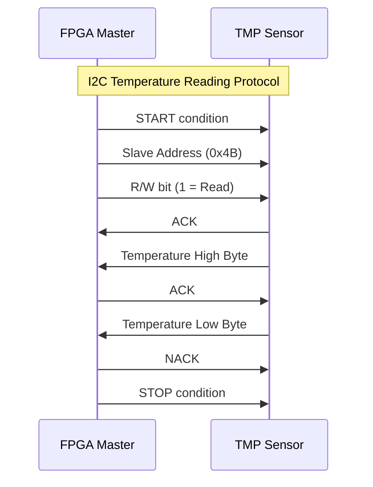

# Глава 5: Интерфейсы и протоколы связи - Подробный анализ

## Обзор главы
Пятая глава знакомит с реальными интерфейсами связи, используемыми в современных цифровых системах. Изучаются два фундаментально разных подхода к передаче данных: протокол I2C для взаимодействия с датчиками температуры и PDM (Pulse Density Modulation) для работы с аудиосигналами. Глава демонстрирует практическое применение конечных автоматов для реализации сложных временных протоколов и введение в цифровую обработку сигналов.

## Структура проектов в главе

Глава 5 содержит два основных проекта, представляющих различные подходы к интерфейсам связи:

```
CH5/
├── hdl/
│   ├── temp_pkg.sv          # Пакет с функциями температурного сенсора
│   ├── i2c_temp.sv          # I2C контроллер для датчика температуры
│   ├── pdm_top.sv           # Верхний уровень PDM аудиосистемы
│   ├── pdm_inputs.sv        # PDM захват аудио с микрофона
│   └── pdm_output.sv        # PDM воспроизведение аудио
└── tb/
    ├── tb_temp.sv           # Тестбенч для температурного сенсора
    └── tb_pdm.sv            # Тестбенч для PDM системы
```

---

## 1. Основы протоколов связи

### 1.1. Классификация интерфейсов

#### Синхронные vs Асинхронные протоколы

**Синхронные протоколы (I2C, SPI):**
- **Dedicated clock line** - отдельная линия тактирования
- **Синхронизация данных** - данные изменяются по фронту часов
- **Детерминированный timing** - предсказуемые временные характеристики
- **Простая реализация** - меньше сложности в приемнике

**Асинхронные протоколы (UART, PDM):**
- **Embedded timing** - тактирование заложено в данные
- **Clock recovery** - восстановление часов из потока данных
- **Гибкость скорости** - адаптация к различным частотам
- **Сложная реализация** - требует буферизации и фильтрации

#### Последовательные vs Параллельные интерфейсы

**Последовательные (I2C, PDM, UART):**
- **Минимум проводов** - экономия выводов корпуса
- **Высокие скорости** - меньше проблем с cross-talk
- **Большие расстояния** - лучшая помехозащищенность
- **Протокольная сложность** - необходимость сериализации/десериализации

**Параллельные (Traditional memory bus):**
- **Высокая пропускная способность** - передача нескольких битов одновременно
- **Простая логика** - прямое соответствие шин данных
- **Короткие расстояния** - проблемы синхронизации на высоких частотах
- **Много выводов** - дорогие корпуса и платы

---

## 2. I2C протокол и работа с датчиком температуры



### 2.1. Архитектура модуля i2c_temp.sv

#### Параметры и временные константы
```systemverilog
module i2c_temp #(
    parameter  SMOOTHING    = 16,        // Количество отсчетов для сглаживания
    parameter  INTERVAL     = 1000000000,// Интервал между измерениями (ns)
    parameter  NUM_SEGMENTS = 8,         // Количество разрядов дисплея
    parameter  CLK_PER      = 10         // Период системных часов (ns)
) (
    input wire                      clk, // 100MHz системные часы

    // Интерфейс датчика температуры
    inout wire                      TMP_SCL, // I2C тактирование
    inout wire                      TMP_SDA, // I2C данные
    inout wire                      TMP_INT, // Прерывание температуры (не используется)
    inout wire                      TMP_CT,  // Критическая температура (не используется)

    // 7-сегментный дисплей
    output logic [NUM_SEGMENTS-1:0] anode,   // Управление разрядами
    output logic [7:0]              cathode  // Сегменты дисплея
);
```

#### Расчет временных параметров I2C
```systemverilog
localparam TIME_1SEC   = int'(INTERVAL/CLK_PER);    // Тактов в 1 секунде
localparam TIME_THDSTA = int'(600/CLK_PER);         // Hold time START (600ns)
localparam TIME_TSUSTA = int'(600/CLK_PER);         // Setup time START (600ns)
localparam TIME_THIGH  = int'(600/CLK_PER);         // Clock HIGH time (600ns)
localparam TIME_TLOW   = int'(1300/CLK_PER);        // Clock LOW time (1300ns)
localparam TIME_TSUDAT = int'(20/CLK_PER);          // Data setup time (20ns)
localparam TIME_TSUSTO = int'(600/CLK_PER);         // Setup time STOP (600ns)
localparam TIME_THDDAT = int'(30/CLK_PER);          // Data hold time (30ns)
```

**Соответствие стандарту I2C:**
- **Standard Mode (100 kHz)** - TIME_TLOW = 4.7μs, TIME_THIGH = 4.0μs
- **Fast Mode (400 kHz)** - TIME_TLOW = 1.3μs, TIME_THIGH = 0.6μs
- **Данная реализация** соответствует Fast Mode requirements

### 2.2. Формат данных I2C транзакции

#### Структура I2C пакета
```systemverilog
localparam I2C_ADDR = 7'b1001011;     // Адрес датчика TMP102 (0x4B)
localparam I2CBITS = 1 +              // START condition
                     7 +              // 7 битов адреса устройства
                     1 +              // 1 бит Read/Write (1 = чтение)
                     1 +              // 1 бит ACK от slave
                     8 +              // 8 битов старшего байта температуры
                     1 +              // 1 бит ACK от master
                     8 +              // 8 битов младшего байта температуры
                     1 +              // 1 бит NACK от master (последний байт)
                     1 + 1;           // STOP condition
// Итого: 30 битов
```

#### Инициализация массивов управления
```systemverilog
always @(posedge clk) begin
    case (spi_state)
        IDLE: begin
            // Формирование данных для передачи
            i2c_data  <= {1'b0,        // START bit
                          I2C_ADDR,    // Адрес 0x4B
                          1'b1,        // Read operation
                          1'b0,        // ACK от slave
                          8'b00,       // Старший байт (получаем)
                          1'b0,        // ACK от master
                          8'b00,       // Младший байт (получаем)
                          1'b1,        // NACK от master
                          1'b0,        // STOP bit
                          1'b1};       // Idle state

            // Маска разрешения передачи (0 = master передает, 1 = slave передает)
            i2c_en    <= {1'b1,        // START: master
                          7'h7F,       // Адрес: master передает
                          1'b1,        // R/W: master передает
                          1'b0,        // ACK: slave отвечает
                          8'b00,       // Данные: slave передает
                          1'b1,        // ACK: master отвечает
                          8'b00,       // Данные: slave передает
                          1'b1,        // NACK: master отвечает
                          1'b1,        // STOP: master
                          1'b1};       // Idle: master

            // Маска захвата данных (1 = сохранить бит в temp_data)
            i2c_capt  <= {1'b0,        // START: не захватывать
                          7'h00,       // Адрес: не захватывать
                          1'b0,        // R/W: не захватывать
                          1'b0,        // ACK: не захватывать
                          8'hFF,       // Данные: захватывать все биты
                          1'b0,        // ACK: не захватывать
                          8'hFF,       // Данные: захватывать все биты
                          1'b0,        // NACK: не захватывать
                          1'b0,        // STOP: не захватывать
                          1'b0};       // Idle: не захватывать
        end
    endcase
end
```

### 2.3. Конечный автомат I2C протокола

#### Определение состояний
```systemverilog
typedef enum bit [2:0] {
    IDLE,      // Ожидание времени следующего измерения
    START,     // Генерация START condition
    TLOW,      // Clock LOW phase
    TSU,       // Data setup time
    THIGH,     // Clock HIGH phase (захват данных)
    THD,       // Data hold time
    TSTO       // Генерация STOP condition
} spi_t;
```

#### Управление двунаправленными сигналами
```systemverilog
// Open-drain реализация I2C
assign TMP_SCL = scl_en ? 'z : '0;    // 'z = high impedance (pull-up), '0 = drive low
assign TMP_SDA = sda_en ? 'z : '0;    // Аналогично для данных

// Формирование управляющих сигналов
always @(posedge clk) begin
    scl_en <= '1;  // По умолчанию SCL = high impedance

    // SDA управляется данными и направлением передачи
    sda_en <= ~i2c_en[I2CBITS - bit_count - 1] |      // 0 если master передает
              i2c_data[I2CBITS - bit_count - 1];      // Данные если master передает
end
```

**Принцип open-drain:**
- **'z (high impedance)** - линия подтягивается к VCC через pull-up резистор
- **'0 (drive low)** - активно притягивается к GND
- **Wired-AND логика** - любое устройство может "притянуть" линию к 0

### 2.4. Реализация автомата протокола

#### Состояние IDLE - Ожидание измерения
```systemverilog
IDLE: begin
    // Инициализация массивов управления (см. выше)
    bit_count <= '0;
    sda_en    <= '1;                    // SDA в состоянии покоя (HIGH)

    if (counter == TIME_1SEC) begin
        temp_data     <= '0;            // Очистка буфера данных
        spi_state     <= START;         // Переход к началу транзакции
        counter_reset <= '1;            // Сброс счетчика времени
        sda_en        <= '0;            // Начало START condition (SDA LOW)
    end
end
```

#### Состояние START - Генерация START condition
```systemverilog
START: begin
    sda_en <= '0;                       // Удержание SDA LOW

    if (counter == TIME_THDSTA) begin   // Hold time for START
        counter_reset <= '1;
        scl_en        <= '0;            // Опускание SCL для начала передачи данных
        spi_state     <= TLOW;
    end
end
```

**START condition в I2C:**
- SDA переходит с HIGH на LOW пока SCL = HIGH
- Сигнализирует всем устройствам о начале транзакции

#### Состояния передачи данных
```systemverilog
TLOW: begin
    scl_en <= '0';                      // SCL удерживается LOW
    if (counter == TIME_TLOW) begin
        bit_count     <= bit_count + 1'b1;  // Переход к следующему биту
        counter_reset <= '1;
        spi_state     <= TSU;           // Переход к setup времени
    end
end

TSU: begin
    scl_en <= '0';                      // SCL все еще LOW, готовим данные
    if (counter == TIME_TSUSTA) begin
        counter_reset <= '1;
        spi_state     <= THIGH;         // Поднимаем SCL для захвата данных
    end
end

THIGH: begin
    scl_en <= '1';                      // SCL HIGH - данные захватываются
    if (counter == TIME_THIGH) begin
        if (capture_en)
            temp_data <= temp_data << 1 | TMP_SDA;  // Захват бита данных
        counter_reset <= '1;
        spi_state     <= THD;           // Переход к hold времени
    end
end

THD: begin
    scl_en <= '0';                      // SCL обратно LOW
    if (counter == TIME_THDDAT) begin
        counter_reset <= '1;
        // Переход к следующему биту или завершение
        spi_state     <= (bit_count == I2CBITS) ? TSTO : TLOW;
    end
end
```

#### Состояние TSTO - Завершение транзакции
```systemverilog
TSTO: begin
    // STOP condition: SDA переходит с LOW на HIGH при SCL = HIGH
    if (counter == TIME_TSUSTO) begin
        convert       <= '1;            // Сигнал готовности данных
        counter_reset <= '1;
        spi_state     <= IDLE;          // Возврат к ожиданию
    end
end
```

### 2.5. Захват и обработка данных температуры

#### Управление захватом данных
```systemverilog
assign capture_en = i2c_capt[I2CBITS - bit_count - 1];

// В состоянии THIGH:
if (capture_en)
    temp_data <= temp_data << 1 | TMP_SDA;
```

**Принцип работы:**
- **i2c_capt массив** определяет, какие биты нужно захватывать
- **Сдвиг влево с добавлением нового бита** формирует 16-битное значение
- **Данные захватываются только в состоянии THIGH** когда SCL = HIGH

#### Формат данных датчика TMP102
```
Биты [15:4] - Температура в градусах Цельсия (знаковое число)
Биты [3:0]  - Дробная часть (1/16 градуса на единицу)

Пример: 0x1964 = 25.390625°C
  [15:4] = 0x196 = 406 (целая часть)
  [3:0]  = 0x4 = 4/16 = 0.25 (дробная часть)
```

---

## 3. Сглаживание температурных данных

### 3.1. Параметрический выбор алгоритма сглаживания

#### Условная генерация сглаживающего фильтра
```systemverilog
generate
    if (SMOOTHING == 0) begin : g_NO_SMOOTH
        assign smooth_data = temp_data;        // Прямая передача данных
        assign smooth_convert = convert;       // Прямая передача сигнала готовности
    end else begin : g_SMOOTH
        // Реализация скользящего среднего
    end
endgenerate
```

### 3.2. Алгоритм скользящего среднего

#### Архитектура фильтра
```systemverilog
logic [$clog2(SMOOTHING):0] smooth_count;     // Счетчик отсчетов в буфере
logic [15:0]                dout;             // Данные из FIFO
logic                       rden, rden_del;   // Сигналы чтения FIFO
logic [31:0]                accumulator;      // Накопитель суммы
```

**Принцип скользящего среднего:**
1. **Накопление новых отсчетов** - добавление в сумму и FIFO
2. **Удаление старых отсчетов** - вычитание из суммы при заполнении буфера
3. **Вычисление среднего** - деление накопленной суммы на количество отсчетов

#### Реализация алгоритма
```systemverilog
always @(posedge clk) begin
    rden           <= '0;
    rden_del       <= rden;
    smooth_convert <= '0;

    if (convert) begin
        smooth_count <= smooth_count + 1'b1;   // Счетчик отсчетов
        accumulator  <= accumulator + temp_data; // Добавление нового отсчета

    end else if (smooth_count == SMOOTHING) begin
        rden         <= '1;                     // Читаем самый старый отсчет
        smooth_count <= smooth_count - 1'b1;    // Декремент (буфер полный)

    end else if (rden) begin
        accumulator  <= accumulator - dout;     // Вычитаем старый отсчет

    end else if (rden_del) begin
        smooth_convert <= '1';                  // Сигнал готовности сглаженных данных
        smooth_data    <= accumulator >> 4;    // Деление на 16 (среднее)
    end
end
```

### 3.3. Использование Xilinx XPM FIFO

#### Инстанцирование XPM_FIFO_SYNC
```systemverilog
xpm_fifo_sync #(
    .FIFO_WRITE_DEPTH       (SMOOTHING),      // Глубина FIFO = параметр сглаживания
    .WRITE_DATA_WIDTH       (16)              // Ширина данных температуры
) u_xpm_fifo_sync (
    .sleep                  ('0),             // FIFO не в режиме сна
    .rst                    ('0),             // Без сброса (используется initial)

    .wr_clk                 (clk),
    .wr_en                  (convert),         // Запись при получении новых данных
    .din                    (temp_data),       // Новые данные температуры

    .rd_en                  (rden),           // Чтение по запросу
    .dout                   (dout),           // Самые старые данные

    // Неиспользуемые сигналы состояния
    .full(), .prog_full(), .wr_data_count(), .overflow(), .wr_rst_busy(),
    .almost_full(), .wr_ack(), .empty(), .prog_empty(), .rd_data_count(),
    .underflow(), .rd_rst_busy(), .almost_empty(), .data_valid(),
    .injectsbiterr('0), .injectdbiterr('0), .sbiterr(), .dbiterr()
);
```

**Преимущества XPM FIFO:**
- **Готовая реализация** - не нужно писать собственную память
- **Оптимизированная логика** - эффективное использование BRAM
- **Надежность** - проверенная реализация с защитой от ошибок
- **Портируемость** - работает на всех FPGA Xilinx

---

## 4. Преобразование и отображение температуры

### 4.1. Разделение на целую и дробную части

#### Извлечение компонентов температуры
```systemverilog
always @(posedge clk) begin
    if (smooth_convert) begin
        // Целая часть: биты [15:7] (старшие 9 битов)
        encoded_int  <= bin_to_bcd(smooth_data[15:7]);

        // Дробная часть: биты [6:3] через таблицу преобразования
        fraction     <= bin_to_bcd(fraction_table[smooth_data[6:3]]);

        // Позиция десятичной точки (разряд 4 справа)
        digit_point  <= 8'b00010000;
    end
end
```

### 4.2. Таблица преобразования дробной части

#### Инициализация таблицы
```systemverilog
logic [3:0][3:0] fraction;              // BCD дробная часть
logic [15:0]     fraction_table[16];    // Таблица преобразования

initial begin
    for (int i = 0; i < 16; i++)
        fraction_table[i] = i * 625;    // 1/16 * 10000 для 4 десятичных разрядов
end
```

**Принцип преобразования:**
- **Дробная часть в датчике**: 4 бита представляют 1/16 доли градуса
- **Десятичное представление**: 1/16 = 0.0625, умножаем на 10000 = 625
- **Результат**: 4 десятичных разряда после запятой

| Биты [3:0] | Десятичная доля | Значение в таблице | BCD результат |
|------------|-----------------|-------------------|---------------|
| 0000       | 0/16 = 0.0000   | 0000              | 0000         |
| 0001       | 1/16 = 0.0625   | 0625              | 0625         |
| 0010       | 2/16 = 0.1250   | 1250              | 1250         |
| ...        | ...             | ...               | ...          |
| 1111       | 15/16 = 0.9375  | 9375              | 9375         |

### 4.3. Объединение результата для дисплея

#### Формирование итогового отображения
```systemverilog
assign encoded = {encoded_int[3:0], fraction[3:0]};
```

**Структура отображения:**
```
Разряды: [7] [6] [5] [4] [.] [3] [2] [1] [0]
         Целая часть      |   Дробная часть

Пример: 25.6250°C
encoded_int  = [0000][0002][0005][xxxx] (целая часть: 25.x)
fraction     = [0006][0002][0005][0000] (дробная часть: .6250)
encoded      = [0000][0002][0005][0006][0002][0005][0000]
Дисплей: 0025.6250
```

---

## 5. PDM (Pulse Density Modulation) аудиосистема

### 5.1. Основы PDM модуляции

#### Принципы PDM
PDM - это метод кодирования аналогового сигнала в цифровой поток битов высокой частоты:

**Характеристики PDM:**
- **Одноразрядный поток** - каждый такт передается один бит
- **Плотность импульсов** пропорциональна амплитуде сигнала
- **Высокая частота дискретизации** - обычно в мегагерцах
- **Простой D/A преобразователь** - low-pass фильтр

**Сравнение с PCM:**
```
PCM (обычная оцифровка):
Sample: [01100100] [01110010] [01011001] ... (8-16 бит на отсчет)

PDM (плотностная модуляция):
Stream: 11010110111010101101... (1 бит на такт, высокая частота)
```

### 5.2. Архитектура системы PDM

#### Верхний уровень pdm_top.sv
```systemverilog
module pdm_top #(
    parameter RAM_SIZE = 16384,         // Размер буфера записи (отсчетов)
    parameter CLK_FREQ = 100            // Частота системных часов (MHz)
) (
    input wire          clk,            // 100MHz системные часы

    // Интерфейс микрофона
    output logic        m_clk,          // Часы микрофона (~2.4MHz)
    output logic        m_lr_sel,       // Выбор канала L/R (=0 для моно)
    input wire          m_data,         // PDM поток от микрофона

    // Индикация уровня сигнала
    output logic        R, G, B,        // RGB LED для визуализации
    output logic [15:0] LED,            // Массив LED для индикации записи

    // Управление
    input logic         BTNU,           // Кнопка воспроизведения
    input logic         BTNC,           // Кнопка записи

    // PDM вывод для динамика
    output wire         AUD_PWM,        // PDM сигнал для динамика
    output wire         AUD_SD          // Shutdown динамика (=1 = включен)
);
```

### 5.3. PDM захват - модуль pdm_inputs.sv

#### Генерация тактирования микрофона
```systemverilog
localparam CLK_COUNT = int'((CLK_FREQ*1000000)/(SAMPLE_RATE*2));
// Для CLK_FREQ=100MHz, SAMPLE_RATE=2.4MHz:
// CLK_COUNT = 100000000/(2400000*2) = 20.8 ≈ 21 тактов

logic [$clog2(CLK_COUNT)-1:0] clk_counter;

always @(posedge clk) begin
    m_clk_en <= '0;

    if (clk_counter == CLK_COUNT - 1) begin
        clk_counter <= '0;
        m_clk       <= ~m_clk;          // Инвертирование тактирования микрофона
        m_clk_en    <= ~m_clk;          // Enable signal для обработки
    end else begin
        clk_counter <= clk_counter + 1;
        if (clk_counter == CLK_COUNT - 2)
            m_clk_en <= ~m_clk;         // Предварительная установка enable
    end
end
```

**Принцип генерации:**
- **Деление частоты** 100MHz → 2.4MHz для микрофона
- **m_clk_en сигнал** синхронизирует обработку с тактированием микрофона
- **Предварительная установка** m_clk_en на 1 такт раньше для синхронизации

#### Алгоритм демодуляции PDM

```systemverilog
logic [1:0][7:0] counter;           // Счетчики для двух каналов обработки
logic [1:0][7:0] sample_counter;    // Накопители PDM импульсов

always @(posedge clk) begin
    amplitude_valid <= '0;

    if (m_clk_en) begin
        counter[0] <= counter[0] + 1'b1;
        counter[1] <= counter[1] + 1'b1;

        // Канал 0: обработка 200 отсчетов
        if (counter[0] == 199) begin
            counter[0]        <= '0;
            amplitude         <= sample_counter[0];      // Вывод результата
            amplitude_valid   <= '1;                     // Сигнал готовности
            sample_counter[0] <= '0;                     // Сброс накопителя
        end else if (counter[0] < 128) begin           // Первая половина окна
            sample_counter[0] <= sample_counter[0] + m_data; // Накопление единиц
        end

        // Канал 1: обработка 228 отсчетов (перекрытие с каналом 0)
        if (counter[1] == 227) begin
            counter[1]        <= '0;
            amplitude         <= sample_counter[1] + m_data; // Вывод с последним битом
            amplitude_valid   <= '1;
            sample_counter[1] <= '0;
        end else if (counter[1] > 100) begin           // Вторая половина окна
            sample_counter[1] <= sample_counter[1] + m_data;
        end
    end
end
```

**Принцип демодуляции:**
1. **Подсчет единиц в окне** - интегрирование PDM потока
2. **Скользящее окно** - постоянное обновление результата
3. **Два канала с разным периодом** - уменьшение латентности
4. **amplitude** = количество единиц в окне ≈ амплитуда исходного сигнала

### 5.4. Система записи и воспроизведения

#### Захват аудиоданных в память
```systemverilog
logic [6:0] amplitude_store[RAM_SIZE];     // Внутренняя память для отсчетов
logic [$clog2(RAM_SIZE)-1:0] ram_wraddr;  // Адрес записи
logic [$clog2(RAM_SIZE)-1:0] ram_rdaddr;  // Адрес чтения
logic ram_we;                              // Разрешение записи

// Управление записью
always @(posedge clk) begin
    button_csync <= button_csync << 1 | BTNC;  // Синхронизация кнопки записи
    ram_we       <= '0;

    // Детекция нажатия кнопки записи
    if (button_csync[2:1] == 2'b01) begin
        start_capture <= '1;
        LED           <= '0;                    // Сброс индикаторов
    end else if (start_capture && amplitude_valid) begin
        // Индикация процесса записи через LED
        LED[ram_wraddr[$clog2(RAM_SIZE)-1:$clog2(RAM_SIZE)-4]] <= '1;

        ram_we     <= '1;                       // Разрешение записи
        ram_wraddr <= ram_wraddr + 1'b1;        // Инкремент адреса

        if (&ram_wraddr) begin                  // Буфер заполнен
            start_capture <= '0;                // Остановка записи
            LED[15]       <= '1;                // Индикация завершения
        end
    end
end

// Простая двухпортовая память
always @(posedge clk) begin
    if (ram_we) amplitude_store[ram_wraddr] <= amplitude;
    ram_dout <= amplitude_store[ram_rdaddr];
end
```

#### Система воспроизведения
```systemverilog
// Управление воспроизведением
always @(posedge clk) begin
    button_usync <= button_usync << 1 | BTNU;  // Синхронизация кнопки воспроизведения

    if (button_usync[2:1] == 2'b01) begin
        start_playback <= '1';
        ram_rdaddr     <= '0;                   // Сброс адреса чтения
    end else if (start_playback && m_clk_en_del) begin
        // Индикация воспроизведения (очистка LED)
        clr_led[clr_addr] <= '1;
        AUD_PWM_en <= '1';                      // По умолчанию high impedance

        if (amplitude_valid) begin
            ram_rdaddr  <= ram_rdaddr + 1'b1;    // Следующий отсчет
            amp_counter <= 7'd1;                 // Сброс счетчика PDM
            amp_capture <= ram_dout;             // Захват амплитуды для воспроизведения
            if (ram_dout != 0) AUD_PWM_en <= '0; // Активация выхода при ненулевой амплитуде
        end else begin
            amp_counter <= amp_counter + 1'b1;   // Счетчик для PDM генерации
            if (amp_capture < amp_counter) AUD_PWM_en <= '0; // PDM модуляция
        end

        if (&ram_rdaddr) start_playback <= '0;  // Конец буфера
    end
end

assign AUD_PWM = AUD_PWM_en ? '0 : 'z;        // Open-drain управление динамиком
```

### 5.5. PDM генерация для воспроизведения

#### Простейший Delta-Sigma модулятор
В модуле `pdm_output.sv` реализован базовый PDM модулятор:

```systemverilog
module pdm_output (
    input wire        clk,              // Высокочастотный тактирование
    input logic [6:0] data_in,          // Входная амплитуда (0-127)
    output logic      data_out          // PDM поток
);

logic [6:0] error;                      // Аккумулятор ошибки

always @(posedge clk) begin
    if (data_in >= error) begin
        data_out <= '1;                 // Выход единицы
        error    <= error + 127 - data_in; // Накопление положительной ошибки
    end else begin
        data_out <= '0;                 // Выход нуля
        error    <= error - data_in;    // Накопление отрицательной ошибки
    end
end
```

**Принцип Delta-Sigma модуляции:**
1. **Сравнение входа с ошибкой** - если вход больше, выдаем '1'
2. **Накопление ошибки** - разность между желаемым и реальным выходом
3. **Обратная связь** - ошибка влияет на следующий выходной бит
4. **Результат** - плотность единиц пропорциональна входной амплитуде

---

## 6. Визуализация аудиоуровня

### 6.1. RGB LED индикация

#### Визуализация амплитуды через синий LED
```systemverilog
logic [6:0] light_count;                // Счетчик для генерации PWM

always @(posedge clk) begin
    if (m_clk_en) light_count <= light_count + 1'b1;  // Счетчик с частотой микрофона

    B <= ((40 - amplitude) < light_count);            // PWM сравнение
    R <= '0';                                          // Красный выключен
    G <= '0';                                          // Зеленый выключен
end
```

**Принцип работы:**
- **light_count** - счетчик 0-127 с частотой тактирования микрофона
- **PWM сравнение** - `B` активен когда `light_count >= (40 - amplitude)`
- **Инверсная зависимость** - большая амплитуда = меньший порог = больше яркость
- **Результат** - яркость синего LED пропорциональна громкости

### 6.2. LED array индикация

#### Индикация процесса записи
```systemverilog
// Во время записи
LED[ram_wraddr[$clog2(RAM_SIZE)-1:$clog2(RAM_SIZE)-4]] <= '1';

// Пример для RAM_SIZE = 16384 (14 битов адреса):
// ram_wraddr[13:10] - старшие 4 бита адреса (16 разных значений 0-15)
// LED[0] светится при адресах 0x0000-0x03FF
// LED[1] светится при адресах 0x0400-0x07FF
// ...
// LED[15] светится при адресах 0x3C00-0x3FFF
```

#### Индикация процесса воспроизведения
```systemverilog
logic [3:0] clr_addr;
assign clr_addr = ~ram_rdaddr[$clog2(RAM_SIZE)-1:$clog2(RAM_SIZE)-4];

// Во время воспроизведения
clr_led[clr_addr] <= '1';               // Обратный порядок - LED гаснут

// Результат: LED гаснут в обратном порядке во время воспроизведения
```

---

## 7. Тестирование и верификация

### 7.1. Тестбенч для температурного сенсора

#### Минимальная симуляция (tb_temp.sv)
```systemverilog
module tb_temp;
    parameter  INTERVAL     = 10000;       // Уменьшенный интервал для симуляции
    parameter  NUM_SEGMENTS = 8;
    parameter  CLK_PER      = 20;          // 50MHz для ускорения симуляции

    logic clk;
    tri1 TMP_SCL, TMP_SDA, TMP_INT, TMP_CT; // tri1 = pull-up по умолчанию
    logic [NUM_SEGMENTS-1:0] anode;
    logic [7:0] cathode;

    // Генерация тактирования
    initial clk = '0;
    always clk = #(CLK_PER/2) ~clk;

    // Инстанцирование модуля с ускоренными параметрами
    i2c_temp #(
        .INTERVAL     (INTERVAL),           // 10μs вместо 1 секунды
        .NUM_SEGMENTS (NUM_SEGMENTS),
        .CLK_PER      (CLK_PER)
    ) u_i2c_temp (.*);
endmodule
```

### 7.2. Продвинутый тестбенч для PDM (tb_pdm.sv)

#### Генератор синусоидального сигнала
```systemverilog
// Таблица синуса для тестирования
bit [6:0] sin_table[128];

initial begin
    // Инициализация таблицы значений синуса (0-127 отсчетов на период)
    sin_table = '{0:7'h00, 1:7'h01, 2:7'h03, /* ... */ 127:7'h01};
end

bit [7:0] counter;
bit [6:0] int_count;

// Генерация тестового сигнала
always @(posedge m_clk) begin
    int_count <= int_count + 1'b1;
    if (&int_count) counter <= counter + 1'b1;     // Медленная смена фазы

    if (counter > 127) begin
        data_in <= ~sin_table[counter[6:0]] + 1'b1; // Отрицательная полуволна
    end else begin
        data_in <= sin_table[counter[6:0]];         // Положительная полуволна
    end
end
```

#### PDM генератор для симуляции микрофона
```systemverilog
pdm_output u_pdm_output (
    .clk      (m_clk),                  // Тактирование микрофона
    .data_in  (data_in),                // Амплитуда от генератора синуса
    .data_out (m_data)                  // PDM поток в систему
);
```

**Полный цикл тестирования:**
1. **Генератор синуса** создает изменяющуюся амплитуду
2. **PDM модулятор** преобразует амплитуду в PDM поток
3. **pdm_inputs** демодулирует PDM обратно в амплитуду
4. **Система записи/воспроизведения** обрабатывает сигнал
5. **Визуальная индикация** показывает уровень сигнала

---

## 8. Практические аспекты и оптимизация

### 8.1. Timing анализ для I2C

#### Критические пути
1. **I2C state machine** - переходы состояний должны укладываться в такт
2. **Counter logic** - счетчики времени для различных фаз протокола
3. **Data capture** - захват данных в состоянии THIGH

#### Constraints для I2C сигналов
```tcl
# Входные сигналы I2C - асинхронные
set_input_delay -clock sys_clk 0.0 [get_ports {TMP_SDA TMP_SCL}]
set_false_path -from [get_ports {TMP_SDA TMP_SCL}]

# Выходные сигналы I2C - open-drain с timing требованиями
set_output_delay -clock sys_clk 2.0 [get_ports {TMP_SDA TMP_SCL}]

# Минимальная частота I2C - не критична
set_max_delay -from [get_clocks sys_clk] -to [get_ports TMP_SCL] 10.0
```

### 8.2. Ресурсы FPGA для различных компонентов

#### Оценка использования ресурсов

| Компонент | LUTs | Registers | BRAM | DSP | Описание |
|-----------|------|-----------|------|-----|----------|
| **I2C Master** | ~150 | ~100 | 0 | 0 | Автомат + счетчики |
| **PDM Input** | ~80 | ~50 | 0 | 0 | Демодулятор |
| **Audio Buffer** | ~50 | ~30 | 1-2 | 0 | 16K x 7bit память |
| **BCD conversion** | ~200 | ~50 | 0 | 0 | Двоичный-десятичный |
| **7-seg display** | ~100 | ~80 | 0 | 0 | Мультиплексор |
| **Smoothing FIFO** | ~100 | ~50 | 0-1 | 0 | XPM FIFO |

**Итого для всего проекта:** ~680 LUTs, ~360 Registers, 1-3 BRAM

### 8.3. Оптимизация для различных применений

#### Для низкого потребления энергии
1. **Clock gating** - отключение неиспользуемых блоков
2. **Уменьшение частоты** дискретизации PDM
3. **Параметр SMOOTHING=0** - отключение сглаживания
4. **Простой дисплей** - меньше разрядов

#### Для высокой точности измерений
1. **Увеличение SMOOTHING** - больше усреднения
2. **Калибровка** датчика температуры
3. **Температурная компенсация** других компонентов
4. **Фильтрация помех** в питании

#### Для аудио качества
1. **Увеличение частоты** дискретизации PDM
2. **Больший буфер** записи (RAM_SIZE)
3. **Улучшенная PDM демодуляция** - более сложные фильтры
4. **Стерео поддержка** - использование m_lr_sel

---

## 9. Расширения и практические применения

### 9.1. Расширения температурной системы

#### Многоканальное измерение
```systemverilog
// Расширение для нескольких датчиков
parameter NUM_SENSORS = 4;
logic [NUM_SENSORS-1:0][7:0] sensor_addr = {8'h4B, 8'h48, 8'h49, 8'h4A};
logic [$clog2(NUM_SENSORS)-1:0] current_sensor;

// Циклический опрос датчиков
always @(posedge clk) begin
    case (spi_state)
        IDLE: begin
            current_sensor <= current_sensor + 1'b1;  // Следующий датчик
            i2c_data[22:16] <= sensor_addr[current_sensor]; // Адрес текущего датчика
        end
    endcase
end
```

#### Alarm система
```systemverilog
logic [15:0] temp_high_limit = 16'h1900;  // 25°C
logic [15:0] temp_low_limit  = 16'h1400;  // 20°C
logic        temp_alarm;

always @(posedge clk) begin
    if (smooth_convert) begin
        temp_alarm <= (smooth_data > temp_high_limit) | (smooth_data < temp_low_limit);
    end
end
```

### 9.2. Расширения аудиосистемы

#### Стерео поддержка
```systemverilog
logic [6:0] amplitude_L, amplitude_R;
logic       amplitude_valid_L, amplitude_valid_R;

// Переключение каналов
always @(posedge clk) begin
    if (m_clk_en) begin
        m_lr_sel <= ~m_lr_sel;  // Переключение L/R каждый такт

        if (m_lr_sel) begin
            amplitude_L <= amplitude;  // Левый канал
            amplitude_valid_L <= amplitude_valid;
        end else begin
            amplitude_R <= amplitude;  // Правый канал
            amplitude_valid_R <= amplitude_valid;
        end
    end
end
```

#### Цифровая обработка звука
```systemverilog
// Простой эквалайзер
logic [7:0] bass_gain = 8'd128;    // Коэффициент усиления басов
logic [7:0] treble_gain = 8'd128;  // Коэффициент усиления высоких частот

// Применение коэффициентов (требует DSP блоков)
logic [14:0] processed_amplitude;
always @(posedge clk) begin
    processed_amplitude <= (amplitude * bass_gain) >> 7;  // Простое масштабирование
end
```

---

## 10. Заключение и ключевые выводы

### Фундаментальные принципы

Глава 5 представила критически важные концепции для создания реальных интерфейсных систем:

#### 🎯 **Ключевые концепции**
1. **Протоколы связи** - I2C как пример синхронного master-slave протокола
2. **Цифровая обработка сигналов** - PDM модуляция и демодуляция
3. **Временные диаграммы** - точное соблюдение timing требований
4. **Буферизация и сглаживание** - методы улучшения качества данных
5. **Интеграция компонентов** - объединение различных подсистем

#### ⚡ **Практические навыки**
1. **Реализация протоколов** - от диаграммы timing к коду автомата
2. **Open-drain интерфейсы** - правильное управление двунаправленными сигналами
3. **Обработка аналоговых сигналов** - PDM как мост между аналогом и цифрой
4. **Оптимизация памяти** - эффективное использование BRAM и FIFO
5. **Отладка временных зависимостей** - использование mark_debug для timing анализа

### Готовность к следующим этапам

После освоения Главы 5 вы готовы к:

#### 📚 **Продвинутые протоколы**
- **SPI высокой скорости** - понимание принципов timing применимо к любым протоколам
- **UART с буферизацией** - асинхронные протоколы и обработка ошибок
- **USB и Ethernet** - более сложные многоуровневые протоколы
- **Custom протоколы** - создание собственных интерфейсов связи

#### 🔧 **DSP приложения**
- **Цифровые фильтры** - FIR/IIR фильтры для обработки аудио
- **FFT реализации** - анализ спектра в реальном времени
- **Адаптивные алгоритмы** - AEC, noise reduction, эквализация
- **Multi-rate системы** - передискретизация и интерполяция

#### 🎨 **Системная интеграция**
- **Multi-master I2C** - сложные топологии с арбитражем
- **DMA контроллеры** - высокоскоростная передача данных
- **Interrupt системы** - эффективная обработка событий
- **Real-time системы** - гарантированные времена отклика

### Критические моменты для запоминания

#### ⚠️ **Протокольные требования:**
1. **Timing критичен** - нарушение setup/hold времен приводит к ошибкам
2. **Open-drain правильно** - используйте 'z для high impedance, '0 для drive low
3. **Обработка ошибок** - всегда предусматривайте timeout и error recovery
4. **Тестируйте с реальными устройствами** - симуляция не покрывает все аспекты
5. **Документируйте timing** - критично для интеграции с другими системами

#### 🚀 **Лучшие практики:**
1. **Параметризация интерфейсов** - делает код переиспользуемым
2. **Разделение протокола и логики** - облегчает отладку и модификацию
3. **Буферизация критична** - особенно для потоковых данных (аудио)
4. **Mark_debug для протоколов** - незаменимо для отладки timing
5. **Comprehensive testbenches** - моделируйте реальные устройства

### Практическое значение

Глава 5 заложила основы для работы с реальными интерфейсами, которые составляют основу современных цифровых систем. Понимание принципов I2C применимо к широкому спектру промышленных протоколов, а опыт работы с PDM открывает путь к продвинутой цифровой обработке сигналов.

Особенно важно понимание компромиссов между сложностью реализации и качеством результата - выбор алгоритма сглаживания, параметров буферизации, частоты дискретизации влияет как на качество системы, так и на использование ресурсов FPGA.

---

*Глава 5 представляет переход от изучения основ к созданию реальных интерфейсных систем. Комбинация протокольной логики и цифровой обработки сигналов создает фундамент для разработки сложных встроенных систем с богатой функциональностью.*