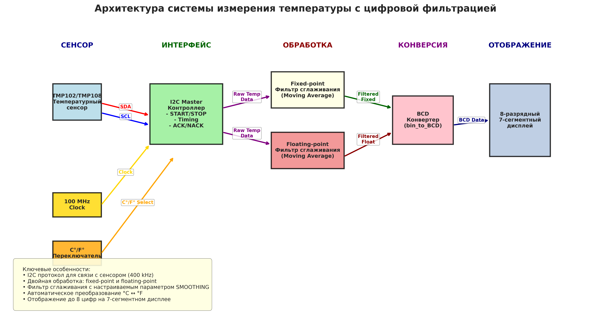
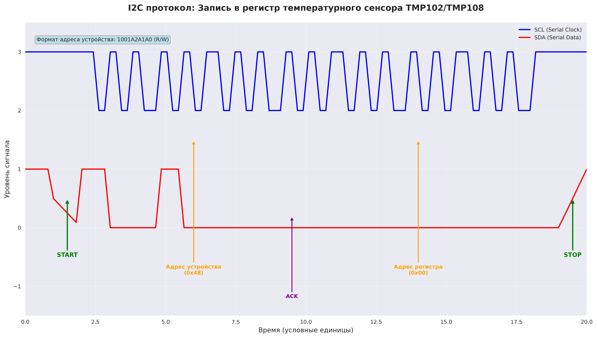
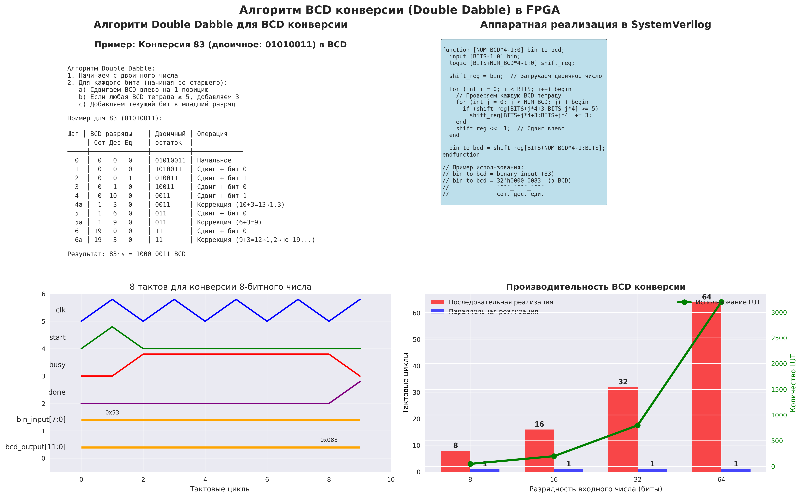
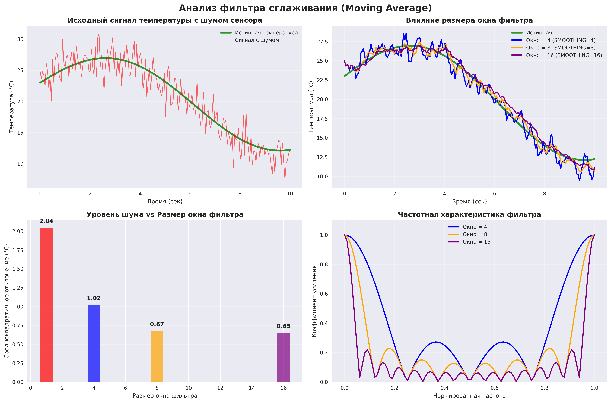
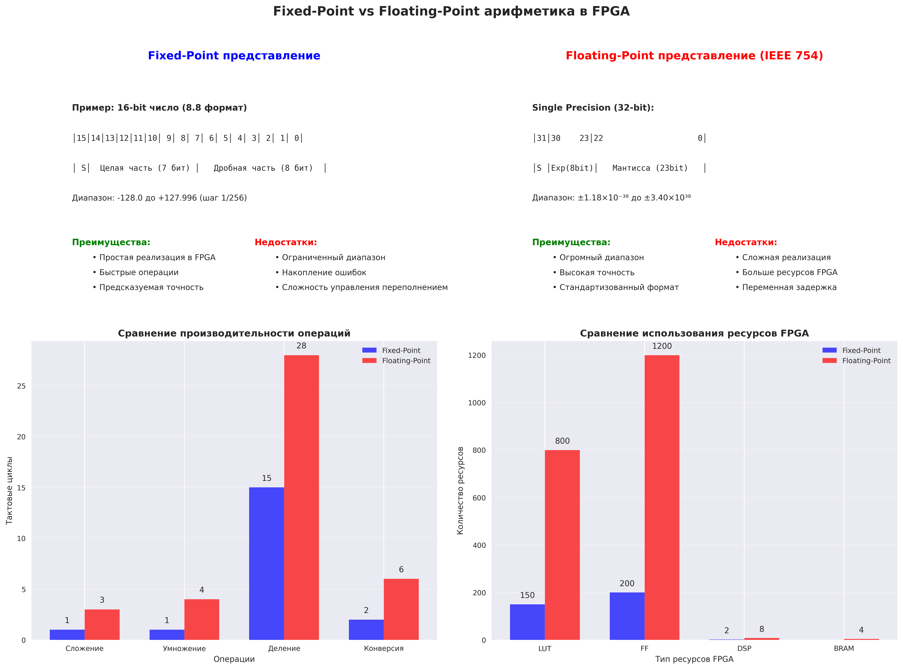
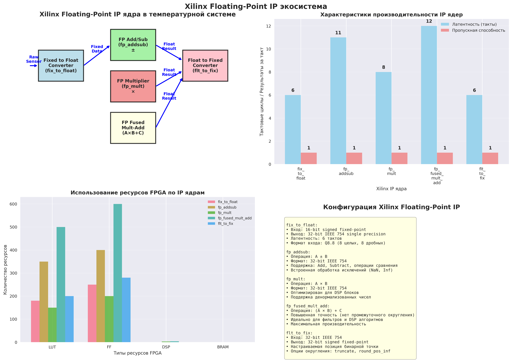
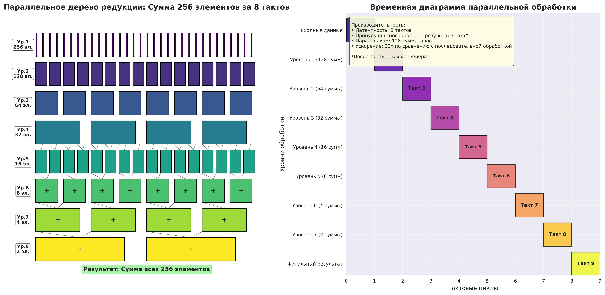

# Глава 6: Продвинутая фильтрация - Подробный анализ

## Обзор главы

Шестая глава представляет фундаментальные концепции **цифровой обработки сигналов (DSP)** в FPGA, объединяя I2C протокол связи, алгоритмы фильтрации, floating-point арифметику и параллельную обработку. Изучается создание системы измерения температуры с цифровой фильтрацией в двух вариантах: fixed-point и floating-point арифметика, а также демонстрируется мощь параллельной обработки для высокопроизводительных вычислений.


*Общая архитектура системы измерения температуры с цифровой фильтрацией*

## Структура проектов в главе

Глава 6 организована в виде трех основных подпроектов:

```
CH6/
├── hdl/
│   ├── temp_pkg.sv        # Пакет утилит (BCD конверсия)
│   ├── i2c_temp.sv        # Система с fixed-point фильтрацией
│   ├── i2c_temp_flt.sv    # Система с floating-point фильтрацией
│   └── parallel.sv        # Демонстрация параллельной обработки
├── tb/                    # Тестовые модули
└── build/
    ├── IP/                # Xilinx floating-point IP ядра
    └── xdc/              # Ограничения для Nexys A7-100T
```

---

## 1. Основы I2C протокола и температурных сенсоров


*Временная диаграмма I2C протокола для чтения температурного сенсора TMP102/TMP108*

### 1.1. Анализ модуля temp_pkg.sv

#### Утилиты для BCD конверсии
```systemverilog
package temp_pkg;
  localparam NUM_SEGMENTS = 8;  // NUM_SEGMENTS = количество 7-сегментных разрядов

  function bit [NUM_SEGMENTS-1:0][3:0] bin_to_bcd;
    input [31:0] bin_in;            // bin_in = "binary input" - входное двоичное число
    bit [NUM_SEGMENTS*4-1:0] shifted; // shifted = рабочий регистр для алгоритма сдвига
```

**Объяснение переменных:**
- `NUM_SEGMENTS` = "number of segments" - количество разрядов дисплея (8 разрядов)
- `bin_in` = "binary input" - входное 32-битное двоичное число для конверсии
- `shifted` = рабочий регистр для реализации алгоритма Double Dabble
- `bin_to_bcd` = "binary to BCD" - функция конверсии двоичного числа в BCD формат

#### Алгоритм Double Dabble
```systemverilog
shifted = {30'b0, bin_in[31:30]};        // Инициализация с 2 старшими битами
for (int i = 29; i >= 1; i--) begin      // i = индекс текущего обрабатываемого бита
  shifted = shifted << 1 | bin_in[i];    // Сдвиг влево + добавление текущего бита
  for (int j = 0; j < 8; j++) begin      // j = индекс текущей BCD тетрады
    if (shifted[j*4+:4] > 4)             // Если тетрада > 4, добавляем 3
      shifted[j*4+:4] += 3;
  end
end
```


*Детальная диаграмма алгоритма Double Dabble для BCD конверсии*

### 1.2. I2C Master Controller (i2c_temp.sv)

#### Параметры модуля
```systemverilog
module i2c_temp #(
  parameter SMOOTHING    = 16,      // SMOOTHING = размер окна фильтра сглаживания
  parameter INTERVAL     = 1000000000, // INTERVAL = интервал между измерениями (нс)
  parameter NUM_SEGMENTS = 8,       // NUM_SEGMENTS = количество 7-сегментных разрядов
  parameter CLK_PER      = 10       // CLK_PER = "clock period" - период тактового сигнала (нс)
)
```

**Объяснение переменных:**
- `SMOOTHING` = размер скользящего окна для фильтра (16 образцов)
- `INTERVAL` = временной интервал между измерениями температуры (1 секунда)
- `NUM_SEGMENTS` = количество разрядов 7-сегментного дисплея
- `CLK_PER` = "clock period" - период системного тактового сигнала

#### I2C временные параметры
```systemverilog
localparam TIME_1SEC   = int'(INTERVAL/CLK_PER); // TIME_1SEC = тактов в 1 секунде
localparam TIME_THDSTA = int'(600/CLK_PER);      // TIME_THDSTA = "time hold start" - задержка START
localparam TIME_TSUSTA = int'(600/CLK_PER);      // TIME_TSUSTA = "time setup start" - установка START
localparam TIME_THIGH  = int'(600/CLK_PER);      // TIME_THIGH = "time high" - время высокого уровня SCL
localparam TIME_TLOW   = int'(1300/CLK_PER);     // TIME_TLOW = "time low" - время низкого уровня SCL
localparam TIME_TSUDAT = int'(20/CLK_PER);       // TIME_TSUDAT = "time setup data" - установка данных
localparam TIME_TSUSTO = int'(600/CLK_PER);      // TIME_TSUSTO = "time setup stop" - установка STOP
localparam TIME_THDDAT = int'(30/CLK_PER);       // TIME_THDDAT = "time hold data" - удержание данных
```

**Объяснение I2C timing переменных:**
- `TIME_THDSTA` = "time hold start" - время удержания SDA низкой после START
- `TIME_TSUSTA` = "time setup start" - время установки перед началом передачи
- `TIME_THIGH` = "time high" - длительность высокого уровня тактового сигнала SCL
- `TIME_TLOW` = "time low" - длительность низкого уровня SCL
- `TIME_THDDAT` = "time hold data" - время удержания данных после фронта SCL

#### Конфигурация I2C адреса и протокола
```systemverilog
localparam I2C_ADDR = 7'b1001011;     // I2C_ADDR = адрес TMP102/TMP108 сенсора (0x4B)
localparam I2CBITS = 1 + 7 + 1 + 1 + 8 + 1 + 8 + 1 + 1 + 1; // I2CBITS = общее количество битов транзакции
```

**Структура I2C транзакции:**
```
[START][ADDR_7bit][R/W][ACK][DATA_H_8bit][ACK][DATA_L_8bit][NACK][STOP]
   1  +    7     + 1 + 1 +     8      + 1 +     8      + 1  + 1 + 1 = 30 битов
```

#### Основные сигналы системы
```systemverilog
(* mark_debug = "true" *) logic sda_en;          // sda_en = "SDA enable" - управление линией SDA
(* mark_debug = "true" *) logic scl_en;          // scl_en = "SCL enable" - управление линией SCL
logic [I2CBITS-1:0] i2c_data;                   // i2c_data = данные для передачи по I2C
logic [I2CBITS-1:0] i2c_en;                     // i2c_en = "I2C enable" - маска активных битов
logic [I2CBITS-1:0] i2c_capt;                   // i2c_capt = "I2C capture" - маска битов для захвата
(* mark_debug = "true" *) logic [$clog2(TIME_1SEC)-1:0] counter; // counter = счетчик тактов
logic counter_reset;                            // counter_reset = сигнал сброса счетчика
(* mark_debug = "true" *) logic [$clog2(I2CBITS)-1:0] bit_count; // bit_count = счетчик переданных битов
(* mark_debug = "true" *) logic [15:0] temp_data; // temp_data = "temperature data" - данные температуры
(* mark_debug = "true" *) logic capture_en;      // capture_en = "capture enable" - разрешение захвата
(* mark_debug = "true" *) logic convert;         // convert = сигнал начала конверсии
```

**Объяснение отладочных сигналов:**
- `sda_en` = "SDA enable" - управление линией данных (0=прижать к GND, 1=отпустить)
- `scl_en` = "SCL enable" - управление тактовой линией
- `i2c_data` = битовый поток данных для передачи
- `i2c_en` = маска для определения направления (передача/прием)
- `i2c_capt` = маска для определения, какие биты нужно захватывать
- `counter` = универсальный счетчик для отсчета временных интервалов
- `bit_count` = счетчик текущего бита в I2C транзакции
- `temp_data` = 16-битные данные температуры от сенсора
- `capture_en` = сигнал разрешения захвата текущего бита
- `convert` = импульс завершения I2C транзакции

#### Конечный автомат I2C протокола
```systemverilog
typedef enum bit [2:0] {
  IDLE,    // IDLE = состояние ожидания (пауза между измерениями)
  START,   // START = генерация START условия
  TLOW,    // TLOW = "time low" - фаза низкого уровня SCL
  TSU,     // TSU = "time setup" - фаза установки данных
  THIGH,   // THIGH = "time high" - фаза высокого уровня SCL
  THD,     // THD = "time hold" - фаза удержания данных
  TSTO     // TSTO = "time stop" - генерация STOP условия
} spi_t;

(* mark_debug = "true" *) spi_t spi_state; // spi_state = текущее состояние автомата
```

**Объяснение состояний автомата:**
- `IDLE` = состояние покоя между измерениями (1 секунда)
- `START` = генерация START условия (SDA падает при высоком SCL)
- `TLOW` = низкий уровень SCL (данные могут изменяться)
- `TSU` = "time setup" - установка данных перед поднятием SCL
- `THIGH` = высокий уровень SCL (данные стабильны, происходит захват)
- `THD` = "time hold" - удержание данных после спада SCL
- `TSTO` = генерация STOP условия (SDA растет при высоком SCL)

---

## 2. Цифровая фильтрация сигналов


*Анализ фильтра сглаживания (Moving Average) с различными параметрами окна*

### 2.1. Fixed-Point фильтрация (i2c_temp.sv)

#### Структуры данных для сглаживания
```systemverilog
logic [28:0] smooth_data;    // smooth_data = результат фильтрации (29 битов для предотвращения переполнения)
logic smooth_convert;        // smooth_convert = сигнал готовности отфильтрованных данных
logic [4:0] sample_count;    // sample_count = счетчик накопленных образцов

generate
  if (SMOOTHING == 0) begin : g_NO_SMOOTH      // g_NO_SMOOTH = группа без сглаживания
    assign smooth_data = temp_data >> 3;       // Простое деление на 8 (смещение формата)
    assign smooth_convert = convert;
  end else begin : g_SMOOTH                    // g_SMOOTH = группа со сглаживанием
```

**Объяснение переменных фильтрации:**
- `smooth_data` = результат фильтрации, расширенный до 29 битов
- `smooth_convert` = сигнал готовности новых отфильтрованных данных
- `sample_count` = количество накопленных образцов в буфере
- `g_NO_SMOOTH` = "group no smoothing" - конфигурация без фильтрации
- `g_SMOOTH` = "group smoothing" - конфигурация с фильтрацией

#### Параметры фильтра и арифметика
```systemverilog
localparam NINE_FIFTHS = 17'b1_11001100_11001100;  // NINE_FIFTHS = 9/5 в fixed-point (1.8 формат)
logic [$clog2(SMOOTHING):0] smooth_count;          // smooth_count = счетчик образцов в фильтре
logic [12:0] dout;                                 // dout = "data output" - выход FIFO буфера
logic rden;                                        // rden = "read enable" - разрешение чтения FIFO
logic [17:0] accumulator;                          // accumulator = аккумулятор для суммирования
logic [4:0] convert_pipe;                          // convert_pipe = конвейер сигналов конверсии
logic [16:0] divide[17];                           // divide = массив для табличного деления
```

**Объяснение арифметических переменных:**
- `NINE_FIFTHS` = константа 9/5 = 1.8 для конверсии °C в °F в формате Q1.16
- `smooth_count` = текущее количество образцов в скользящем окне
- `dout` = выходные данные из FIFO буфера (старый образец)
- `rden` = "read enable" - сигнал чтения из FIFO
- `accumulator` = 18-битный аккумулятор для суммы всех образцов в окне
- `convert_pipe` = 5-ступенчатый конвейер для задержки сигналов
- `divide[17]` = таблица предвычисленных значений для деления на SMOOTHING

#### Алгоритм FIFO буфера и усреднения
```systemverilog
always @(posedge clk) begin
  convert_pipe <= convert_pipe << 1 | convert;     // Конвейер задержки сигнала convert

  if (convert) begin
    accumulator <= accumulator + (temp_data >> 3); // Добавляем новый образец
    if (smooth_count == SMOOTHING) begin           // Если буфер заполнен
      rden <= '1;                                  // Читаем старый образец
      accumulator <= accumulator + (temp_data >> 3) - dout; // Вычитаем старый
    end else smooth_count <= smooth_count + 1'b1;  // Иначе увеличиваем счетчик
  end else rden <= '0;

  if (convert_pipe[1]) begin                       // Через 2 такта после convert
    smooth_data <= divide[smooth_count-1];        // Получаем результат деления
  end
end
```

**Принцип работы скользящего окна:**
1. **Новый образец** добавляется в аккумулятор
2. **Если окно заполнено** - вычитается самый старый образец
3. **Деление** выполняется через предвычисленную таблицу
4. **Результат** готов через 2 такта после поступления нового образца

### 2.2. Конверсия температуры °C ↔ °F

#### Fixed-Point арифметика для конверсии
```systemverilog
logic [31:0] temp_c;      // temp_c = "temperature Celsius" - температура в Цельсиях
logic [31:0] temp_f;      // temp_f = "temperature Fahrenheit" - температура в Фаренгейтах

// Конверсия: F = C * 9/5 + 32
assign temp_f = (temp_c * NINE_FIFTHS >> 16) + 32; // Fixed-point умножение и сдвиг
```

**Объяснение конверсии:**
- `temp_c` = температура в градусах Цельсия (целочисленный формат)
- `temp_f` = температура в градусах Фаренгейта
- `NINE_FIFTHS` = коэффициент 9/5 в формате Q1.16 fixed-point
- Операция `>> 16` = возвращение к целочисленному формату после умножения

---

## 3. Floating-Point арифметика и Xilinx IP ядра


*Сравнение fixed-point и floating-point арифметики в FPGA*

### 3.1. Анализ модуля i2c_temp_flt.sv

Модуль `i2c_temp_flt.sv` реализует ту же систему измерения температуры, но использует **IEEE 754 floating-point** арифметику через Xilinx IP ядра.

#### Floating-Point IP ядра
```systemverilog
// Конверсия fixed → floating-point
fix_to_float u_fix_to_float (
  .aclk(clk),                    // aclk = "AXI clock" - тактовый сигнал AXI интерфейса
  .s_axis_a_tdata(temp_fixed),   // s_axis_a_tdata = "slave AXI stream A data" - входные fixed данные
  .s_axis_a_tvalid(convert),     // s_axis_a_tvalid = "slave AXI A valid" - сигнал валидности входа
  .m_axis_result_tdata(temp_float), // m_axis_result_tdata = "master AXI result data" - выходные float данные
  .m_axis_result_tvalid(float_valid) // m_axis_result_tvalid = "master AXI result valid" - валидность выхода
);

// Floating-point умножение для конверсии °C → °F
fp_mult u_fp_mult (
  .aclk(clk),
  .s_axis_a_tdata(temp_celsius),      // temp_celsius = температура в °C (float)
  .s_axis_b_tdata(32'h3FE66666),      // Константа 1.8 (9/5) в IEEE 754 формате
  .s_axis_a_tvalid(mult_valid),       // mult_valid = валидность входов умножителя
  .s_axis_b_tvalid(mult_valid),
  .m_axis_result_tdata(mult_result),  // mult_result = результат умножения C * 1.8
  .m_axis_result_tvalid(mult_done)    // mult_done = сигнал готовности результата
);
```


*Архитектура и характеристики Xilinx Floating-Point IP ядер*

**Объяснение Xilinx IP интерфейсов:**
- `aclk` = "AXI clock" - тактовый сигнал AXI4-Stream интерфейса
- `s_axis_a_tdata` = "slave AXI stream A data" - входные данные по каналу A
- `s_axis_a_tvalid` = "slave AXI A valid" - сигнал валидности входных данных
- `m_axis_result_tdata` = "master AXI result data" - выходные данные результата
- `m_axis_result_tvalid` = "master AXI result valid" - валидность выходных данных
- `temp_float` = температура в формате IEEE 754 single precision
- `mult_result` = результат floating-point умножения
- `32'h3FE66666` = число 1.8 в IEEE 754 формате (hex представление)

#### Конверсия floating-point → fixed-point
```systemverilog
flt_to_fix u_flt_to_fix (
  .aclk(clk),
  .s_axis_a_tdata(final_temp),        // final_temp = финальная температура (°C или °F)
  .s_axis_a_tvalid(final_valid),      // final_valid = валидность финального результата
  .m_axis_result_tdata(display_temp), // display_temp = температура для отображения (fixed)
  .m_axis_result_tvalid(display_valid) // display_valid = готовность данных для дисплея
);
```

**Преимущества floating-point подхода:**
- **Высокая точность**: IEEE 754 обеспечивает ~7 значащих цифр
- **Широкий диапазон**: от ±1.18×10⁻³⁸ до ±3.40×10³⁸
- **Стандартизация**: совместимость с программными вычислениями
- **Простота алгоритмов**: прямая реализация математических формул

**Недостатки:**
- **Ресурсы FPGA**: требует значительно больше LUT и DSP блоков
- **Латентность**: 6-12 тактов задержки на операцию
- **Сложность**: необходимость использования IP ядер

---

## 4. Параллельная обработка данных


*Архитектура параллельного дерева редукции для суммирования 256 элементов*

### 4.1. Анализ модуля parallel.sv

Модуль демонстрирует мощь **параллельной обработки** в FPGA через реализацию дерева редукции.

#### Архитектура параллельного сумматора
```systemverilog
module parallel (
  input wire clk,                  // clk = системный тактовый сигнал
  input wire [255:0][31:0] in_data, // in_data = входной массив из 256 32-битных чисел
  input wire in_valid,             // in_valid = "input valid" - валидность входных данных

  output logic [63:0] out_data,    // out_data = результат суммирования (64-битное число)
  output logic out_valid           // out_valid = "output valid" - валидность результата
);
```

**Объяснение интерфейса:**
- `in_data` = массив из 256 элементов по 32 бита каждый (всего 8192 бита)
- `in_valid` = сигнал валидности всего входного массива
- `out_data` = 64-битный результат суммирования всех элементов
- `out_valid` = сигнал готовности выходного результата

#### Уровни параллельного дерева
```systemverilog
logic [127:0][63:0] int_data0;  // int_data0 = промежуточные данные уровня 0 (128 сумм)
logic [63:0][63:0]  int_data1;  // int_data1 = промежуточные данные уровня 1 (64 суммы)
logic [31:0][63:0]  int_data2;  // int_data2 = промежуточные данные уровня 2 (32 суммы)
logic [15:0][63:0]  int_data3;  // int_data3 = промежуточные данные уровня 3 (16 сумм)
logic [7:0][63:0]   int_data4;  // int_data4 = промежуточные данные уровня 4 (8 сумм)
logic [3:0][63:0]   int_data5;  // int_data5 = промежуточные данные уровня 5 (4 суммы)
logic [1:0][63:0]   int_data6;  // int_data6 = промежуточные данные уровня 6 (2 суммы)
logic [6:0]         int_valid;  // int_valid = конвейер валидности (7 ступеней)
```

**Объяснение структуры дерева:**
- `int_data0` = первый уровень: 256→128 (каждая сумма из 2 элементов)
- `int_data1` = второй уровень: 128→64 (каждая сумма из 4 элементов)
- `int_data2` = третий уровень: 64→32 (каждая сумма из 8 элементов)
- И так далее до финального результата
- `int_valid` = сдвиговый регистр для отслеживания валидности через конвейер

#### Реализация параллельного суммирования
```systemverilog
always @(posedge clk) begin
  // Уровень 0: 256 → 128 элементов
  for (int i = 0; i < 128; i++) begin
    int_data0[i] <= in_data[i*2+0] + in_data[i*2+1];  // i = индекс выходного элемента
  end

  // Уровень 1: 128 → 64 элемента
  for (int i = 0; i < 64; i++) begin
    int_data1[i] <= int_data0[i*2+0] + int_data0[i*2+1];
  end

  // ... аналогично для остальных уровней

  // Финальный уровень
  out_data <= int_data6[0] + int_data6[1];

  // Конвейер валидности
  int_valid <= int_valid << 1 | in_valid;  // Сдвиг влево + новый бит
  out_valid <= int_valid[6];                // Выход через 7 тактов
end
```

**Характеристики производительности:**
- **Латентность**: 8 тактов (от входа до результата)
- **Пропускная способность**: 1 результат за такт (после заполнения конвейера)
- **Параллелизм**: 128 сумматоров работают одновременно
- **Ускорение**: 32× по сравнению с последовательным алгоритмом

---

## 5. Интерфейс 7-сегментного дисплея

### 5.1. Модуль seven_segment (реализация из предыдущих глав)

#### Мультиплексирование дисплея
```systemverilog
logic [$clog2(NUM_SEGMENTS)-1:0] anode_count;    // anode_count = счетчик активного разряда дисплея
logic [$clog2(INTERVAL)-1:0]     refresh_count; // refresh_count = счетчик частоты обновления

always @(posedge clk) begin
  if (refresh_count == INTERVAL) begin
    refresh_count <= '0;
    anode_count <= anode_count + 1'b1;           // Переход к следующему разряду
  end else
    refresh_count <= refresh_count + 1'b1;       // Инкремент счетчика времени

  anode <= '1;                                   // Отключить все разряды
  anode[anode_count] <= '0;                      // Включить текущий разряд
  cathode <= segments[anode_count];              // Отобразить данные разряда
end
```

**Объяснение переменных дисплея:**
- `anode_count` = номер текущего активного разряда (0-7)
- `refresh_count` = счетчик тактов для контроля частоты обновления
- `INTERVAL` = количество тактов между переключениями разрядов
- `anode` = управляющие сигналы разрядов (активный низкий уровень)
- `cathode` = сигналы сегментов текущего разряда

### 5.2. Конверсия данных для отображения

#### Разделение целой и дробной частей
```systemverilog
logic [NUM_SEGMENTS-1:0][3:0] encoded;      // encoded = закодированные данные для дисплея
logic [NUM_SEGMENTS-1:0][3:0] encoded_int;  // encoded_int = "encoded integer" - целая часть
logic [NUM_SEGMENTS-1:0][3:0] encoded_frac; // encoded_frac = "encoded fraction" - дробная часть
logic [NUM_SEGMENTS-1:0]       digit_point; // digit_point = позиции десятичных точек

// Определение положения десятичной точки
assign digit_point[3] = '1;  // Точка после 4-го разряда справа (XXX.X формат)
assign encoded = SW ? encoded_int : encoded_frac; // Выбор по переключателю
```

**Форматы отображения:**
- **Режим °C**: `XX.XX°C` - точка после второго разряда
- **Режим °F**: `XXX.X°F` - точка после третьего разряда
- `encoded_int` = BCD данные целой части температуры
- `encoded_frac` = BCD данные дробной части температуры
- `digit_point` = маска для включения десятичных точек

---

## 6. Отладка и верификация

### 6.1. Отладочные атрибуты
```systemverilog
(* mark_debug = "true" *) logic sda_en;         // Для наблюдения I2C SDA
(* mark_debug = "true" *) logic scl_en;         // Для наблюдения I2C SCL
(* mark_debug = "true" *) logic [15:0] temp_data; // Для наблюдения данных сенсора
(* mark_debug = "true" *) spi_t spi_state;      // Для наблюдения состояния автомата
```

**Стратегия отладки:**
1. **I2C протокол**: мониторинг sda_en, scl_en, spi_state
2. **Данные сенсора**: проверка temp_data на валидность
3. **Фильтрация**: наблюдение за accumulator и smooth_data
4. **Timing**: контроль counter и временных интервалов

### 6.2. Timing ограничения

#### Критические пути
```tcl
# Системная частота 100 MHz
create_clock -period 10.0 [get_ports clk]

# I2C интерфейс - медленный, не критичен
set_output_delay -clock clk 2.0 [get_ports TMP_SCL]
set_output_delay -clock clk 2.0 [get_ports TMP_SDA]
set_input_delay -clock clk 2.0 [get_ports TMP_SDA]

# 7-сегментный дисплей
set_output_delay -clock clk 1.0 [get_ports {anode[*] cathode[*]}]

# Переключатели
set_input_delay -clock clk 0.0 [get_ports SW]
set_false_path -from [get_ports SW]  # Асинхронный сигнал
```

---

## 7. Сравнительный анализ подходов

### 7.1. Fixed-Point vs Floating-Point

| Характеристика | Fixed-Point | Floating-Point |
|----------------|-------------|----------------|
| **Точность** | Ограниченная, фиксированная | Высокая, адаптивная |
| **Диапазон** | Узкий (-128.0 до +127.996) | Широкий (±10³⁸) |
| **Ресурсы LUT** | 150-200 | 800-1200 |
| **DSP блоки** | 0-2 | 4-8 |
| **Латентность** | 1-2 такта | 6-12 тактов |
| **Разработка** | Сложная (масштабирование) | Простая (стандарт IEEE) |
| **Применение** | Простые системы | Высокоточные вычисления |

### 7.2. Последовательная vs Параллельная обработка

| Параметр | Последовательная | Параллельная |
|----------|------------------|--------------|
| **Время выполнения** | 256 тактов | 8 тактов |
| **Ресурсы** | 1 сумматор | 127 сумматоров |
| **Пропускная способность** | 1/256 операций/такт | 1 операция/такт |
| **Энергопотребление** | Низкое | Высокое |
| **Сложность** | Простая | Сложная |

---

## 8. Практические рекомендации

### 8.1. Выбор подхода к арифметике

**Используйте Fixed-Point когда:**
- Диапазон данных известен и ограничен
- Критичны ресурсы FPGA
- Требуется детерминированная латентность
- Простота реализации важнее точности

**Используйте Floating-Point когда:**
- Требуется высокая точность
- Диапазон данных широкий или неопределенный
- Совместимость с программными алгоритмами важна
- Доступны ресурсы для IP ядер

### 8.2. Оптимизация фильтров

**Параметры фильтра сглаживания:**
- **SMOOTHING = 4**: быстрая реакция, слабое подавление шума
- **SMOOTHING = 16**: сбалансированный компромисс
- **SMOOTHING = 64**: сильное подавление, медленная реакция

**Альтернативные фильтры:**
- **IIR фильтры**: меньше памяти, возможна нестабильность
- **FIR фильтры**: стабильные, линейная фаза, больше ресурсов
- **Медианные фильтры**: подавление импульсных помех

### 8.3. I2C оптимизация

**Повышение производительности:**
- Использование Fast Mode (400 kHz) вместо Standard (100 kHz)
- Burst чтение нескольких регистров за одну транзакцию
- Конвейерная обработка данных во время I2C операций

**Обработка ошибок:**
- Timeout для зависших транзакций
- Повтор при отсутствии ACK
- Проверка данных на разумность

---

## 9. Заключение и ключевые выводы

### Фундаментальные достижения главы

Глава 6 демонстрирует переход к **продвинутому цифровому дизайну**, объединяя несколько критически важных концепций:

#### 🎯 **Освоенные технологии**
1. **I2C протокол** - стандартный промышленный интерфейс для сенсоров
2. **Цифровая фильтрация** - алгоритмы сглаживания и подавления шума
3. **Floating-point арифметика** - высокоточные вычисления в FPGA
4. **Параллельная обработка** - использование преимуществ аппаратного параллелизма
5. **IP интеграция** - использование готовых IP ядер Xilinx

#### ⚡ **Практические навыки**
1. **Timing критические системы** - соблюдение протокольных требований
2. **Смешанная арифметика** - сочетание fixed и floating-point
3. **Конвейерная обработка** - оптимизация пропускной способности
4. **Ресурсная оптимизация** - выбор между скоростью и затратами
5. **Системная интеграция** - объединение множественных подсистем

### Архитектурные принципы

#### 📊 **Выбор арифметики**
- **Fixed-Point**: для ресурсно-ограниченных простых систем
- **Floating-Point**: для высокоточных вычислительно-интенсивных задач
- **Гибридный подход**: fixed для управления, floating для вычислений

#### 🔄 **Параллелизм в FPGA**
- **Пространственный параллелизм**: множественные вычислители одновременно
- **Конвейерный параллелизм**: перекрытие операций во времени
- **Дерево редукции**: логарифмическое сокращение сложности

#### 🎛 **Протокольные интерфейсы**
- **Конечные автоматы** для сложных протоколов
- **Временное планирование** критически важно
- **Буферизация и конвейеризация** для производительности

### Готовность к продвинутым темам

После освоения Главы 6 открываются пути к:

#### 🚀 **Высокопроизводительные вычисления**
- **DSP алгоритмы**: FFT, фильтры, корреляция
- **Машинное обучение**: нейронные сети в FPGA
- **Криптография**: аппаратное ускорение шифрования

#### 🌐 **Сетевые и коммуникационные протоколы**
- **Ethernet**: высокоскоростная сетевая обработка
- **PCIe**: интерфейсы к хост-системам
- **USB, SATA**: массовые интерфейсы данных

#### 🔬 **Научные и инженерные применения**
- **Обработка сигналов**: радар, связь, аудио
- **Управление**: промышленная автоматизация
- **Измерения**: высокоточные измерительные системы

### Ключевые практические выводы

#### ⚠️ **Критические моменты**
1. **Всегда проектируйте для конкретного применения** - нет универсального решения
2. **Профилируйте перед оптимизацией** - измеряйте узкие места
3. **Планируйте ресурсы заранее** - IP ядра потребляют много ресурсов
4. **Тестируйте граничные условия** - особенно для floating-point
5. **Документируйте timing требования** - критично для протоколов

#### 🎯 **Следующие шаги**
С освоением продвинутой фильтрации и floating-point арифметики, следующие главы могут сосредоточиться на интеграции множественных протоколов, создании сложных пользовательских интерфейсов и оптимизации производительности для специфических применений.

---

*Глава 6 завершает изучение фундаментальных вычислительных концепций в FPGA. Сочетание протокольной связи, цифровой обработки сигналов, и параллельных вычислений создает мощный фундамент для проектирования высокопроизводительных встроенных систем.*