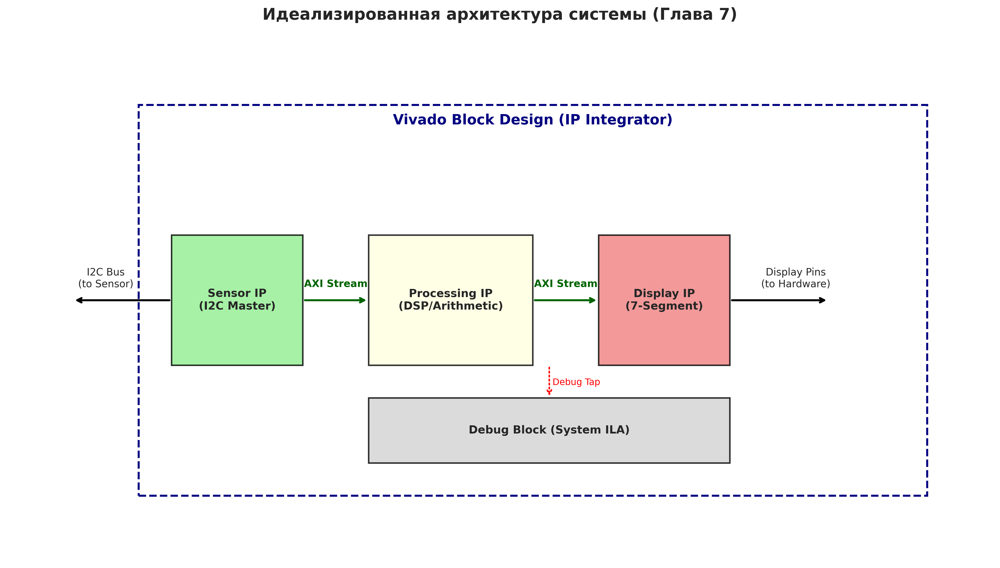
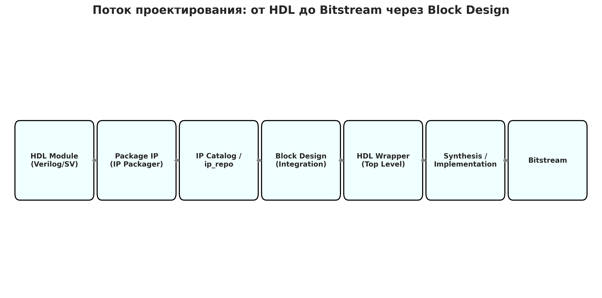
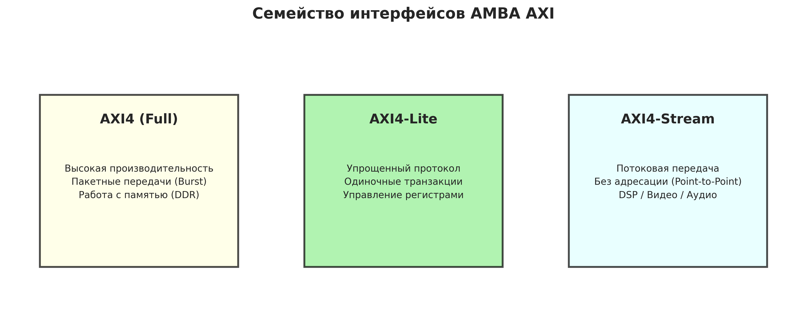
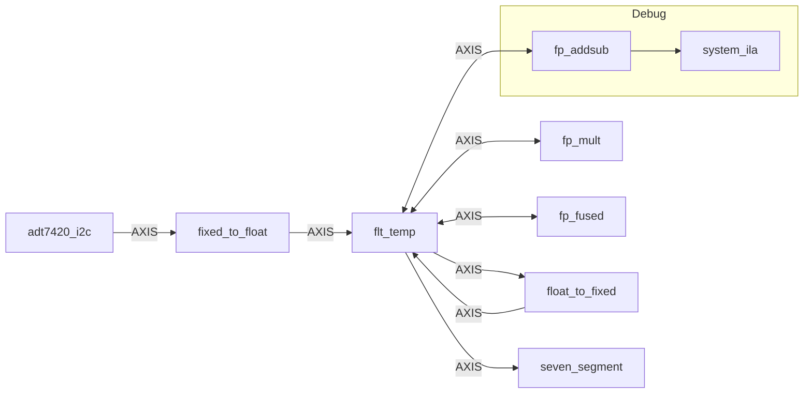
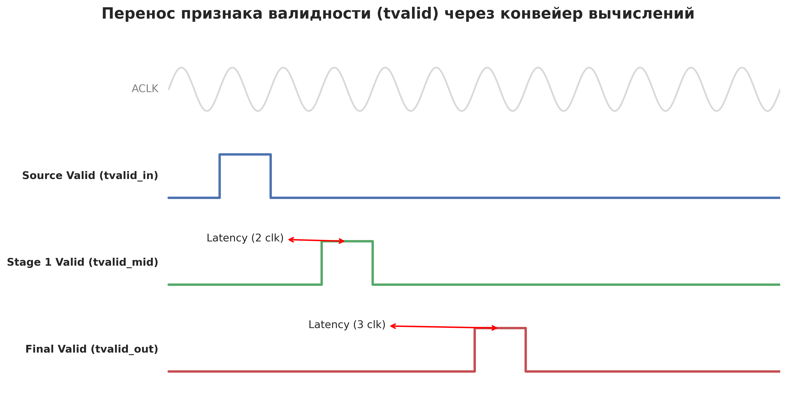
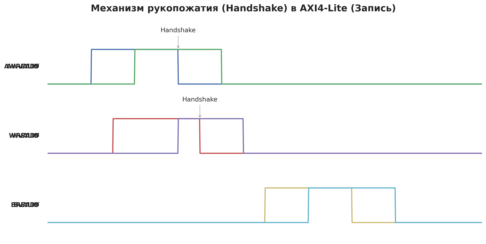

# Глава 7: Блочные дизайны и интеграция IP - Подробный анализ

## Обзор главы

Седьмая глава знаменует переход от ручного написания монолитного HDL-кода к методологии проектирования **System-on-Chip (SoC)**. Вместо того чтобы описывать всю логику в одном файле, мы разделяем её на независимые компоненты — **IP-ядра (Intellectual Property)**, которые объединяются на графическом холсте **Vivado Block Design**.

Ключевые темы главы:
- Упаковка собственных модулей в формат IP-ядер.
- Использование интерфейсов семейства **AMBA AXI** для системной интеграции.
- Работа в среде **IP Integrator** (Block Design).
- Аппаратная отладка сложных систем через ядро **System ILA**.


*Рис. 1. Идеализированная архитектура системы измерения температуры (по книге)*

---

## Структура проектов в главе

Глава 7 организована как переход от HDL-исходников к упакованным компонентам и финальной сборке в Block Design:

```
CH7/
├── hdl/                        # Исходный HDL-код модулей
│   ├── adt7420_i2c_mod.sv      # Ядро датчика температуры
│   └── adt7420_i2c_bd.v        # Обертка для Block Design
├── build/
│   ├── IP/                     # Упакованные IP-ядра (репозиторий проекта)
│   │   ├── adt7420_i2c/        # IP датчика
│   │   ├── flt_temp/           # IP обработки вычислений
│   │   └── seven_segment/      # IP дисплея
│   ├── i2c_temp_flt_bd/        # Проект Vivado с Block Design
│   │   └── .../design_1.bd     # Файл блочного дизайна
│   ├── ip_repo/                # Дополнительные примеры IP (pdm_capture)
│   └── xdc/                    # Файлы ограничений (constraints)
```

---

## 1. Концепция проектирования на основе IP (по книге)

### 1.1. Жизненный цикл IP-ядра
Процесс создания системы в этой главе следует четкому маршруту:


*Рис. 2. Этапы разработки: от модуля до битового потока*

1.  **Создание HDL**: Написание кода на Verilog/SystemVerilog.
2.  **Packaging**: Использование *IP Packager* для создания пакета IP (файл `component.xml`, настройки GUI).
3.  **Integration**: Добавление IP в Block Design.
4.  **Wrapping**: Создание HDL-обертки над блочным дизайном для синтеза.

### 1.2. Семейство интерфейсов AXI
Для взаимодействия блоков в SoC-дизайне используется стандарт **AMBA AXI**.


*Рис. 3. Три основных типа интерфейсов AXI*

| Тип | Назначение | Особенности |
| :--- | :--- | :--- |
| **AXI4 (Full)** | Высокоскоростная передача данных | Поддержка Burst (пакетных передач), адресация памяти. |
| **AXI4-Lite** | Управление и статус | Простой протокол, чтение/запись одиночных регистров. |
| **AXI4-Stream** | Потоковая передача данных | Нет адресации, передача "точка-точка" с сигналами `tvalid/tready`. |

---

## 2. Привязка к репозиторию (CH7)

### 2.1. Top-уровень и Block Design
В этой главе верхним уровнем иерархии является **HDL Wrapper** над блочным дизайном.

**Файл:** `CH7/build/i2c_temp_flt_bd/.../design_1_wrapper.v`
```verilog
// Инстанцирование блочного дизайна внутри обертки
design_1 design_1_i
     (.LED(LED),
      .SW(SW),
      .TMP_CT(TMP_CT),
      .TMP_SCL(TMP_SCL), // Линии I2C
      .TMP_SDA(TMP_SDA),
      .anode(anode),
      .cathode(cathode),
      .reset(reset),      // Кнопка сброса
      .sys_clock(sys_clock));
```

### 2.2. Архитектура Block Design (design_1)
Согласно файлу `design_1_bd.tcl`, система представляет собой конвейер обработки данных:



### 2.3. IP датчика температуры: adt7420_i2c_mod.sv
Модуль реализует протокол I2C и подготавливает данные для потоковой передачи.

**Логика управления линиями (Open-Drain):**
```systemverilog
// Если сигнал_en == 1, линия 'z' (подтянута резистором к 1). Если 0, линия '0' (GND).
assign TMP_SCL = scl_en ? 'z : '0;
assign TMP_SDA = sda_en ? 'z : '0;
```

**Формирование выходного потока AXI Stream:**
```systemverilog
assign fix_temp_tvalid = convert;        // Импульс по завершении транзакции
assign fix_temp_tdata = temp_data >> 3;  // Отсекаем младшие 3 бита (флаги)
```

**Объяснение переменных:**
- `scl_en / sda_en` (Serial Clock/Data Enable) — управление драйверами линий.
- `I2CBITS` (I2C Bits) — общее количество тактов в транзакции (30 бит).
- `capture_en` (Capture Enable) — маска, определяющая моменты выборки данных из SDA.
- `spi_state` (State) — конечный автомат (FSM), управляющий таймингами I2C.

### 2.4. Вычислительный блок: flt_temp.sv
Это ядро обработки, которое управляет внешними Floating-Point IP ядрами.

**Принцип Valid Pipeline:**
Поскольку FP-блоки Xilinx имеют латентность (несколько тактов), признак валидности `tvalid` должен "путешествовать" по конвейеру вместе с данными.


*Рис. 4. Сопровождение данных сигналом валидности*

**Операции с плавающей точкой (Fahrenheit conversion):**
```systemverilog
// Константы для формулы: F = (C * 9/5) + 32
const bit [31:0] nine_fifths = 32'h3fe66666; // 1.8 в FP32
const bit [31:0] thirty_two = 32'h42000000;  // 32.0 в FP32

// Использование Fused Multiply-Add (A*B + C)
assign fused_a_tdata  = result_data.raw; // Температура в C
assign fused_b_tdata  = nine_fifths;
assign fused_c_tdata  = thirty_two;
```

**Объяснение переменных:**
- `smooth_count` (Smoothing Count) — количество накопленных отсчетов в FIFO.
- `accumulator` (Accumulator) — текущая сумма окна для среднего арифметического.
- `divide[]` (Division Table) — таблица предвычисленных значений `1/N` для замены операции деления на умножение.
- `tuser` (User Sideband) — дополнительные биты AXI Stream, используемые здесь для передачи флагов десятичной точки.

### 2.5. Пример AXI4-Lite: pdm_capture_v1_0_S00_AXI.v
Этот модуль демонстрирует, как создать IP-ядро, управляемое процессором или мастером через регистры.

**Механизм Handshake:**
Для передачи адреса или данных обе стороны (Master и Slave) должны выставить `VALID` и `READY`.


*Рис. 5. Временная диаграмма рукопожатия AXI4-Lite*

**Командный интерфейс через регистры:**
```verilog
// Запись в reg0 вызывает начало захвата (start_capt)
case ( axi_awaddr[ADDR_LSB+OPT_MEM_ADDR_BITS:ADDR_LSB] )
  2'h0: if ( |S_AXI_WSTRB ) begin
          slv_reg0   <= '0;
          start_capt <= '1; // Импульс запуска
        end
  // ...
```

---

## 3. Рекомендации по отладке (System ILA)

В блочном дизайне для отладки используется **System ILA**. Это IP-ядро подключается к шинам AXI и позволяет:
1.  **Видеть транзакции**: Vivado декодирует сигналы AXI Stream, показывая целые пакеты данных, а не отдельные биты.
2.  **Триггеры по условию**: Можно запустить захват данных, например, только когда `tvalid` равен 1 и данные превышают порог.
3.  **Анализ латентности**: Измерение времени между появлением данных на входе системы и выходом на дисплей.

---
**Итог главы**: Седьмая глава учит мыслить категориями системных интерфейсов. Вместо пайки "лапши" из проводов между модулями, мы строим стандартизированную экосистему, готовую к интеграции с процессорами (MicroBlaze/Zynq).

