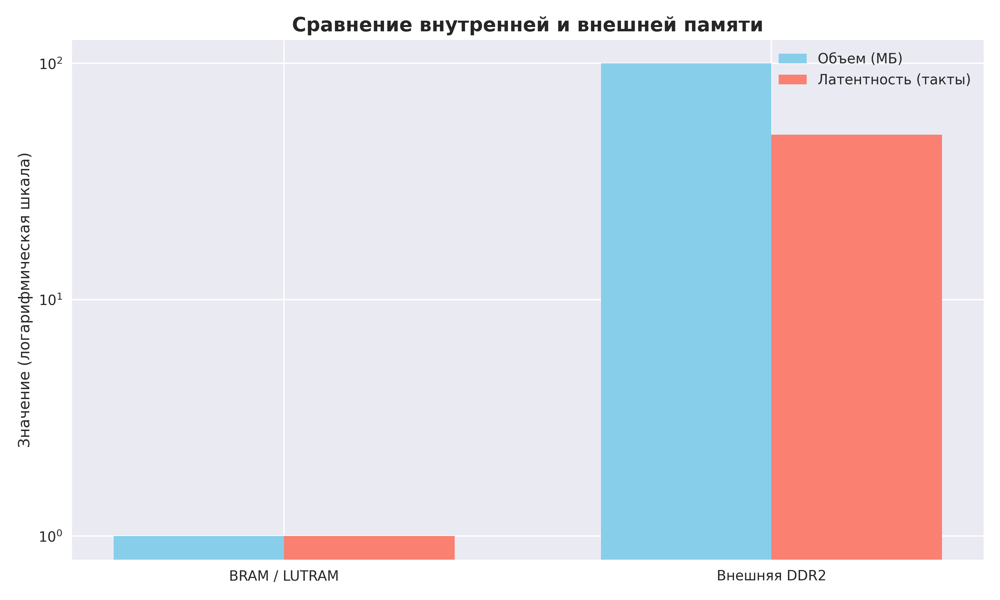
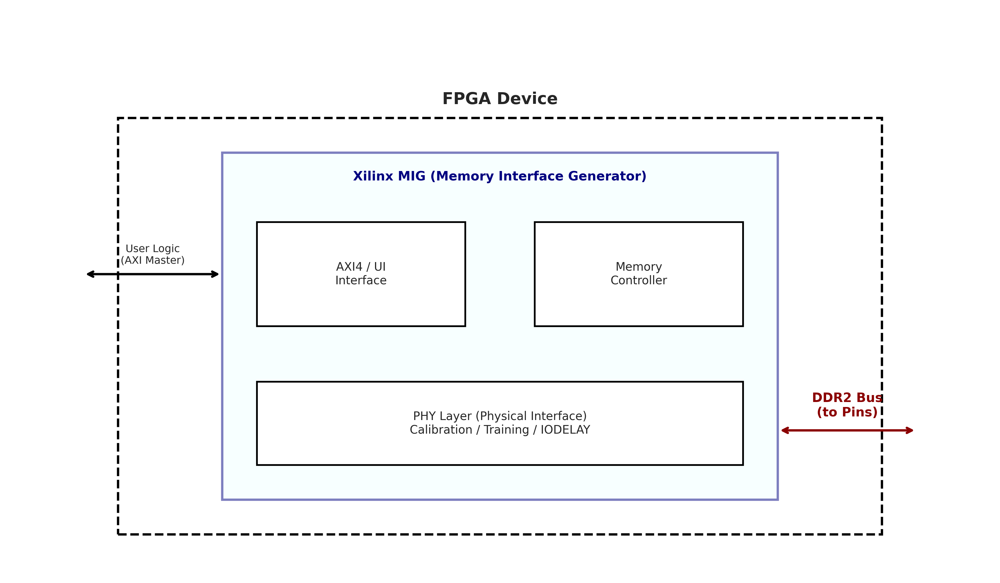
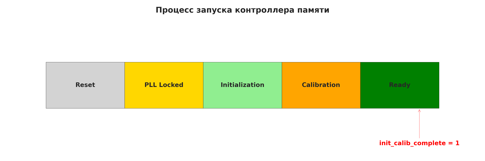
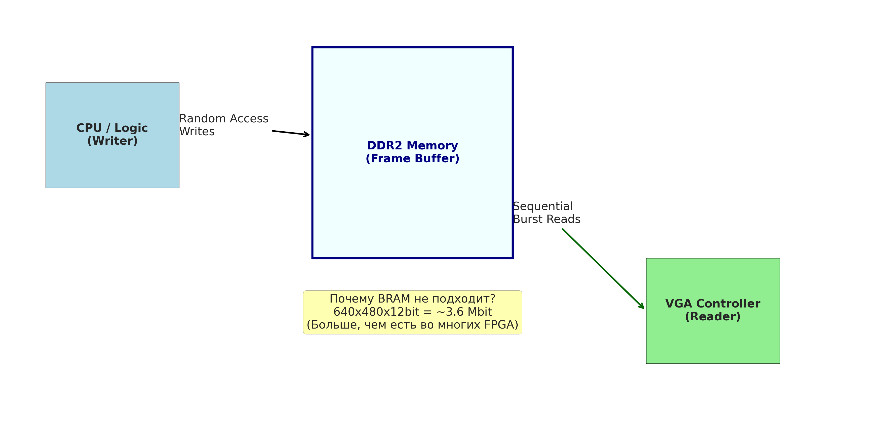
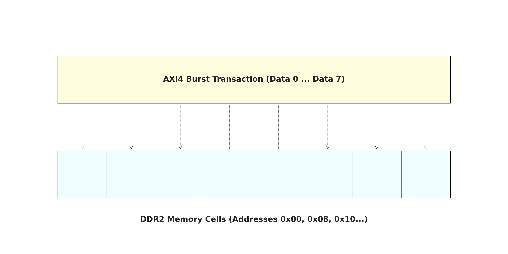

# Глава 8: Контроллеры внешней памяти (MIG и DDR2) - Подробный анализ

## Обзор главы

Восьмая глава посвящена одной из самых сложных и критических подсистем современных FPGA-проектов — контроллеру внешней памяти. Когда внутренних ресурсов кристалла (BRAM/LUTRAM) становится недостаточно для хранения больших объемов данных (например, видеокадров или аудио-буферов), разработчик вынужден использовать внешнюю микросхему SDRAM. Глава подробно разбирает использование IP-ядра **Xilinx MIG (Memory Interface Generator)** для работы с памятью **DDR2** на плате Nexys A7 / Nexys4 DDR.

---

## Структура проектов в главе

Глава 8 сфокусирована на инфраструктурных проектах и примерах от производителя IP:

```
CH8/
├── build/
│   ├── ddr2/                   # Базовый проект с настроенным MIG
│   │   └── ddr2.srcs/sources_1/ip/ddr2_controller/
│   │       ├── ddr2_controller_stub.v   # Интерфейс (контракт) модуля
│   │       └── ddr2_controller.xci      # Файл конфигурации IP
│   ├── ddr2_example/           # Демонстрационный проект (Example Design)
│   │   └── imports/
│   │       ├── example_top.v            # Эталонный верхний уровень
│   │       ├── ddr2_model.v             # Симуляционная модель памяти
│   │       └── sim_tb_top.v             # Тестбенч для проверки железа
│   ├── IP/
│   │   └── sys_pll/            # PLL для тактирования памяти и логики
│   └── xdc/                    # Файлы ограничений (constraints)
│       └── i2c_temp.xdc        # Назначение пинов (включая DDR2)
```

---

## 1. Конспект главы (по книге)

### 1.1. Проблема: BRAM против DRAM
Внутренняя память FPGA (**BRAM**) быстрая и работает на частоте логики, но её объем ограничен единицами мегабит. Для задач видеозахвата или хранения данных (например, кадровый буфер VGA 640x480 потребует ~3.6 Мбит) необходима внешняя память.


*Рис. 1. Сравнение внутренней и внешней памяти*

### 1.2. Технология DDR2 и роль MIG
Прямое управление линиями DDR2 из HDL практически невозможно из-за:
- **Высоких скоростей**: передача данных по обоим фронтам клока.
- **Сложной инициализации**: строгая последовательность команд при включении.
- **Динамической калибровки**: выравнивание задержек на линиях DQ/DQS для компенсации разброса параметров чипа и трасс на плате.

Для решения этих задач используется **Xilinx MIG**. Оно создает слой абстракции (**PHY** + **Controller**), предоставляя пользователю простой интерфейс.


*Рис. 2. Архитектура контроллера памяти внутри FPGA*

### 1.3. Процесс запуска (Initialization & Calibration)
Память не готова к работе сразу после сброса. Ключевой сигнал, за которым должна следить пользовательская логика — `init_calib_complete`.


*Рис. 3. Этапы готовности системы памяти*

---

## 2. Прикладная перспектива: Память для видео (Approach B)

В контексте книги DDR2 рассматривается как фундамент для будущих глав (VGA/Видео).

### 2.1. Концепция Frame Buffer
Для вывода стабильного изображения на экран логика записи (процессор или сенсор) и логика чтения (VGA-контроллер) должны работать независимо. DDR2 выступает общим хранилищем.


*Рис. 4. Роль DDR2 как кадрового буфера*

### 2.2. Эффективность через AXI Burst
Поскольку DDR2 — память с последовательным доступом, одиночные чтения крайне неэффективны. Интерфейс **AXI4** позволяет читать/записывать данные пачками (**Bursts**), что максимально утилизирует пропускную способность шины.


*Рис. 5. Преобразование AXI-транзакций в обращения к ячейкам DDR2*

---

## 3. Привязка к репозиторию (CH8)

### 3.1. Анализ интерфейса MIG (ddr2_controller_stub.v)
Хотя IP-ядро содержит тысячи строк кода, взаимодействие с ним происходит через четко определенный "контракт" портов.

**Физические порты (к микросхеме на плате):**
- `ddr2_dq[15:0]` — шина данных (двунаправленная).
- `ddr2_dqs_p/n` — дифференциальные стробы данных (самые критичные для таймингов).
- `ddr2_addr[12:0]` — шина адреса.
- `ddr2_ba[2:0]` — выбор банка.

**Пользовательский интерфейс (AXI4 Slave):**
- `s_axi_awaddr[26:0]` — адрес записи.
- `s_axi_wdata[127:0]` — данные для записи (заметьте: шина 128 бит для эффективных burst).
- `ui_clk` — тактовая частота, на которой должна работать ваша логика доступа к памяти.
- `init_calib_complete` — флаг готовности.

### 3.2. Эталонный дизайн (example_top.v)
Файл в папке `ddr2_example` служит лучшим учебным пособием. Он инстанцирует:
1.  **MIG IP Core**.
2.  **Traffic Generator**: блок, который имитирует нагрузку на память, записывая и считывая тестовые паттерны.
3.  **Infrastructure**: управление клоками и сбросами.

### 3.3. Моделирование (ddr2_model.v)
Поскольку внешнюю микросхему нельзя "засунуть" в симулятор Vivado, Xilinx предоставляет Verilog-модель, которая ведет себя как реальный чип памяти. Это позволяет отлаживать логику доступа к DDR без наличия физической платы.

---

## 4. Рекомендации и типичные ошибки

1.  **Reset Polarity**: MIG на Nexys A7 часто требует `sys_rst` определенной полярности. Неверный сигнал сброса приведет к тому, что калибровка никогда не завершится.
2.  **Clocking**: Сигнал `clk_ref_i` (обычно 200 МГц) критически важен для работы блоков задержки (IDELAYCTRL). Он должен быть стабильным до начала работы MIG.
3.  **Termination**: Не забывайте про настройки **ODT** (On-Die Termination), которые MIG настраивает автоматически, но они должны соответствовать схематике платы.

---
**Итог главы**: Глава 8 превращает FPGA из изолированного вычислителя в систему с огромным запасом памяти, открывая путь к созданию видеокарт, процессоров и систем обработки больших данных.
