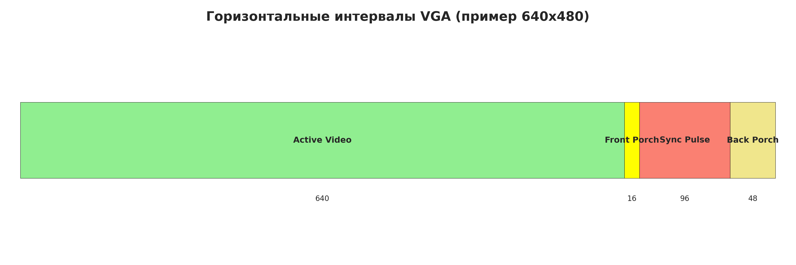
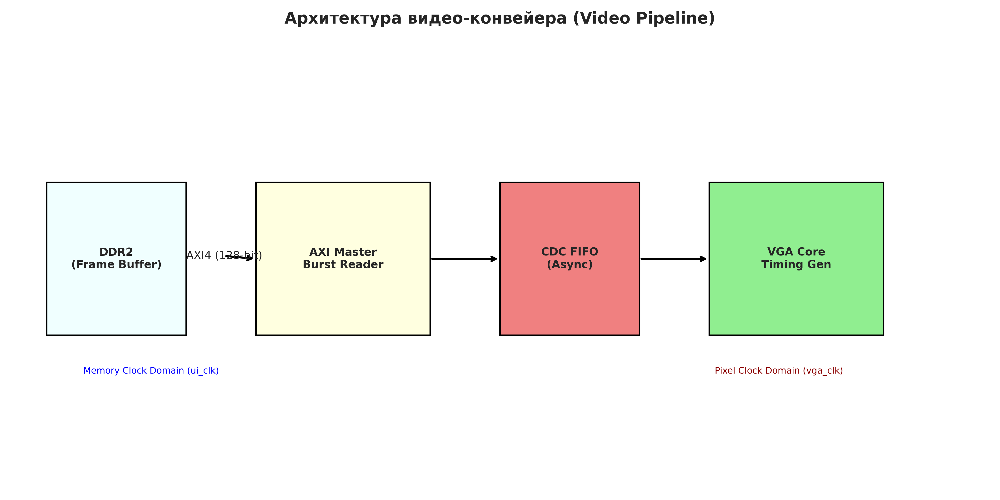
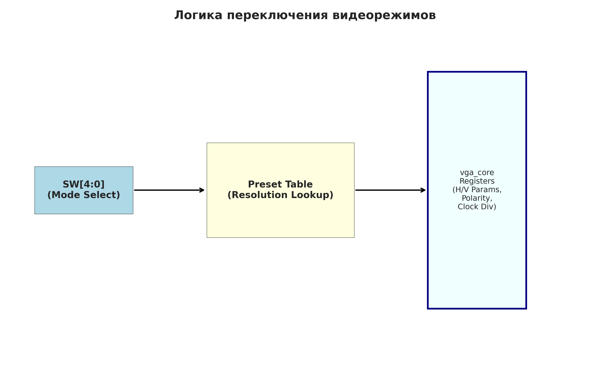
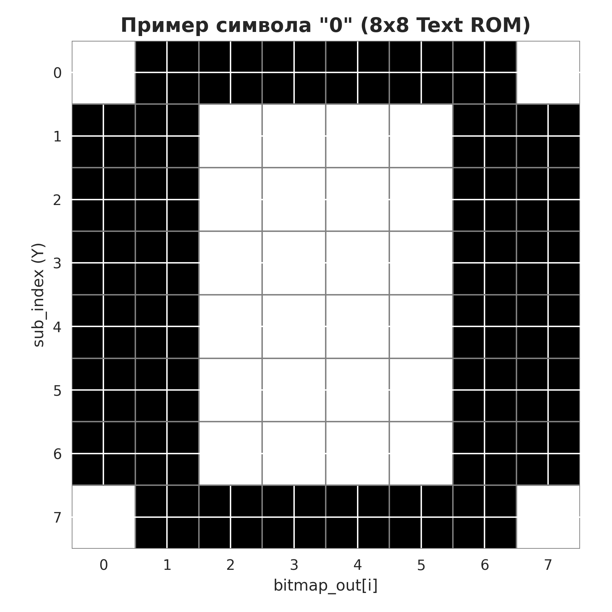

# Глава 9: VGA, память и графика - Подробный анализ

## Обзор главы

Девятая глава посвящена реализации видеосистемы на FPGA. Ключевая задача — генерация стабильного аналогового видеосигнала VGA (Video Graphics Array). Глава объединяет навыки работы с точными таймингами, внешнюю память (DDR2) как кадровый буфер и управление системой через регистровую шину. Особенностью главы является реализация гибкого контроллера, параметры которого можно настраивать на лету для поддержки различных разрешений.

---

## Структура проектов в главе

Глава содержит полноценный HDL-проект видеоядра с интеграцией контроллера памяти:

```
CH9/
├── hdl/                        # Исходный HDL-код модулей
│   ├── vga.sv                  # Top-level проекта (интеграция подсистем)
│   ├── vga_core.sv             # Ядро VGA (тайминги, AXI Master, регистры)
│   └── text_rom.sv             # ROM символьного генератора (8x8)
├── tb/
│   └── tb_vga.sv               # Тестбенч с моделью DDR2 памяти
├── build/
│   ├── IP/                     # Настроенные IP-ядра (sys_clk, pix_clk, ddr2_vga)
│   ├── vga/                    # Проект Vivado
│   └── xdc/
│       └── vga.xdc             # Пины VGA (RGB, HS, VS) и переключатели
```

---

## 1. Концепция VGA (по книге)

### 1.1. VGA как протокол времени
В отличие от многих цифровых интерфейсов, VGA крайне чувствителен к временным интервалам. Каждая строка и каждый кадр состоят из четко определенных фаз:
- **Active Video**: время выдачи реальных пикселей.
- **Front Porch**: небольшая пауза перед синхроимпульсом.
- **Sync Pulse**: сигнал для монитора начать новую строку/кадр.
- **Back Porch**: пауза после синхроимпульса до начала видео.


*Рис. 1. Состав одной строки видеосигнала*

### 1.2. Видео-конвейер (Video Pipeline)
Для отображения картинки из внешней памяти система должна работать как конвейер:
1.  **AXI Burst Reader**: читает данные из DDR2 большими пачками (Bursts) в системном клоке.
2.  **CDC FIFO**: асинхронный буфер для перехода из домена памяти в пиксельный домен.
3.  **VGA Core**: потребляет пиксели равномерно, строго по пиксельному клоку, формируя сигналы синхронизации.


*Рис. 2. Архитектура передачи данных от памяти к экрану*

### 1.3. Универсальность: Выбор разрешения через SW
Книжный подход предполагает, что контроллер не "зашит" под одно разрешение. Через переключатели **SW[4:0]** выбирается профиль (Preset), который загружает в регистры `vga_core` нужные параметры: H/V тайминги и частоту клока.


*Рис. 3. Логика динамической настройки видеорежима*

---

## 2. Привязка к репозиторию (CH9)

### 2.1. Анализ vga_core.sv: три интерфейса
Этот модуль является самым сложным в главе, так как объединяет три типа взаимодействия:

#### А) Регистровое управление (AXI-Lite Style)
Модуль содержит набор регистров, доступных для записи по упрощенной шине `reg_*`.
- `DISPLAY_ADDR` (0x100) — базовый адрес кадрового буфера в памяти.
- `DISPLAY_PITCH` (0x104) — шаг строки (stride) в памяти.
- `H_DISP_START_WIDTH` (0x000) — объединяет начало и ширину активной области.

#### Б) Доступ к памяти (AXI4 Read Channel)
Ядро выступает как **AXI Master** для чтения пикселей.
- `mem_araddr` — адрес текущего burst-чтения.
- `mem_rdata[127:0]` — шина данных (128 бит позволяет получить за один такт несколько пикселей).

#### В) Видео-выход (VGA Domain)
- `vga_clk` — входящий пиксельный клок.
- `vga_hsync / vga_vsync` — выходные импульсы синхронизации.
- `vga_rgb[23:0]` — данные цвета.

### 2.2. Текстовый ROM: text_rom.sv
Для вывода отладочной информации используется знакогенератор.
- **Формат**: сетка 8x8 пикселей на символ.
- **Логика**: `bitmap_out[i] = bitmap[7-i]`. Бит-реверс необходим, так как данные в ROM хранятся от младшего к старшему, а на экран выводятся слева направо.


*Рис. 4. Визуализация хранения символа в ROM*

### 2.3. Тестирование: tb_vga.sv
Тестбенч симулирует полный цикл запуска системы:
1.  Ожидание калибровки памяти DDR2 (`init_calib_complete`).
2.  Ожидание захвата частоты PLL (`locked`).
3.  Имитация нажатия кнопки `button_c` для применения настроек и начала вывода.

---

## 3. Этимология переменных (vga_core.sv)

| Сигнал | Расшифровка | Функция |
| :--- | :--- | :--- |
| `horiz_display_start` | Horizontal Display Start | Смещение начала видео от HSync. |
| `vert_total_width` | Vertical Total Width | Полная высота кадра в строках (включая Blank). |
| `pitch` | Pitch / Stride | Количество байт между началами двух соседних строк. |
| `reg_wstrb` | Register Write Strobe | Маска байт при записи в регистр (стандарт AXI). |
| `vga_hblank` | VGA Horizontal Blanking | Сигнал гашения луча во время обратного хода по горизонтали. |

---

## 4. Рекомендации по реализации

1.  **Полярность синхронизации**: Разные разрешения требуют разной полярности `hsync/vsync` (положительная или отрицательная). Это настраивается через регистр `V_DISP_POLARITY_FORMAT`.
2.  **Пропускная способность**: Если DDR2 не успевает отдавать данные, в FIFO произойдет *Underrun*. Это приведет к мерцанию или сдвигу картинки. Рекомендуется использовать максимальный размер Burst (`mem_arlen`).
3.  **Выравнивание адреса**: Для эффективного AXI-чтения базовый адрес кадрового буфера (`disp_addr`) должен быть выравнен по границе 128 бит (16 байт).

---
**Итог главы**: Девятая глава превращает FPGA в базовый графический ускоритель, способный выводить данные из памяти на стандартный монитор, используя гибкую систему настройки через регистры.
