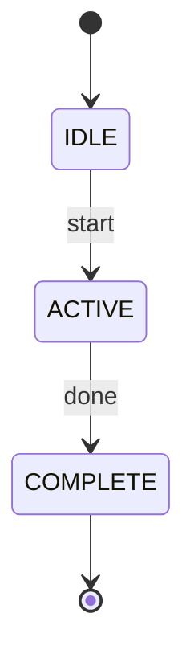
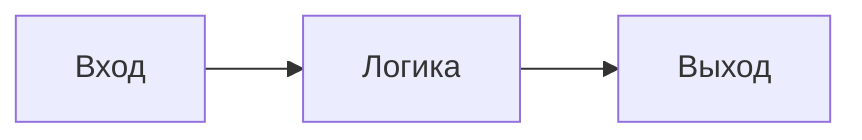

# Скрипты визуализации для документации FPGA проектов

## Описание
Эта папка содержит Python скрипты для автоматической генерации диаграмм, схем и графиков для документации по курсу "FPGA Programming for Beginners".

## Установка зависимостей

```bash
pip install -r requirements.txt
```

## Доступные скрипты

### 📊 logic_diagrams.py
Генерация логических схем и диаграмм подключений.

**Возможности:**
- Диаграммы логических элементов (AND, OR, NOT, XOR)
- Таблицы истинности с визуальным оформлением
- Схемы подключений на плате Nexys A7-100T
- Автоматическое сохранение с правильными именами файлов

**Использование:**
```bash
cd visualization_scripts
python logic_diagrams.py
```

**Генерируемые файлы для Главы 1:**
- `chapter_1_logic_gates_diagram.png` - Схемы логических элементов
- `chapter_1_truth_tables.png` - Таблицы истинности
- `chapter_1_nexys_connections.png` - Схема подключений платы

### 🕐 timing_diagrams.py *(планируется)*
Генерация временных диаграмм (waveforms) для последовательной логики.

### 🔄 state_machines.py *(планируется)*
Диаграммы состояний для конечных автоматов (FSM).

### 📡 protocol_diagrams.py *(планируется)*
Диаграммы протоколов связи (I2C, SPI, UART, VGA).

### 📈 performance_charts.py *(планируется)*
Графики использования ресурсов FPGA и производительности.

## Стандарты генерации

### 🎯 Новые правила генерации изображений

#### Принцип одной смысловой единицы
- **1 изображение = 1 концепция**: На одной картинке должна быть представлена только одна смысловая единица (один график, одна таблица, одна схема)
- **Разделение сложных диаграмм**: Если концепция сложная, лучше создать несколько отдельных изображений

#### Правила для временных диаграмм сигналов
- **Четкое разделение сигналов**: Сигналы должны быть разделены максимально четко, чтобы они не задевали друг друга визуально
- **Достаточное количество тактов**: Количество "тактов" (точек по оси X) должно быть достаточным для отображения всех важных моментов и переходов
- **Масштаб времени**: Временная шкала должна позволять увидеть все детали протокола или поведения

#### Предпочтение текста над изображениями
- **Текстовая информация в Markdown**: Если основной смысл передается через текст, использовать обычный Markdown вместо генерации картинки
- **Читаемость превыше всего**: Форматирование должно сохранять читаемость и структуру
- **Изображения только для визуальной информации**: Создавать изображения только когда визуальное представление добавляет понимание

#### Диаграммы и схемы
- **UML вместо картинок**: Для диаграмм, где возможно, предпочитать код UML или Mermaid вместо сгенерированных изображений
- **Векторные форматы**: Использовать SVG для диаграмм, которые должны масштабироваться

#### Масштабирование и читаемость
- **Все элементы читаемы**: Независимо от содержания, все элементы изображения должны быть четко видны и читаемы
- **Адаптивный размер**: Размер изображения должен соответствовать количеству и сложности информации
- **Минимальный размер шрифта**: Не менее 12pt для текста на диаграммах

### Параметры изображений
- **Разрешение:** 300 DPI
- **Формат:** PNG (для растровых), SVG (для векторных), Mermaid (для диаграмм)
- **Размеры:** Адаптивные в зависимости от содержания (минимум 800x600, максимум по необходимости)
- **Цветовая схема:** Профессиональная, подходящая для технической документации

### Именование файлов
```
chapter_X_description_type.png

Примеры:
- chapter_1_logic_gates_diagram.png
- chapter_3_state_machine_fsm.png
- chapter_5_i2c_protocol_timing.png
- chapter_8_memory_controller_block.png
```

### Языковые настройки
- Все подписи и тексты на русском языке
- Техническая терминология соответствует документации
- Монокосильный шрифт для кода и сигналов

## Структура сохранения

Изображения автоматически сохраняются в соответствующие папки:
```
CH1/docs/images/          # Диаграммы для Главы 1
CH2/docs/images/          # Диаграммы для Главы 2
...
CH11/docs/images/         # Диаграммы для Главы 11
```

### 📋 Рекомендации по применению правил

#### Когда использовать изображения:
✅ **СОЗДАВАТЬ изображения для:**
- Логических схем и диаграмм подключений
- Временных диаграмм сигналов (waveforms)
- Графиков производительности и ресурсов
- Блок-диаграмм архитектуры
- Диаграмм состояний (FSM)
- Схем протоколов связи

❌ **НЕ СОЗДАВАТЬ изображения для:**
- Списков команд или конфигураций
- Объяснений концепций (лучше использовать текст)
- Таблиц с большим количеством текста
- Кода программ (использовать блоки кода)
- Пошаговых инструкций

#### Альтернативы изображениям:

**Для таблиц истинности:**
```markdown
| A | B | AND | OR | XOR |
|---|---|-----|----|----- |
| 0 | 0 | 0   | 0  | 0   |
| 0 | 1 | 0   | 1  | 1   |
| 1 | 0 | 0   | 1  | 1   |
| 1 | 1 | 1   | 1  | 0   |
```

**Для диаграмм состояний:**


**Для блок-диаграмм:**


#### 🎨 Практические рекомендации по визуализации:

**Временные диаграммы:**
- Минимум 8-10 тактов для демонстрации паттерна
- Вертикальное расстояние между сигналами >= 1.5 высоты линии
- Подписи сигналов слева, не перекрывающие диаграмму
- Четкие метки времени по оси X

**Логические схемы:**
- Один тип элементов на схеме (только AND, или только OR, etc.)
- Входы слева, выходы справа
- Четкие соединительные линии без пересечений
- Подписи входов и выходов

**Диаграммы состояний:**
- Не более 5-7 состояний на одной диаграмме
- Четкие подписи переходов
- Выделение начального и конечных состояний
- Группировка связанных состояний

#### 📏 Требования к масштабированию:

**Минимальные размеры:**
- Текст: не менее 12pt
- Линии: не менее 1.5pt
- Зазоры между элементами: не менее 8px
- Поля: не менее 20px по краям

**Адаптивные размеры:**
- Простые схемы: 800x600
- Сложные диаграммы: 1200x800
- Временные диаграммы: ширина по количеству тактов
- Таблицы: высота по количеству строк

## Добавление новых скриптов

При создании нового скрипта следуйте шаблону:

```python
#!/usr/bin/env python3
# -*- coding: utf-8 -*-
"""
Описание скрипта
"""

import matplotlib.pyplot as plt
import numpy as np
from pathlib import Path

# Настройка русского языка
plt.rcParams['font.family'] = ['DejaVu Sans', 'Arial Unicode MS', 'Tahoma']
plt.rcParams['axes.unicode_minus'] = False

def setup_plot_style():
    """Единый стиль для всех диаграмм"""
    # ... (см. logic_diagrams.py)

def save_diagrams(chapter_num):
    """Сохранение диаграмм в правильную папку"""
    output_dir = Path(f'../CH{chapter_num}/docs/images')
    output_dir.mkdir(parents=True, exist_ok=True)
    # ... сохранение файлов

if __name__ == "__main__":
    # Генерация диаграмм
    pass
```

## Цветовые схемы

### Логические элементы
- **AND:** `#E8F4FD` (голубой)
- **OR:** `#FFF2E8` (оранжевый)
- **NOT:** `#F0E8FF` (сиреневый)
- **XOR:** `#E8FFF2` (зеленый)

### Сигналы и состояния
- **Активный HIGH:** `#90EE90` (светло-зеленый)
- **Активный LOW:** `#FFB6C1` (светло-красный)
- **Неопределенное состояние:** `#FFFFE0` (светло-желтый)
- **Тактовый сигнал:** `#87CEEB` (небесно-голубой)

### Компоненты системы
- **FPGA:** `#333333` (темно-серый)
- **Память:** `#4169E1` (синий)
- **Периферия:** `#32CD32` (зеленый)
- **Интерфейсы:** `#FF6347` (красный)

## Troubleshooting

### Проблемы с русскими шрифтами
```python
# Проверка доступных шрифтов
import matplotlib.font_manager as fm
fonts = [f.name for f in fm.fontManager.ttflist]
print([f for f in fonts if 'Deja' in f or 'Arial' in f])
```

### Настройка шрифтов в Windows
1. Установите шрифты с поддержкой кириллицы
2. Очистите кеш matplotlib: `rm -rf ~/.matplotlib`
3. Перезапустите Python

## Примеры использования

### Генерация диаграмм для конкретной главы
```bash
python logic_diagrams.py        # Глава 1
python state_machines.py        # Глава 4
python protocol_diagrams.py     # Глава 5
```

### Пакетная генерация всех диаграмм
```bash
python generate_all_diagrams.py
```

## Поддержка
При возникновении проблем с генерацией диаграмм проверьте:
1. Установлены ли все зависимости из `requirements.txt`
2. Доступны ли русские шрифты в системе
3. Создана ли папка назначения для сохранения
4. Соответствует ли структура проекта ожидаемой

## Лицензия
Скрипты распространяются под той же лицензией, что и основной проект.